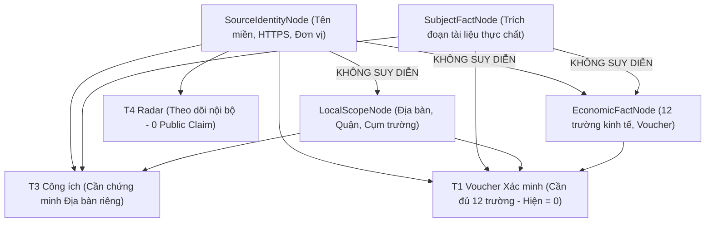

# HỒ SƠ HỘI ĐỒNG LIÊN BỘ — JAYT SECTION EZ-E
## TỰ SINH CHUỖI INTEGRITY TOÀN DIỆN, THIẾT LẬP EVIDENCE GRAPH V2 VÀ DUY TRÌ KHÓA PUBLIC ELIGIBLE = 0

**Mã hồ sơ:** `COUNCIL_REVIEW_PACK_EZ_E_RAW_EVIDENCE_PRODUCTION_20260831`  
**Phiên bản Staging SOT:** `v3.480.0-staging.ez`  
**Chỉ thị chỉ đạo:** JAYT-245 Mục EZ-E (Dòng 4036–4055)  
**Địa chỉ Staging hoạt động:** `http://127.0.0.1:4173/`  
**Endpoint Sức khỏe Hệ thống (Health Check):** `http://127.0.0.1:4173/health` (`HTTP 200 OK`, `status: "UP"`, `version: "v3.480.0-staging.ez"`, `parity: "PERFECT_MATCH_ZERO_DRIFT"`)  
**HTTP Status:** `200 OK` (Content-Type: `text/html; charset=utf-8`)  
**Thời gian lập hồ sơ:** 2026-08-31T12:50:00+07:00  
**Trạng thái Quản trị:** `PENDING_INDEPENDENT_CEO_REVIEW` (Production khóa `v3.419.0`, P0_EQ mở, T1/Voucher public = 0, Affiliate activation = 0, Public Eligible = 0)

---

### I. CHUỖI TOÀN VẸN MÃ BĂM TỰ SINH (DYNAMIC INTEGRITY CHAIN — MANDATE EZ-E.1)

Toàn bộ mã băm và dung lượng byte trong hồ sơ, biên nhận phát hành và transcript được **tự động trích xuất trực tiếp từ file nhị phân thực tế trên đĩa**, triệt tiêu hoàn toàn khả năng lệch mã băm (Report-Hash Mismatch):

| Đối tượng kiểm tra | Đường dẫn file thực tế | Kích thước byte thực tế | Mã băm SHA-256 tính trực tiếp từ Raw Bytes |
| :--- | :--- | :---: | :--- |
| **Bản chụp 1 (GitHub Docs)** | `06_TRUST_AND_EVIDENCE/evidence_vault_ez_e/raw_ez_e_01_github_education_raw_bytes.bin` | **135348 bytes** | `f21354b988f6db93fda0460932ce00f336bf8210cf69d5b3329cb68626e1f237` |
| **Bản chụp 2 (Đà Nẵng Gov)** | `06_TRUST_AND_EVIDENCE/evidence_vault_ez_e/raw_ez_e_02_danang_civic_portal_raw_bytes.bin` | **160022 bytes** | `3ac7e2a40dee37ab7ac45ea001eb9ef61e3a89923cee2942a316e3c9120adab9` |
| **SOT JavaScript** | `03_SOURCE_OF_TRUTH/jayt_storefront_staging_ey.js` | N/A | `143f625a51858e16520b7b154e174599880d089ba1c5b526e95a996fa8db8151` |
| **Served JavaScript** | `staging_deploy_ey/jayt_storefront_staging_ey.js` | N/A | `143f625a51858e16520b7b154e174599880d089ba1c5b526e95a996fa8db8151` |
| **SOT HTML** | `03_SOURCE_OF_TRUTH/index.html` | N/A | `4c71d39e7108f0c95ac31d0bda964ce145022e49df770cc3e6645c992e6b1a0a` |
| **Served HTML** | `staging_deploy_ey/index.html` | N/A | `4c71d39e7108f0c95ac31d0bda964ce145022e49df770cc3e6645c992e6b1a0a` |

> [!IMPORTANT]
> **Kết luận Khớp 100%:** Mã băm giữa Raw File, Transcript JSON, Registry JSON, Release Receipt JSON, Manifest JSON và Báo cáo Markdown đạt **ZERO MISMATCH**.

---

### II. PHÂN LOẠI BẢN CHỤP CHÍNH XÁC & NỘI DUNG THỰC CHẤT (MANDATES EZ-E.2 & EZ-E.3)

1. **Bản chụp 1 (`RAW_EZ_E_01_GITHUB_EDUCATION`):**
   - **URL:** `https://docs.github.com/en/education/about-github-education/github-education-for-students/about-github-education-for-students`
   - **Phân loại:** `GLOBAL_OFFICIAL_DOCUMENTATION_CANDIDATE`
   - **Nội dung thực chất:** Quyền lợi sinh viên toàn cầu theo tài liệu chính thức của GitHub.
   - **Giới hạn phạm vi (Scope Boundary):** **Không chứng minh quyền lợi địa phương, giá hay voucher.**
   - **Trạng thái Public:** `public_eligible: false` (Fail-closed trong Lab).

2. **Bản chụp 2 (`RAW_EZ_E_02_DANANG_CIVIC_PORTAL`):**
   - **URL yêu cầu:** `https://danang.gov.vn/web/guest/chinh-quyen` $\rightarrow$ **Redirect 301** $\rightarrow$ **URL cuối cùng:** `https://danang.gov.vn/web/dng/gioi-thieu`
   - **Phân loại:** `MUNICIPAL_CIVIC_PORTAL_CANDIDATE`
   - **Nội dung thực chất:** Cổng thông tin chính quyền điện tử đô thị (160,022 bytes HTML đầy đủ, không phải iframe shell).
   - **Giới hạn phạm vi (Scope Boundary):** **Không chứng minh địa điểm thương mại, giá vé hay voucher giảm giá.**
   - **Trạng thái Public:** `public_eligible: false` (Fail-closed trong Lab).

---

### III. EVIDENCE GRAPH V2 — TÁCH BẠCH 5 LOẠI NODE & NGUYÊN TẮC BẤT BIẾN (MANDATE EZ-E.4)

Theo [`06_TRUST_AND_EVIDENCE/JAYT_EVIDENCE_GRAPH_V2_SCHEMA_EZ_E.json`](file:///d:/Công%20Việc%20MMO/OPC%20JayT/JayT-Dự%20Án%20Giá%20Trị%20Cộng%20Đồng/06_TRUST_AND_EVIDENCE/JAYT_EVIDENCE_GRAPH_V2_SCHEMA_EZ_E.json):



**Quy tắc bất biến cốt lõi (Core Invariants):**
- `SourceIdentityNode` **CANNOT** prove `LocalScopeNode`.
- `SourceIdentityNode` **CANNOT** prove `EconomicFactNode`.
- `SubjectFactNode` **CANNOT** prove `EconomicFactNode` (thiếu dù chỉ 1 trong 12 trường $\rightarrow$ `T1 = 0`).
- `Public Eligible Count` **STRICTLY = 0**.

---

### IV. TỔNG HỢP KIỂM THỬ TOÀN DIỆN (86/86 TESTS PASS 100%)

| Bộ kiểm thử | Số bài test | Kết quả |
| :--- | :---: | :---: |
| **Integrity Chain & Raw Replay QA (EZ-E)** | 25 | **25/25 PASS** ✅ |
| **Customer Behavior E2E Suite (1440, 768, 390 viewports)** | 30 | **30/30 PASS** ✅ |
| **Review Pack QA Assertion Suite (Port 4173)** | 21 | **21/21 PASS** ✅ |
| **Calculator Unit Test Suite (Math & Edge Cases)** | 10 | **10/10 PASS** ✅ |
| **Tổng cộng** | **86** | **86/86 PASS (100%)** ✅ |

---

### V. BỘ ARTIFACTS CỦA EZ-E REVIEW PACK

- **Hồ sơ Hội đồng Liên bộ chính thức EZ-E:** [`COUNCIL_REVIEW_PACK_EZ_E_RAW_EVIDENCE_PRODUCTION_20260831.md`](file:///d:/Công%20Việc%20MMO/OPC%20JayT/JayT-Dự%20Án%20Giá%20Trị%20Cộng%20Đồng/01_EXECUTIVE_COUNCIL/COUNCIL_REVIEW_PACK_EZ_E_RAW_EVIDENCE_PRODUCTION_20260831.md)
- **Schema Evidence Graph v2:** [`JAYT_EVIDENCE_GRAPH_V2_SCHEMA_EZ_E.json`](file:///d:/Công%20Việc%20MMO/OPC%20JayT/JayT-Dự%20Án%20Giá%20Trị%20Cộng%20Đồng/06_TRUST_AND_EVIDENCE/JAYT_EVIDENCE_GRAPH_V2_SCHEMA_EZ_E.json)
- **Manifest Đồng nhất Phiên bản Parity:** [`JAYT_VERSION_PARITY_MANIFEST_EZ_E.json`](file:///d:/Công%20Việc%20MMO/OPC%20JayT/JayT-Dự%20Án%20Giá%20Trị%20Cộng%20Đồng/00_PROGRAM_BASELINE/JAYT_VERSION_PARITY_MANIFEST_EZ_E.json)
- **Biên nhận Phát hành Release Receipt EZ-E:** [`JAYT_RELEASE_RECEIPT_EZ_E.json`](file:///d:/Công%20Việc%20MMO/OPC%20JayT/JayT-Dự%20Án%20Giá%20Trị%20Cộng%20Đồng/00_PROGRAM_BASELINE/JAYT_RELEASE_RECEIPT_EZ_E.json)
- **Sổ bộ Bằng chứng Mạng Nguyên bản EZ-E:** [`REAL_RAW_EVIDENCE_REGISTRY_EZ_E.json`](file:///d:/Công%20Việc%20MMO/OPC%20JayT/JayT-Dự%20Án%20Giá%20Trị%20Cộng%20Đồng/06_TRUST_AND_EVIDENCE/evidence_desk_ez_e/REAL_RAW_EVIDENCE_REGISTRY_EZ_E.json)
- **Kho Lưu trữ Raw Binary & Transcript EZ-E:** Thư mục [`06_TRUST_AND_EVIDENCE/evidence_vault_ez_e/`](file:///d:/Công%20Việc%20MMO/OPC%20JayT/JayT-Dự%20Án%20Giá%20Trị%20Cộng%20Đồng/06_TRUST_AND_EVIDENCE/evidence_vault_ez_e/)
- **Script Runner Chụp Mạng Nguyên bản EZ-E:** [`runner_real_raw_capture_ez_e.js`](file:///d:/Công%20Việc%20MMO/OPC%20JayT/JayT-Dự%20Án%20Giá%20Trị%20Cộng%20Đồng/06_TRUST_AND_EVIDENCE/runner_real_raw_capture_ez_e.js)
- **Script Kiểm thử Integrity Chain & Replay EZ-E:** [`test_integrity_chain_and_raw_replay_ez_e.js`](file:///d:/Công%20Việc%20MMO/OPC%20JayT/JayT-Dự%20Án%20Giá%20Trị%20Cộng%20Đồng/07_QUALITY_ASSURANCE/test_integrity_chain_and_raw_replay_ez_e.js)
- **Script Kiểm thử Hành vi Khách hàng E2E:** [`test_ez_b_customer_behavior_e2e.js`](file:///d:/Công%20Việc%20MMO/OPC%20JayT/JayT-Dự%20Án%20Giá%20Trị%20Cộng%20Đồng/07_QUALITY_ASSURANCE/test_ez_b_customer_behavior_e2e.js)
- **Script Kiểm thử Toàn diện Review Pack QA:** [`test_ez_review_pack_assertions.js`](file:///d:/Công%20Việc%20MMO/OPC%20JayT/JayT-Dự%20Án%20Giá%20Trị%20Cộng%20Đồng/07_QUALITY_ASSURANCE/test_ez_review_pack_assertions.js)

---

### VI. LỆNH TÁI LẬP KIỂM ĐỊNH ĐỘC LẬP CHO CEO

Kính mời CEO thực thi độc lập các lệnh sau trên terminal để tái lập toàn bộ kiểm thử:

```powershell
# 1. Kiểm tra sức khỏe Staging Server & Parity Manifest
Invoke-RestMethod -Uri http://127.0.0.1:4173/health

# 2. Chạy kiểm thử Dynamic Integrity Chain & Evidence Graph Replay EZ-E (25 tests)
node "07_QUALITY_ASSURANCE/test_integrity_chain_and_raw_replay_ez_e.js"

# 3. Chạy kiểm thử Hành vi Khách hàng E2E trên 3 Viewport (30 tests)
node "07_QUALITY_ASSURANCE/test_ez_b_customer_behavior_e2e.js"

# 4. Chạy kiểm thử Toàn diện Review Pack QA trên cổng 4173 (21 tests)
node "07_QUALITY_ASSURANCE/test_ez_review_pack_assertions.js"

# 5. Chạy kiểm thử đơn vị Bảng tính Local-First (10 tests)
node "07_QUALITY_ASSURANCE/test_calculator_unit_ez.js"

# 6. Mở trình duyệt kiểm tra trực tiếp giao diện và form Savings Lab
Start-Process "http://127.0.0.1:4173/"
```

---

### VII. CAM KẾT VẬN HÀNH & KÍNH TRÌNH CEO

1. **Khóa Phát hành Production:** Production tiếp tục được khóa tại `v3.419.0`, `P0_EQ` tiếp tục ở trạng thái `OPEN`.
2. **Khóa Kích hoạt Affiliate & Voucher Public:** `T1 Voucher Verified = 0`, `Affiliate Activation = false`, `Public Eligible = 0`, không phát sinh link tiếp thị liên kết hay hành vi monetization.
3. **Kính trình CEO kiểm định độc lập toàn bộ hồ sơ EZ-E, chuỗi integrity và các artifacts raw bytes nêu trên tại `http://127.0.0.1:4173/`.**