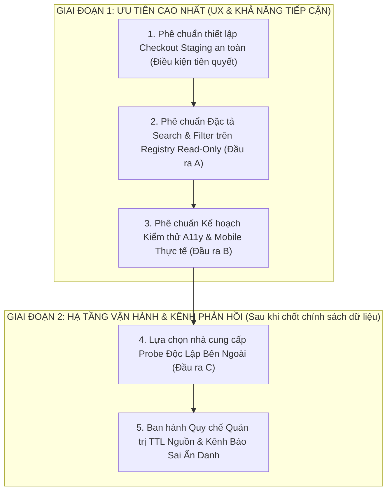

# TỜ TRÌNH CỐ VẤN CHIẾN LƯỢC — PHÊ DUYỆT PHẠM VI ƯU TIÊN P1 SAU PHÁT HÀNH v3.422.0
**Số hiệu văn bản:** JAYT-328-STRATEGIC-ADVISOR-P1-SUBMISSION  
**Phiên bản:** v2.0 (Hiệu chỉnh toàn diện theo chỉ đạo của Verification Authority)  
**Căn cứ lập hồ sơ:** Ma trận Khoảng trống Sản phẩm Hậu Phát hành `01_EXECUTIVE_COUNCIL/JAYT_327_POST_LAUNCH_PRODUCT_GAP_MATRIX.md`  
**Thời điểm lập:** 2026-09-06T11:25:00+07:00 (Giờ Việt Nam)  
**Cơ quan trình:** Bộ phận Kỹ thuật & Đảm bảo Chất lượng (Engineering & QA Pair)  
**Cơ quan tiếp nhận thẩm định:** Cố vấn Chiến lược & Hội đồng Điều hành JayT  
**Trạng thái đề xuất:** `PENDING_ADVISOR_SCOPE_REVIEW__ZERO_CODE_MUTATION`  

---

## 1. NGUYÊN TẮC QUẢN TRỊ & NĂM ĐIỂM HIỆU CHỈNH CỐT LÕI

Theo chỉ thị của Hội đồng và Verification Authority, hồ sơ JAYT-328 được chuẩn hóa và cam kết 5 điểm hiệu chỉnh bắt buộc:

1. **Ranh giới đánh giá P0:** Khẳng định chuẩn xác: **"Chưa phát hiện lỗi P0 trong phạm vi khảo sát hiện thời"**. Tuyệt đối không đưa ra tuyên bố mang tính khái quát hóa hoặc suy diễn rằng toàn bộ hệ thống không có P0. Nếu quá trình kiểm thử phát hiện bất kỳ sự cố mất chức năng thiết yếu hoặc rủi ro an ninh dữ liệu, sự cố đó sẽ được nâng cấp thành P0 ngay lập tức.
2. **Chính sách riêng tư & Giới hạn phạm vi ẩn danh:** Thừa nhận nguyên tắc: Email (kể cả trường tùy chọn) vẫn là Dữ liệu Định danh Cá nhân (PII), nên việc loại bỏ trường email là bước giảm thiểu dữ liệu cần thiết. Tuy nhiên, việc bỏ email chưa thể tự động coi là "ẩn danh 100%" vì IP rate-limiting, nhật ký máy chủ (server logs) và nội dung văn bản người gửi vẫn đòi hỏi chính sách xử lý dữ liệu chặt chẽ. Toàn bộ nội dung này thuộc phạm vi **Giai đoạn 2**, cần xây dựng quy chế dữ liệu riêng và **hoàn toàn không cản trở việc triển khai Giai đoạn 1 (Search & Filter + Kiểm thử A11y/Mobile)**.
3. **Kiểm soát chống Spam phía máy chủ (Server-Side Control):** Rate-limiting phía client chỉ là lớp bảo vệ giao diện sơ cấp, không đủ bảo đảm an toàn. Mọi giải pháp tiếp nhận báo sai bắt buộc phải có cơ chế kiểm soát, giới hạn tần suất (rate limiting / throttling) và xác thực tại máy chủ nhận tin (server-side).
4. **Cô lập Staging an toàn bằng thẩm định mã băm (Cryptographic Verification):** `.gitignore` chỉ là chỉ thị lọc file của Git, không có giá trị bảo vệ tính bất biến của dữ liệu. Do đó, Staging bắt buộc phải là **thư mục checkout tách biệt hoàn toàn**, thiết lập phân quyền read-only đối với vault và sổ cái, đồng thời thực thi script đối soát mã băm SHA-256 đối chiếu khớp 100% trước và sau mọi phiên làm việc.
5. **Bản chất của TTL và đề xuất Probe:** Các mốc thời gian 7/14/30 ngày và giải pháp probe zero-cost **mới là đề xuất thảo luận kỹ thuật ban đầu**, chưa được Hội đồng phê chuẩn. Đồng thời, **TTL chỉ là ngưỡng kích hoạt chu kỳ kiểm tra (inspection trigger interval), tuyệt đối không chứng minh nguồn bên ngoài còn hiệu lực**. Nguồn chỉ được coi là hợp lệ khi có kết quả thẩm định trực tiếp.

---

## 2. ĐIỀU KIỆN TIÊN QUYẾT TRƯỚC IMPLEMENTATION: THIẾT LẬP CHECKOUT STAGING AN TOÀN

**Điều kiện bắt buộc:** Trước khi thực hiện bất kỳ lệnh lập trình module nào, hạ tầng Staging phải được phê chuẩn và thiết lập an toàn theo các tiêu chí sau:

1. **Thư mục làm việc độc lập:** Tạo một thư mục checkout riêng biệt (ví dụ: `staging_workspace/` hoặc worktree độc lập), hoàn toàn tách biệt với thư mục phát hành live `deploy_personal_v3422/`.
2. **Bảo vệ quyền truy cập (Permissions Lock):**
   - Kho lưu trữ trung tâm `08_RELEASE_VAULT/`, kho chứng từ `06_TRUST_AND_EVIDENCE/` và sổ cái `PROJECT_MEMORY.md` được đặt ở chế độ chỉ đọc (read-only access).
   - Tuyệt đối cấm mọi thao tác ghi, xóa, di chuyển hoặc can thiệp trực tiếp từ môi trường Staging vào kho trung tâm.
3. **Đối chiếu mã băm tự động (Cryptographic Hash Reconciliation):**
   - Trước khi bắt đầu phiên làm việc Staging: Script tự động đo và ghi nhận SHA-256 của toàn bộ các file trong vault.
   - Sau khi hoàn thành phiên Staging: Script kiểm tra lại toàn bộ mã băm; nếu phát hiện bất kỳ file vault nào bị thay đổi dù chỉ 1 byte, toàn bộ phiên làm việc bị hủy bỏ ngay lập tức (fail-closed).
4. **Cấm thăng cấp tự động (No Auto-Promotion):** Mọi bản dựng từ Staging không bao giờ được tự động đẩy lên Production mà phải trải qua quy trình đóng gói RC, kiểm toán độc lập và Sắc lệnh Chủ tịch riêng biệt.

---

## 3. ĐẦU RA A: ĐẶC TẢ MODULE TÌM KIẾM & BỘ LỌC TRÊN REGISTRY CHỈ ĐỌC

### 3.1. Bảng Ánh Xạ Chuẩn Hóa 24 Candidate ID → Danh Mục Lọc Hiển Thị (Filter Taxonomy)
*Lưu ý: Bảng ánh xạ này được định nghĩa ở tầng logic giao diện client, tuyệt đối KHÔNG sửa đổi file registry gốc `08_RELEASE_VAULT/RELEASE_CANDIDATE_v3.422.0_REGISTRY.json`.*

Nhằm giúp người dân và sinh viên phân biệt tức thì, phân loại cho tiện ích **Chuyến bay (B11_01)** và **Văn hóa Champa (B11_02)** được định danh trực quan rõ ràng thành hai nhóm riêng biệt:

| Slot | Mã Thực Thể (Candidate ID) | Tiêu Đề Được Phê Duyệt | Danh Mục Lọc Hiển Thị (User-Facing Category) | Nhãn Chip Lọc Trên Giao Diện |
|:---:|:---|:---|:---|:---:|
| 1 | `GITHUB_EDUCATION_PILOT_T2` | GitHub Student Developer Pack | Giáo dục & Sinh viên | `Học tập & Giáo dục` |
| 2 | `BATCH03_DS_07` | DanaBus — Thông tin xe buýt Đà Nẵng | Giao thông Công cộng | `Xe buýt & Giao thông` |
| 3 | `J287-HK-STUDENT-POLICY-UED-20260903` | UED — Hướng dẫn chế độ chính sách sinh viên | Giáo dục & Sinh viên | `Học tập & Giáo dục` |
| 4 | `B04_02_KY_SO_TOAN_DAN_Y_TE` | Ký Số Toàn Dân — Dịch Vụ Công & Y Tế Đà Nẵng | Chính quyền số & Dịch vụ công | `Dịch vụ công & Kỹ năng số` |
| 5 | `B04_07_THU_VIEN_SO_HOC_LIEU_UED` | Thư viện số và tra cứu học liệu trực tuyến UED | Giáo dục & Sinh viên | `Học tập & Giáo dục` |
| 6 | `B04_06_AN_TOAN_TIEM_CHUNG_CDC_DANANG` | Hướng dẫn an toàn tiêm chủng CDC Đà Nẵng | Y tế & Phòng dịch | `Y tế & Sức khỏe` |
| 7 | `B04_10_LICH_TIEM_CHUNG_TRE_EM_CDC_DANANG` | Cẩm nang lịch tiêm chủng trẻ em CDC Đà Nẵng | Y tế & Phòng dịch | `Y tế & Sức khỏe` |
| 8 | `B05_01_LICH_TIEM_CHUNG_THAI_KY_CDC_DANANG` | Cẩm nang lịch tiêm chủng thai kỳ CDC Đà Nẵng | Y tế & Phòng dịch | `Y tế & Sức khỏe` |
| 9 | `B05_03_DANABUS_TUYEN_05_HOA_HIEP_NAM_BIEN_DONG` | DanaBus Tuyến 05 — Xe buýt điện KCC Hòa Hiệp Nam – CV Biển Đông | Giao thông Công cộng | `Xe buýt & Giao thông` |
| 10 | `B06_01_DANABUS_CHUYEN_DOI_XE_BUYT_DIEN_02_13_21` | DanaBus — Chuyển đổi xe buýt sử dụng điện tuyến 02, 13, 21 | Giao thông Công cộng | `Xe buýt & Giao thông` |
| 11 | `B06_03_HUONG_DAN_DICH_VU_CONG_TRUC_TUYEN_DANANG` | Hướng dẫn nộp hồ sơ dịch vụ công trực tuyến DVCQG/VNeID | Chính quyền số & Dịch vụ công | `Dịch vụ công & Kỹ năng số` |
| 12 | `B06_02_BAN_TIN_SUC_KHOE_CONG_DONG_CDC_DANANG` | Bản tin Sức khỏe cộng đồng: Vệ sinh môi trường & phòng dịch | Y tế & Phòng dịch | `Y tế & Sức khỏe` |
| 13 | `B07_01_DANABUS_CHUYEN_DOI_XE_BUYT_DIEN_03_09_14` | DanaBus — Điều chỉnh phương tiện xe buýt điện tuyến 03, 09, 14 | Giao thông Công cộng | `Xe buýt & Giao thông` |
| 14 | `B07_02_CAM_NANG_AN_TOAN_SO_DEEPFAKE_1022` | Cẩm nang phòng chống lừa đảo trực tuyến: Video Deepfake | Chính quyền số & Kỹ năng số | `Dịch vụ công & Kỹ năng số` |
| 15 | `B07_03_TRA_CUU_MAY_KHU_RUNG_TIM_AED_CONG_CONG_1022` | Hướng dẫn tra cứu máy khử rung tim tự động (AED) công cộng | Y tế & Cấp cứu | `Y tế & Sức khỏe` |
| 16 | `B08_01_BAN_DO_SO_UNG_PHO_LU_LUT_HOA_XUAN_1022` | Bản đồ số & biển vết lũ phục vụ ứng phó ngập lụt 1022 | Tiện ích Đô thị & Dân sinh | `Dịch vụ công & Kỹ năng số` |
| 17 | `B08_03_TIEN_ICH_SO_CONG_DONG_WIFI_AN_HAI_1022` | Mạng Wi-Fi miễn phí nhà sinh hoạt cộng đồng An Hải | Tiện ích Đô thị & Dân sinh | `Dịch vụ công & Kỹ năng số` |
| 18 | `B09_01_DANABUS_TUYEN_11_XUAN_DIEU_BEN_XE_TIEN_SA` | Tuyến xe buýt đô thị số 11: Xuân Diệu – Bến xe Tiên Sa | Giao thông Công cộng | `Xe buýt & Giao thông` |
| 19 | `B09_02_TRO_LY_SO_DANANG_AI_PHO_BIEN_PHAP_LUAT_1022` | Trợ lý số DaNang AI & số hóa hộ tịch phục vụ công dân | Chính quyền số & Pháp luật | `Dịch vụ công & Kỹ năng số` |
| 20 | `B09_03_CHIEN_DICH_BAO_VE_DANH_TINH_SO_MA_SO_THUE_1022` | Bảo vệ an toàn danh tính số và phòng ngừa lợi dụng MST | Chính quyền số & Kỹ năng số | `Dịch vụ công & Kỹ năng số` |
| 21 | `B10_01_DIEM_TIEP_NHAN_THU_TUC_HANH_CHINH_TAM_KY_1022` | Điểm tăng cường tiếp nhận TTHC cấp sở tại Tam Kỳ | Chính quyền số & Dịch vụ công | `Dịch vụ công & Kỹ năng số` |
| 22 | `B10_02_PHO_CAP_KY_NANG_SO_VNEID_PHU_NU_1022` | Phổ cập kỹ năng số, kích hoạt VNeID vùng cao | Chính quyền số & Kỹ năng số | `Dịch vụ công & Kỹ năng số` |
| **23** | **`B11_01_TRA_CUU_CHUYEN_BAY_DANANG_SMART_CITY_1022`** | **Thông tin chuyến bay trên Danang Smart City** | **Hàng không & Di chuyển Sân bay** | **`Tra cứu Chuyến bay`** |
| **24** | **`B11_02_HOAT_DONG_VAN_HOA_BAO_TANG_CHAM_1022`** | **Lịch biểu diễn vũ điệu Champa — Bảo tàng Chăm Đà Nẵng** | **Văn hóa, Nghệ thuật & Di sản** | **`Văn hóa & Nghệ thuật`** |

*Tóm tắt bộ 7 Chip lọc giao diện (1 nút "Tất cả" + 6 nhóm danh mục = 7 chip tổng cộng):*
1. `Tất cả (24)` — Trạng thái mặc định ban đầu
2. `Y tế & Sức khỏe (5)`
3. `Xe buýt & Giao thông (5)`
4. `Học tập & Giáo dục (3)`
5. `Dịch vụ công & Kỹ năng số (9)`
6. `Tra cứu Chuyến bay (1)` *(Phân loại rõ ràng cho tiện ích sân bay, không lẫn vào xe buýt)*
7. `Văn hóa & Nghệ thuật (1)` *(Phân loại rõ ràng cho di sản văn hóa Champa)*

### 3.2. Quy Tắc Kỹ Thuật Module Tìm Kiếm & Lọc
- **Tìm kiếm tức thời (Client-side Search):**
  - Chuẩn hóa ký tự: Chuyển chuỗi tìm kiếm và dữ liệu thẻ về chữ thường (lowercase) và loại bỏ dấu tiếng Việt (ví dụ: `chuyen bay` khớp `chuyến bay`, `danabus` khớp `DanaBus`).
  - Phạm vi so khớp: Tiêu đề thẻ, mô tả tóm tắt, tên cơ quan phát hành và từ khóa danh mục.
- **Tổ hợp Tìm kiếm + Bộ lọc (AND Logic):**
  - Kết quả hiển thị = (Thực thể khớp danh mục đã chọn) $\cap$ (Thực thể khớp từ khóa tìm kiếm).
  - Trạng thái rỗng (Zero-result state): Khi không tìm thấy tiện ích, hiển thị thông báo thân thiện kèm 2 nút hành động khôi phục rõ ràng:
    - *"Xóa tìm kiếm"*: Chỉ xóa chuỗi truy vấn trong ô tìm kiếm, giữ nguyên chip lọc danh mục đang chọn.
    - *"Đặt lại tất cả"*: Xóa cả chuỗi tìm kiếm và chuyển chip lọc về `Tất cả (24)`, khôi phục hiển thị đầy đủ 24 thẻ.
- **Ràng buộc toàn vẹn dữ liệu:**
  - Tuyệt đối không thêm/bớt phần tử trong mảng gốc; chỉ ẩn/hiện (`display: none` hoặc filter class) các thẻ DOM.
  - Số lượng thẻ tối đa luôn là 24, không xuất hiện thẻ nhân bản (duplicate DOM node).
  - Thao tác "Đặt lại tất cả" luôn trả về đúng 24 thẻ với nguyên vẹn Evidence ID và URL gốc.

---

## 4. ĐẦU RA B: KẾ HOẠCH KIỂM THỬ KHẢ NĂNG TIẾP CẬN (A11Y) & MOBILE THỰC TẾ

### 4.1. Ma Trận Kịch Bản Kiểm Thử A11y (WCAG 2.1 AA)

| Mã Tiêu Chuẩn WCAG | Tên Kịch Bản Kiểm Thử | Thao Tác Thực Hiện | Kết Quả Kỳ Vọng (Pass Criteria) |
|:---|:---|:---|:---|
| **2.1.1 Keyboard** | Điều hướng tuần tự bằng bàn phím | Nhấn `Tab` và `Shift+Tab` qua toàn bộ trang web từ đầu đến cuối trang | 100% các nút tìm kiếm, chip lọc, thẻ tiện ích và nút hành động nhận được focus; không có bẫy phím gây kẹt |
| **2.4.7 Focus Visible** | Chỉ báo Focus rõ ràng | Quan sát viền focus khi di chuyển qua từng phần tử interactive | Viền focus (outline) hiển thị độ tương phản cao, tối thiểu 3:1 so với nền, không bị ẩn bởi `outline: none` |
| **2.4.3 Focus Order** | Thứ tự Focus logic | Kiểm tra thứ tự Tab: Header $\to$ Ô tìm kiếm $\to$ Chip lọc $\to$ Thẻ 1..24 $\to$ Footer | Thứ tự focus đi theo luồng đọc tự nhiên từ trên xuống dưới, từ trái sang phải; không nhảy cóc bất thường |
| **Dialog A11y** | Bẫy Focus và hoàn trả Focus | Bấm mở modal dialog ("Báo nguồn" hoặc "Chi tiết"), nhấn `Tab`, sau đó nhấn `Esc` | Focus bị khóa bên trong modal khi mở; khi nhấn `Esc`, modal đóng và focus được trả chính xác về nút đã mở |
| **1.3.1 / 4.1.2** | Trình đọc màn hình NVDA | Bật NVDA, di chuyển qua ô tìm kiếm, chip lọc và các thẻ tiện ích | NVDA phát âm rõ: Role (Search, Button, Link), Tên nút, Trạng thái chọn (`aria-pressed="true/false"`), và số lượng kết quả |
| **1.4.10 Reflow** | Phóng to màn hình 200% (Zoom 200%) | Nhấn `Ctrl +` phóng to trình duyệt lên 200% ở độ phân giải 1280px (tương đương 320 CSS px) | Nội dung tự động co giãn theo cột dọc; **zero horizontal overflow** (không xuất hiện thanh cuộn ngang); không mất chữ |

### 4.2. Kế Hoạch Kiểm Thử Thiết Bị Di Động Thực Tế (Real Mobile Journey)
- **Thiết bị kiểm thử:** iPhone (iOS Safari) và Android Phone (Chrome Mobile).
- **Tiêu chuẩn Touch Target (Sản phẩm):** Mọi nút hành động, chip lọc và icon tương tác đều phải có diện tích chạm thực tế $\ge 44 \times 44$ CSS px.
- **Kiểm tra hành trình cuộn & thao tác:**
  - Cuộn trang liên tục 24 thẻ: Đảm bảo chuyển động mượt mà (60fps), không giật lag.
  - Thanh điều hướng (bottom navigation): Cố định đúng vị trí, không che khuất thẻ cuối cùng, không che mất disclaimer B11.
  - Tương tác mở/đóng bàn phím ảo (Virtual Keyboard): Khi chạm vào ô tìm kiếm, giao diện không bị zoom cưỡng bức (font-size input $\ge 16\text{px}$ để tránh auto-zoom trên iOS Safari).

---

## 5. ĐẦU RA C: CÁC LỰA CHỌN HẠ TẦNG CẦN CỐ VẤN PHÊ DUYỆT

### 5.1. Các Phương Án Hạ Tầng Probe Độc Lập Bên Ngoài (Always-On External Probe)

| Tiêu Chí So Sánh | Phương Án 1: Serverless Scheduled Probe (GitHub Actions / Cloud Scheduler) | Phương Án 2: Uptime Monitoring Chuyên Dụng (BetterStack / UptimeRobot Free Tier) | Phương Án 3: Duy Trì Heartbeat Máy Trạm Hiện Hành |
|:---|:---|:---|:---|
| **Cơ chế hoạt động** | Workflow chạy theo lịch cron (15-30 phút/lần) từ hạ tầng đám mây độc lập | Dịch vụ đám mây chuyên dụng ping HTTP endpoint 24/7 (5 phút/lần) | Script node.js chạy trên máy trạm cục bộ qua task scheduler |
| **Tính độc lập với máy trạm** | **Độc lập 100%:** Tiếp tục chạy ngay cả khi máy trạm tắt | **Độc lập 100%:** Chạy 24/7 từ nhiều PoP trên toàn cầu | **Phụ thuộc:** Dừng hoạt động khi máy trạm tắt |
| **Khả năng phân tách lỗi** | Phân tách tốt mã lỗi HTTP và lỗi mạng | Cung cấp traceroute, log độ trễ và snapshot phản hồi | Phân tách tốt nhờ logic đã viết sẵn trong script monitor |
| **Cảnh báo tức thời** | Bắn email/webhook khi phát hiện sự cố liên tục $\ge 3$ chu kỳ | Bắn email/SMS/webhook tự động khi có outage | Ghi log cục bộ, chưa có kênh push thông báo |
| **Chi phí ngân sách** | Miễn phí (trong hạn ngạch free-tier) | Miễn phí (gói Free) | Miễn phí |
| **Ràng buộc quản trị** | Cần khởi tạo Git repo để đẩy workflow | Cần Cố vấn duyệt tạo tài khoản dịch vụ ngoài | Đã sẵn sàng, không cần quyền ngoài |
| **Khuyến nghị kỹ thuật** | **Khuyến nghị ưu tiên số 1** (Toàn quyền kiểm soát mã nguồn) | Khuyến nghị số 2 (Phụ thuộc bên thứ ba) | Phương án tạm thời trong lúc chờ duyệt |

### 5.2. Chính Sách TTL & Kênh Báo Sai Ẩn Danh (Đề Xuất Chờ Duyệt)
- **Chu kỳ kiểm tra TTL:**
  - Nhóm Văn bản/Quy chế: Chu kỳ xem xét đề xuất **30 ngày**.
  - Nhóm Y tế CDC: Chu kỳ xem xét đề xuất **14 ngày**.
  - Nhóm Giao thông/Lịch văn hóa: Chu kỳ xem xét đề xuất **7 ngày**.
  - *Lưu ý quan trọng:* Chu kỳ này chỉ là mốc nhắc kiểm tra định kỳ, **không thay thế kết quả đo trực tiếp**.
- **Kênh báo sai cộng đồng (Chờ chính sách dữ liệu Giai đoạn 2):**
  - Giảm thiểu trường nhập: Tên thẻ (tự động điền) + Nút chọn loại lỗi ("Link không truy cập được", "Nội dung thay đổi", "Khác") + Ô mô tả lỗi ngắn. Loại bỏ hoàn toàn trường email, số điện thoại, họ tên.
  - **Xử lý dữ liệu & Chống Spam phía máy chủ:** Bỏ trường email chưa đồng nghĩa là "ẩn danh 100%" vì địa chỉ IP (dùng cho rate-limiting), nhật ký máy chủ và nội dung văn bản người dùng nhập vào vẫn là dữ liệu cần quy chế thu thập, lưu trữ, bảo mật và tiêu hủy rõ ràng.
  - **Phân kỳ độc lập:** Toàn bộ chính sách dữ liệu và kênh báo sai được hoãn sang Giai đoạn 2, không làm cản trở tiến độ Search & Filter của Giai đoạn 1.

---

## 6. KIẾN NGHỊ LỘ TRÌNH TRIỂN KHAI THEO THỨ TỰ ƯU TIÊN

Đội ngũ Kỹ thuật & QA kiến nghị Cố vấn Chiến lược phê chuẩn lộ trình thực hiện 2 giai đoạn:

### Đề Xuất Hành Động Ngay:
1. Cố vấn Chiến lược xem xét và phê duyệt **Phạm vi Giai đoạn 1** (Search/Filter Read-Only + Kế hoạch kiểm thử A11y/Mobile).
2. CEO JayT ban hành Work Order chỉ định vị trí thư mục Git Staging an toàn.
3. Duy trì nghiêm ngặt trạng thái **đóng băng Production live v3.422.0 (24 thẻ)** và phương án **Rollback v3.421.0 (22 thẻ)** trong toàn bộ thời gian thẩm định.
