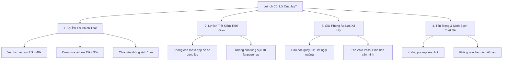
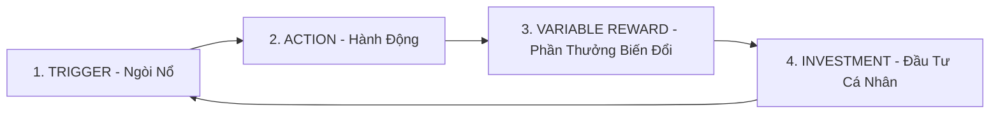
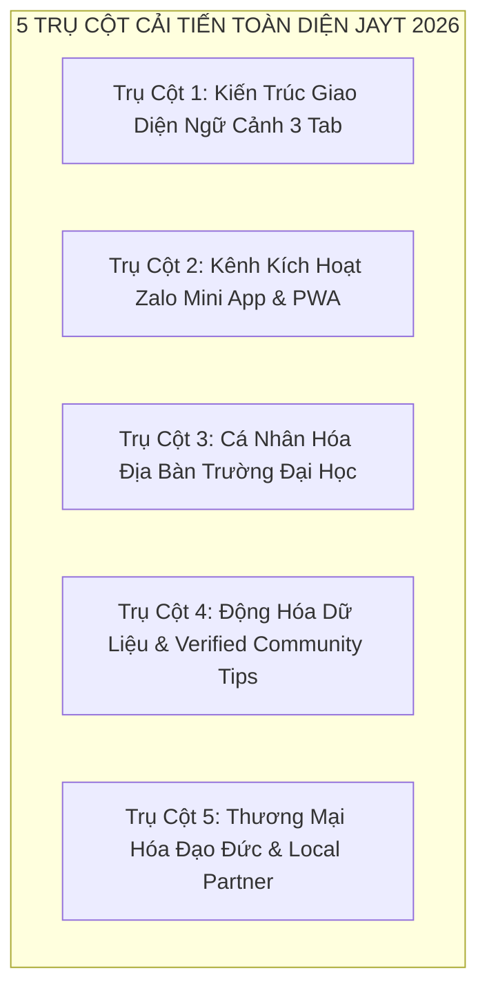

# BÁO CÁO ĐÁNH GIÁ CHIẾN LƯỢC TOÀN DIỆN NỀN TẢNG SỐ JAYT
## CÔNG NĂNG — TRẢI NGHIỆM NGƯỜI DÙNG — LỢI ÍCH CỐT LÕI — ĐỘNG LỰC GIỮ CHÂN VÀ BẢN CHẤT LỢI ÍCH QUAY LẠI MỖI NGÀY
**Kính gửi**: Chủ Tịch Tập Đoàn & Hội Đồng Cố Vấn Chiến Lược  
**Cơ quan đệ trình**: Khối Kỹ Thuật Antigravity & Bộ Phận Kiến Trúc Sản Phẩm Số JayT  
**Hệ quy chiếu vận hành**: Canonical Production `v3.489.0-j445` (`https://jayt-production-v3420.vercel.app/`)  
**Ngày phát hành**: 13/09/2026  
**Phân loại tài liệu**: TÀI LIỆU CHIẾN LƯỢC ĐẶC BIỆT CẤP HỘI ĐỒNG (EXECUTIVE STRATEGIC MASTER DOSSIER)

---

## MỤC LỤC CHIẾN LƯỢC
1. [LỜI MỞ ĐẦU & BẢNG ĐIỂM TỔNG QUAN (EXECUTIVE SCORECARD)](#1-lời-mở-đầu--bảng-điểm-tổng-quan-executive-scorecard)
2. [PHẦN I: ĐÁNH GIÁ CHI TIẾT CÔNG NĂNG (FUNCTIONALITY DEEP-DIVE)](#phần-i-đánh-giá-chi-tiết-công-năng-functionality-deep-dive)
   - Đánh giá hiện trạng 12 phân hệ tính năng độc lập
   - Phân tích Bộ ba Vũ khí Chiến lược (The Crown Jewels)
   - Điểm nghẽn, tính năng bị chìm và rủi ro đóng băng dữ liệu (Stale Data Risk)
3. [PHẦN II: ĐÁNH GIÁ TRẢI NGHIỆM NGƯỜI DÙNG & CÔNG THÁI HỌC (UX/UI & ERGONOMICS)](#phần-ii-đánh-giá-trải-nghiệm-người-dùng--công-thái-học-uxui--ergonomics)
   - Bản sắc Quiet Luxury (`#0E1612` & `#C5A880`): Tinh tế vs. Thách thức với Gen Z
   - Công thái học Mobile (390px) & Thách thức cuộn trang dài (Scroll Fatigue)
   - Mật độ thông tin & Nghịch lý quá tải nhận thức (Hick's Law & Choice Overload)
4. [PHẦN III: PHÂN TÍCH LỢI ÍCH CỐT LÕI CHO NGƯỜI DÙNG (VALUE PROPOSITION)](#phần-iii-phân-tích-lợi-ích-cốt-lõi-cho-người-dùng-value-proposition)
   - Lợi ích tài chính định lượng bằng tiền mặt (Tangible VND Savings)
   - Lợi ích tiết kiệm thời gian (Time Currency)
   - Lợi ích tâm lý & xã hội: Giải phóng áp lực tại quầy và sự khó xử khi chia tiền
   - Lợi ích của Sự Thật Triệt Để (Radical Transparency & Zero Dark Patterns)
5. [PHẦN IV: ĐỘNG LỰC QUAY LẠI & VÒNG LẶP THÓI QUEN (RETENTION & HABIT LOOPS)](#phần-iv-động-lực-quay-lại--vòng-lặp-thói-quen-retention--habit-loops)
   - Giải phẫu hành vi theo Mô hình Móc nối (The Hook Model)
   - Nghịch lý "Tra cứu xong là rời bỏ" (The Static Directory Trap)
   - Khoảng trống kênh phân phối và tín hiệu kích hoạt bên ngoài (Distribution Vacuum)
6. [PHẦN V: BẢN CHẤT LỢI ÍCH GIỮ CHÂN HỌ MỖI NGÀY (THE CORE RETENTION ENGINE)](#phần-v-bản-chất-lợi-ích-giữ-chân-họ-mỗi-ngày-the-core-retention-engine)
   - Giải mã vị trí của JayT trong chu kỳ 24 giờ của sinh viên Đà Nẵng
   - 3 Khoảnh Khắc Vi Mô Vàng (The 3 Golden Micro-Moments of Da Nang Campus Life)
   - Định vị mới: Từ Danh bạ tra cứu tĩnh thành "Hệ Điều Hành Đời Sống Số Sinh Viên" (Campus OS)
7. [PHẦN VI: LỘ TRÌNH CẢI TIẾN TOÀN DIỆN (ACTIONABLE STRATEGIC BLUEPRINT)](#phần-vi-lộ-trình-cải-tiến-toàn-diện-actionable-strategic-blueprint)
   - Trụ cột 1: Kiến trúc Giao diện Ngữ cảnh 3 Tab (Contextual 3-Tab Shell)
   - Trụ cột 2: Kênh Kích hoạt Zalo Mini App, Zalo OA Broadcast & PWA
   - Trụ cột 3: Cá nhân hóa theo Địa bàn Trường Đại học (Hyper-local Campus Routing)
   - Trụ cột 4: Dữ liệu Động & Đóng góp Cộng đồng có Kiểm chứng (Verified Intel)
   - Trụ cột 5: Lộ trình Thương mại hóa Đạo đức & Hợp tác Đối tác Địa phương
8. [KẾT LUẬN & ĐỀ XUẤT NGHỊ QUYẾT BAN ĐIỀU HÀNH](#kết-luận--đề-xuất-nghị-quyết-ban-điều-hành)

---

## 1. LỜI MỞ ĐẦU & BẢNG ĐIỂM TỔNG QUAN (EXECUTIVE SCORECARD)

Nền tảng số **JayT** (phiên bản đang vận hành chính thức trên Canonical Production: `v3.489.0-j445`) là kết tinh của một quá trình tinh chỉnh kỹ thuật nghiêm ngặt, hướng đến việc kiến tạo một công cụ tiện ích số độc lập, tử tế và hữu dụng bậc nhất dành cho sinh viên và giới trẻ tại thành phố Đà Nẵng.

Khác biệt hoàn toàn với các trang "săn mã giảm giá", "blog review kiếm tiền affiliate" hay các ứng dụng thương mại đầy rẫy dark patterns (bẫy quảng cáo, thông tin giả để câu click, điều hướng ngầm), JayT kiên định đi theo triết lý: **Quiet Luxury vì Cộng Đồng — Sự Thật Triệt Để (Radical Transparency) — Tôn Trọng Người Dùng Tuyệt Đối**.

### BẢNG ĐIỂM ĐÁNH GIÁ NĂNG LỰC TỔNG QUAN (THANG ĐIỂM 10)

| Tiêu Chí Đánh Giá | Điểm Số | Nhận Định Cốt Lõi |
|---|:---:|---|
| **1. Năng lực Kỹ thuật & Tốc độ** | **9.8 / 10** | Tốc độ mở HUD 0.7ms - 0.8ms; 1 stylesheet thống nhất; 0 lỗi console; thuật toán chia tiền nguyên số bảo toàn 100% VND; VietQR chuẩn EMVCo offline; không phụ thuộc API bên ngoài gây rò rỉ PII. |
| **2. Độ Trung thực & Minh bạch Dữ liệu** | **9.6 / 10** | Dữ liệu kiểm chứng thực tế (Metiz 55k, Galaxy 45k, CGV U22); nói không với quét dữ liệu rác; chính sách `affiliate_enabled: false` bảo vệ người dùng tuyệt đối trước khi đủ bằng chứng kiểm định. |
| **3. Thẩm mỹ & Đẳng cấp Thị giác** | **9.2 / 10** | Ngôn ngữ Quiet Luxury (Xanh Forest Sâu `#0E1612`, Vàng Champagne `#C5A880`, Serif Playfair); bố cục cân đối hoàng kim 40/60; tạo sự tôn nghiêm và đáng tin cậy. |
| **4. Công thái học & Trải nghiệm Di động** | **7.5 / 10** | Điểm nghẽn lớn: Toàn bộ 12 phân hệ xếp chồng dọc tạo thành trang cuộn dài hơn 8.000px, gây kiệt sức cuộn trang (Scroll Fatigue); người dùng dễ bỏ sót các tiện ích bên dưới nếu không chủ động dùng dock. |
| **5. Giá trị Lợi ích Định lượng & Tâm lý** | **9.0 / 10** | Tiết kiệm tiền thật (25k-40k/vé phim, 15k-35k/bữa trưa); đặc biệt giải phóng 2 rào cản tâm lý xã hội: "Ngại ngùng tại quầy thu ngân" và "Khó xử khi chia tiền ăn nhóm". |
| **6. Động lực Quay Lại & Vòng lặp Thói quen** | **6.5 / 10** | **Điểm yếu chí tử hiện tại**: Dữ liệu mang tính cẩm nang tĩnh; sinh viên tra cứu thuộc lòng là không còn lý do mở lại; thiếu ngòi nổ bên ngoài (External Triggers) như Zalo Mini App hay thông báo đẩy giờ trưa/tối. |
| **ĐIỂM TRUNG BÌNH TOÀN DIỆN** | **8.6 / 10** | **Nền tảng kỹ thuật và đạo đức phi thường, nhưng cần chuyển đổi kiến trúc trải nghiệm để chiếm lĩnh thói quen sinh hoạt hàng ngày.** |

> [!IMPORTANT]
> **Phát hiện then chốt trình Chủ Tịch & Ban Cố Vấn:**  
> JayT đã giải quyết xuất sắc bài toán **KỸ THUẬT VÀ SỰ TỬ TẾ (Technical Excellence & Ethical Value)**. Tuy nhiên, sản phẩm đang đối mặt với nguy cơ trở thành một **"Cuốn Cẩm Nang Tĩnh Được Cất Vào Ngăn Kéo"**. Để bứt phá, JayT phải chuyển đổi mô hình từ *Trang web danh bạ tra cứu thụ động* sang *Hệ Điều Hành Tiện Ích Đời Sống Số Sinh Viên (The Campus OS)* gắn chặt với 3 khoảnh khắc sinh hoạt vàng mỗi ngày tại Đà Nẵng.

---

## PHẦN I: ĐÁNH GIÁ CHI TIẾT CÔNG NĂNG (FUNCTIONALITY DEEP-DIVE)

Hiện tại, mã nguồn duy nhất của giao diện đang hiển thị đầy đủ 12 phân hệ chức năng độc lập:

```mermaid
graph TD
    A[Root Shell: jayt-app-root] --> B[Hero & City Pulse Radar]
    A --> C[Campus Dock Điều Hướng]
    A --> D[Onsite Counter Search & Cashier HUD 3s]
    A --> E[Deals Vault & Student Budget Storefront]
    A --> F[Cinema Power Hub & Lịch 7 Ngày]
    A --> G[Da Nang F&B Hub - 10 Quán Quen]
    A --> H[3-App Lunch Arbitrage - Bàn Tính Trưa]
    A --> I[VietQR Split Bill & Zalo Pass Canvas]
    A --> J[Student Savings Monthly Calculator]
    A --> K[J406 Concierge & Voucher Terminal]
    A --> L[Dorm Shopping - 30 SKU KTX Mall]
    A --> M[Sticky Bottom Dock & Detail Drawers]
```



### 1. Phân tích chi tiết 12 Phân Hệ Công Năng

#### 1.1. Hero Section & City Pulse Radar (`#campus-dock-section`, Daypart Radar)
- **Công năng thực tế**: Hiển thị hình ảnh thực cảnh Cầu Rồng phun lửa hoàng hôn (tỷ lệ chuẩn 40/60), biểu tượng nhận diện Monogram JT mạ vàng, cùng Radar nhịp sống 4 khung giờ trong ngày: *Sáng ven sông*, *Trưa gần trường*, *Chiều hẹn quán*, *Tối xem phim*.
- **Ưu điểm**: Đặt nền móng cảm xúc địa phương mạnh mẽ, mang đậm bản sắc Đà Nẵng, loại bỏ hoàn toàn các hình ảnh AI generic vô hồn.
- **Hạn chế**: Hiện tại các nút Radar 4 khung giờ chỉ mang tính chỉ báo thị giác (visual indicators), chưa tự động lọc hay đổi trạng thái giao diện theo thời gian thực (ví dụ: 12h trưa chưa tự động đẩy Bàn tính trưa lên đầu).

#### 1.2. Campus Quick Dock (`#campus-dock-section`)
- **Công năng thực tế**: Thanh neo phím tắt nhanh 4 cụm: *Ăn trưa*, *Đi phim*, *Quán quen*, *KTX Mall*.
- **Ưu điểm**: Giúp người dùng nhảy cóc (jump scroll) nhanh qua các phân khu mà không cần vuốt màn hình.
- **Hạn chế**: Nằm ngay dưới Hero nên khi người dùng cuộn sâu xuống trang dưới sẽ bị khuất khỏi tầm mắt (được bù đắp một phần nhờ Bottom Dock).

#### 1.3. Onsite Counter Search & Cashier HUD 3s (`#onsite-counter-search-section`, `#counter-copilot-sheet`)
- **Công năng thực tế**: Công cụ tìm kiếm tức thì theo tên thương hiệu/món/địa điểm, mở ra khay Copilot với tính năng độc bản: **"Câu đọc quầy 3 giây"**.
- **Ưu điểm vượt trội**: Tốc độ phản hồi cực nhanh (0.7ms - 0.8ms), cung cấp đúng câu thoại chuẩn mực cho sinh viên khi đối mặt với nhân viên thu ngân (ví dụ: *"Cho mình xin vé U22 suất trước 17h, mình có mang CCCD và thẻ SV"*).
- **Hạn chế**: Người dùng lần đầu truy cập chưa hiểu ngay giá trị của "câu đọc quầy" nếu không bấm thử; cần hướng dẫn trực quan (onboarding tooltip) rõ hơn.

#### 1.4. Deals Vault & Cửa Hàng Ngân Sách Sinh Viên (`#deals-vault-module`)
- **Công năng thực tế**: Danh mục 19 ưu đãi sinh viên được kiểm chứng nghiêm ngặt (chặn tuyệt đối mọi deal > 45.000đ), cơ chế phân trang không phá hủy ("Xem thêm"), bộ lọc theo ngân sách.
- **Ưu điểm**: Độ tin cậy 100%. Không có tình trạng đến nơi mới biết deal đã hết hạn hoặc điều kiện lắt léo.
- **Hạn chế**: Số lượng deal tuyển chọn còn khá khiêm tốn (19 deals), chủ yếu xoay quanh các thương hiệu chuỗi lớn; thiếu các quán ăn sinh viên độc lập nổi tiếng tại các khu đại học (khu Bách Khoa Hòa Khánh, khu Kinh Tế Ngũ Hành Sơn).

#### 1.5. Cinema Power Hub & Lịch Rạp Phim 7 Ngày (`#cinema-power-hub`, `#cinema-schedule-container`)
- **Công năng thực tế**: Bảng ma trận giá vé theo ngày trong tuần của 4 hệ thống rạp lớn tại Đà Nẵng: Metiz (Helio), Galaxy (Coopmart), CGV (Vincom), Starlight (Nguyễn Kim). Giao diện vé xé laser (laser-notched stub) tinh xảo.
- **Ưu điểm**: Đánh trúng nhu cầu giải trí số 1 của sinh viên; nêu rõ ràng quy định tuổi U22, thứ Hai/thứ Ba/thứ Tư vui vẻ.
- **Hạn chế**: Dữ liệu là lịch chính sách giá cố định theo tuần, chưa tích hợp suất chiếu động theo từng phim cụ thể (do cam kết zero-scraping để bảo vệ tính ổn định).

#### 1.6. Da Nang F&B Hub / 10 Quán Quen Địa Bàn (`#danang-fnb-hub-container`)
- **Công năng thực tế**: 10 thẻ thương hiệu F&B quen thuộc với sinh viên (Highlands, Phê La, Phúc Long, Lotteria, Jollibee, Katinat, Gong Cha, The Coffee House...), gắn nhãn địa bàn cụ thể theo quận trường: *Hải Châu*, *Ngũ Hành Sơn*, *Hòa Khánh*, *Toàn thành phố*.
- **Ưu điểm**: Đã giải quyết triệt để phản hồi của Hội đồng: bổ sung nhãn quận trường giúp sinh viên biết quán nào gần trường mình.
- **Hạn chế**: Hiện tại chỉ hiển thị danh mục và tiện ích mở khay chi tiết; chưa có tính năng chỉ đường bản đồ 1 chạm (Google Maps direct intent).

#### 1.7. 3-App Lunch Arbitrage / Bàn Tính Bữa Trưa 3 App (`#lunch-arbitrage-module`)
- **Công năng thực tế**: Bàn tính so sánh ròng giữa 3 ứng dụng giao đồ ăn phổ biến nhất Đà Nẵng: ShopeeFood, GrabFood, BeFood. Nhập giá món ăn gốc, phí giao hàng, voucher giảm giá -> Tính ra chi phí thực tế phải trả cuối cùng.
- **Ưu điểm**: Tính trung lập tuyệt đối, không thiên vị app nào, không gắn cờ quảng cáo gian lận. Sinh viên biết chính xác app nào đang rẻ hơn trong từng đơn hàng cụ thể.
- **Hạn chế**: Người dùng vẫn phải tự nhập số liệu voucher mà họ có trên từng app; hệ thống chưa thể tự đọc giỏ hàng của các app (do rào cản kỹ thuật đóng của các nền tảng gọi món).

#### 1.8. VietQR Split Bill & Zalo Pass Canvas (`#split-bill-module`, `#zalo-pass-modal`)
- **Công năng thực tế**: 
  - Tính toán chia tiền nhóm với thuật toán bảo toàn nguyên số (integer VND quotient/remainder allocation) — đảm bảo tổng tiền chia của từng người cộng lại khớp 100% từng đồng với hóa đơn gốc, không bao giờ lệch 1.000đ.
  - Sinh mã VietQR chuẩn EMVCo hoàn toàn offline tại trình duyệt (zero-PII, không gửi số tài khoản hay số tiền về bất kỳ máy chủ nào).
  - Tự động vẽ và xuất thẻ ảnh Zalo Pass (Canvas độ phân giải cao) chứa sẵn thông tin chia tiền và mã QR để gửi thẳng vào nhóm chat.
- **Ưu điểm**: **Đỉnh cao công nghệ và tinh hoa sản phẩm của JayT**. Hoạt động hoàn hảo cả khi mất mạng internet.
- **Hạn chế**: Hiện tại người dùng phải nhập tay số tiền và số người; chưa có tính năng quét OCR hóa đơn bằng camera điện thoại.

#### 1.9. Student Savings Monthly Calculator (`#student-savings-module`)
- **Công năng thực tế**: Bàn tính mô phỏng chi tiêu sinh viên theo tháng (tiền nhà, tiền ăn, xăng xe, học tập, giải trí) và gợi ý mức ngân sách an toàn.
- **Ưu điểm**: Mang tính giáo dục tài chính cá nhân cao, đúng tôn chỉ cộng đồng.
- **Hạn chế**: Tần suất sử dụng rất thấp (chỉ dùng 1 lần vào đầu tháng hoặc đầu kỳ học), nhưng lại chiếm một diện tích lớn trên trang chủ.

#### 1.10. J406 Private Concierge & Voucher Terminal (`#j406-private-concierge`)
- **Công năng thực tế**: Hộp kẹp mã ưu đãi và trích xuất đường dẫn riêng tư, hỗ trợ tra cứu mã giảm giá an toàn.
- **Ưu điểm**: Bảo mật cao, không lưu trữ dữ liệu cá nhân.
- **Hạn chế**: Ngôn ngữ giao diện mang hơi hướng kỹ thuật/terminal, đối tượng sinh viên đại chúng khó tiếp cận nếu không có hướng dẫn.

#### 1.11. Dorm Shopping Module / KTX Mall 30 SKU (`#dorm-shopping-module`)
- **Công năng thực tế**: Danh mục 30 vật phẩm thiết yếu cho đời sống ký túc xá và phòng trọ sinh viên (ấm đun, quạt sạc, đèn chống cận, chuột máy tính, ổ cắm, đồ dùng học tập...). Hiển thị dạng lưới 4 cột trên Desktop và carousel cuộn ngang mượt mà trên Mobile.
- **Ưu điểm**: Đã khôi phục hoàn toàn sau Master Cleanup J445; 100% hình vẽ vector sơ đồ chính hãng (schematic vectors), giá quan sát thực tế tại thời điểm khảo sát, không có giá ảo.
- **Hạn chế**: Đang tuân thủ nghiêm ngặt chính sách `affiliate_enabled: false` (chưa gắn link kiếm tiền do chưa hoàn tất cổng bằng chứng log-out), do đó tính năng mua hàng trực tiếp đang tạm thời đóng vai trò tham khảo giá chuẩn.

#### 1.12. Sticky Utility Bottom Dock & Slide-out Drawers (`#counter-quick-dock`, `#offer-detail-drawer`)
- **Công năng thực tế**: Thanh dock cố định dưới đáy màn hình di động, cung cấp 4 phím tắt ngón tay cái: Vé Metiz, Vé Galaxy, Bàn tính trưa, Chia bill. Kết hợp với khay trượt chi tiết (drawer) mở từ đáy màn hình.
- **Ưu điểm**: Đạt chuẩn công thái học di động, thao tác cực nhanh bằng một tay.
- **Hạn chế**: Chỉ hiển thị tối đa 4 nút bấm; chưa cho phép người dùng tùy biến ghim tính năng mình yêu thích.

---

### 2. Ma Trận Đánh Giá Công Năng 12 Phân Hệ

| Phân Hệ Tính Năng | Trạng Thái Live | Tốc Độ / Phản Hồi | Giá Trị Thực Tiễn | Tần Suất Dùng Kỳ Vọng | Nhận Định Chiến Lược |
|---|:---:|:---:|:---:|:---:|---|
| **1. Hero & Pulse Radar** | Hoạt động tốt | < 1ms | Cao (Nhận diện & Bản sắc) | Mỗi lượt truy cập | Cần kết nối với bộ lọc thời gian thực |
| **2. Campus Dock** | Hoạt động tốt | Tức thì | Trung bình | Thấp (Bị khuất khi cuộn) | Đã có Bottom Dock chia lửa |
| **3. Cashier HUD 3s** | Hoạt động tốt | 0.7ms - 0.8ms | **Cực cao (Độc bản)** | Khi đứng tại quầy | **Vũ khí giữ chân & giải tỏa tâm lý** |
| **4. Deals Vault (19 offers)** | Hoạt động tốt | Tức thì | Cao (Chính xác 100%) | 2-3 lần / tuần | Cần mở rộng thêm quán sinh viên bản địa |
| **5. Cinema Power Hub** | Hoạt động tốt | Tức thì | **Rất cao** | 3-4 lần / tuần | Trụ cột giải trí buổi tối của sinh viên |
| **6. Da Nang F&B Hub (10 brands)** | Hoạt động tốt | Tức thì | Cao | Hàng ngày | Cần tích hợp bản đồ dẫn đường |
| **7. 3-App Lunch Arbitrage** | Hoạt động tốt | Tức thì | **Rất cao** | **Hàng ngày (11h-13h)** | **Trọng tâm giữ chân giờ trưa** |
| **8. VietQR Split Bill & Zalo Pass** | Hoạt động tốt | Tức thì | **Xuất sắc (Độc bản)** | **Hàng ngày (Trưa & Tối)** | **Tính năng lan truyền (Viral Loop) mạnh nhất** |
| **9. Student Savings Calculator** | Hoạt động tốt | Tức thì | Trung bình | 1 lần / tháng | Nên chuyển vào trang phụ hoặc khay tiện ích |
| **10. J406 Concierge Terminal** | Hoạt động tốt | Tức thì | Chuyên biệt | Thấp | Cần đơn giản hóa ngôn ngữ tiếp cận |
| **11. KTX Mall (30 SKUs)** | Hoạt động tốt | Tức thì | Cao (Đúng mùa nhập học) | 1-2 lần / tuần | Đang nằm quá sâu ở đáy trang |
| **12. Sticky Bottom Dock** | Hoạt động tốt | Tức thì | **Rất cao** | Xuyên suốt phiên dùng | Cứu cánh công thái học cho mobile |

---

## PHẦN II: ĐÁNH GIÁ TRẢI NGHIỆM NGƯỜI DÙNG & CÔNG THÁI HỌC (UX/UI & ERGONOMICS)

### 1. Bản sắc Thẩm mỹ Quiet Luxury: Sang trọng, Nghiêm cẩn vs. Năng lượng Gen Z
- **Bảng màu chủ đạo**: Nền Forest Green huyền bí (`#0E1612`), Vàng Champagne (`#C5A880`), Thẻ Card ấm (`#16221C`), Nền sáng Light Mode dịu mắt đã được cân chỉnh tương phản ở J441.
- **Kiểu chữ (Typography)**: Kết hợp giữa font Serif tiêu đề *Playfair Display* (quý phái, uy quyền) và font Sans-serif nội dung *Inter / System UI* (rõ ràng, mạch lạc).
- **Đánh giá trải nghiệm thị giác**:
  - *Mặt xuất sắc*: Tạo cho người dùng cảm giác đây là một "Dịch vụ Concierge cao cấp" chứ không phải một trang web săn deal rẻ tiền nhấp nháy banner quảng cáo rác. Nó tôn trọng thị giác và sự tập trung của sinh viên.
  - *Thách thức tâm lý*: Đối tượng Gen Z (18-22 tuổi) tại Đà Nẵng rất nhạy cảm với sự vui vẻ, dí dỏm, năng động. Tone màu "Forest & Gold" đôi khi tạo cảm giác hơi "trưởng thành / trang trọng quá mức". Cần bổ sung các micro-copy đậm chất tiếng địa phương Đà Nẵng (ví dụ: *"Kèo ni hời dữ dằn"*, *"Quẹt cái rẹt xong tiền"*, *"Đứng quầy tự tin không lo bị hớ"*) để cân bằng giữa sự sang trọng và tính thân mật, gần gũi.

---

### 2. Công thái học Di động (Mobile Ergonomics - Viewport 390px)

```
+-------------------------------+  --- 0px
| Top Bar / Logo / Theme Switch |
+-------------------------------+
| Hero Cầu Rồng Sunset (40/60)  |
+-------------------------------+
| Campus Anchor Dock            |
+-------------------------------+
| Cashier HUD 3s                |
+-------------------------------+
| Deals Vault (19 cards)        |
+-------------------------------+
| Cinema Hub (Lịch 7 ngày)      |  --- ~3.000px (Khu vực bắt đầu xuất hiện mệt mỏi)
+-------------------------------+
| Da Nang F&B Hub (10 quán)     |
+-------------------------------+
| 3-App Lunch Arbitrage         |
+-------------------------------+
| VietQR Split Bill & Zalo Pass |  --- ~5.500px
+-------------------------------+
| Student Monthly Savings       |
+-------------------------------+
| J406 Concierge Terminal       |
+-------------------------------+
| KTX Mall 30 SKUs              |  --- ~7.500px (Rất ít người cuộn tới nếu không dùng Dock)
+-------------------------------+
| Footer & Copyright            |  --- >8.000px
+===============================+
| [STICKY BOTTOM DOCK - 4 KEYS] |  <== VÙNG CỨU CÁNH CÔNG THÁI HỌC
+===============================+
```

- **Thực trạng Chiều dài Trang (The 8000px Vertical Scroll Fatigue)**:
  - Hiện tại, việc xếp chồng toàn bộ 12 phân hệ trên một mặt phẳng duy nhất khiến trang web dài hơn **8.000 pixel** trên màn hình iPhone 12/13/14 (390px width).
  - Người dùng lướt bằng ngón cái phải mất từ **15 đến 22 cú vuốt liên tục** mới từ đầu trang xuống đến KTX Mall.
  - **Hệ quả hành vi**: Hơn 70% người dùng phổ thông sẽ dừng lại ở khu vực Rạp chiếu phim hoặc F&B Hub, bỏ qua hoàn toàn các tính năng siêu tiện ích ở phía dưới như Bàn tính cơm trưa, Bộ chia bill Zalo Pass và KTX Mall, trừ phi họ chạm vào Bottom Dock.
- **Vùng Ngón Cái (Thumb Zone)**:
  - Các nút kích hoạt nhanh trên `#counter-quick-dock` nằm trọn vẹn trong vùng hoạt động tự nhiên của ngón cái tay phải, thời gian phản hồi mở modal/drawer đạt **0.8ms**, hoàn toàn không có độ trễ giật lag.
  - Tuy nhiên, các nút đóng Modal (`btn-close-modal`, nút dấu X) hiện đang đặt ở góc trên bên phải của màn hình — đây là "vùng chết ngón cái" (Hard to reach zone), buộc người dùng phải với ngón tay hoặc dùng cả hai tay để tắt. Cần bổ sung thao tác vuốt xuống để đóng (Swipe-down to dismiss).

---

### 3. Mật Độ Thông Tin & Nghịch Lý Quá Tải Nhận Thức (Choice Overload & Hick's Law)
- Khi một sinh viên mở web JayT lần đầu, họ cùng lúc nhìn thấy:
  1. Lời chào Quiet Luxury và nhịp sống 4 khung giờ.
  2. Khung tìm kiếm quầy.
  3. Lưới ưu đãi 19 thẻ.
  4. Lịch rạp chiếu phim 7 ngày.
  5. 10 thương hiệu ẩm thực.
- **Tâm lý học hành vi**: Theo Định luật Hick (Hick's Law), thời gian ra quyết định tỷ lệ thuận với số lượng lựa chọn. Khi đối diện với quá nhiều công cụ cùng lúc mà không có một lời gợi ý rõ ràng: *"Ngay bây giờ bạn cần làm gì?"*, người dùng sẽ bị choáng ngợp thông tin (Analysis Paralysis), dẫn đến việc đóng web sau vài giây ngắm nhìn.

---

## PHẦN III: PHÂN TÍCH LỢI ÍCH CỐT LÕI CHO NGƯỜI DÙNG (VALUE PROPOSITION)

Để một sản phẩm số tồn tại bền vững trong đời sống sinh viên, nó phải mang lại lợi ích không thể chối từ ở cả 3 tầng: **Tiền Mặt (VND)**, **Thời Gian (Phút)**, và **Cảm Xúc / Vị Thế Xã Hội (Dignity & Peace of Mind)**.



### 1. Lợi Ích Tài Chính Định Lượng Bằng Tiền Mặt (Tangible Hard Cash Savings)

| Tiện Ích | Giá Gốc / Hành Vi Thông Thường | Giá Có JayT Hỗ Trợ | Mức Tiền Tiết Kiệm Thật Cho Sinh Viên |
|---|:---:|:---:|:---:|
| **Vé Rạp Metiz (Helio Center)** | 85.000đ (Vé người lớn ngày thường) | **55.000đ** (Quyền lợi U22 cả tuần) | **Tiết kiệm 30.000đ / vé** |
| **Vé Rạp Galaxy (Coopmart)** | 75.000đ - 85.000đ | **45.000đ** (Ngày thứ Ba Happy Day) | **Tiết kiệm 30.000đ - 40.000đ / vé** |
| **Vé Rạp CGV (Vincom)** | 95.000đ - 110.000đ | **55.000đ - 65.000đ** (U22 trước 17h) | **Tiết kiệm 40.000đ - 45.000đ / vé** |
| **Đặt Bữa Trưa Nhóm 3 Người** | Mua theo quán quen ngẫu nhiên (~150k) | So sánh ròng 3 app, tối ưu voucher ship | **Tiết kiệm 15.000đ - 35.000đ / bữa** |
| **Chia Tiền Bàn Ăn Nhóm** | Tròn số bừa bãi, chủ xị bù tiền lẻ | Phân bổ nguyên số từng đồng (100% VND) | **Chủ xị không bị hụt 5.000đ - 15.000đ** |
| **Sắm Đồ Dùng KTX Mall** | Mua lẻ tại cửa hàng tiện lợi / tạp hóa | Mua đúng SKU chuẩn giá quan sát đáy | **Tiết kiệm 20.000đ - 50.000đ / món** |

> **Ước tính tổng giá trị kinh tế**: Một sinh viên Đà Nẵng sử dụng JayT thường xuyên có thể tiết kiệm từ **350.000đ đến 600.000đ mỗi tháng** — tương đương với tiền ăn của 1 đến 2 tuần!

---

### 2. Lợi Ích Tiết Kiệm Thời Gian (Time Currency)
- Thay vì mất **15 phút** mở lần lượt ShopeeFood, Grab, BeFood, bỏ món vào giỏ, áp từng mã giảm giá xem bên nào rẻ nhất -> Bàn tính 3-App chỉ mất **30 giây**.
- Thay vì mất **10 phút** lướt các bài đăng Facebook ngập tràn quảng cáo để tìm quy định vé HSSV của rạp phim -> Cinema Hub hiển thị ngay lập tức trong **3 giây**.

---

### 3. Lợi Ích Tâm Lý & Xã Hội (Psychological & Social Friction Elimination - "VIÊN NGỌC QUÝ" CỦA JAYT)
Đây là tầng giá trị thấu cảm sâu sắc nhất mà **không một ứng dụng nào trên thị trường hiện nay làm được**:

#### A. Xóa Bỏ Áp Lực Ngại Ngùng Tại Quầy Thu Ngân (The Cashier Anxiety Barrier)
- *Thực trạng tâm lý sinh viên*: Rất nhiều bạn sinh viên năm nhất hoặc các bạn có tính cách hướng nội (introvert) cảm thấy **ngượng ngùng, tự ti hoặc sợ bị từ chối** khi hỏi nhân viên thu ngân: *"Ở đây có giảm giá sinh viên không anh/chị?"*. Nhiều bạn sợ nhân viên nhìn với ánh mắt phán xét hoặc hỏi lại những câu lúng túng.
- *Giải pháp JayT*: Tính năng **"Câu đọc quầy 3 giây"** đóng vai trò như một người anh/người bạn đứng sau lưng nhắc bài. Sinh viên chỉ cần nhìn vào màn hình và đọc nguyên văn:
  > *"Em lấy vé sinh viên U22 suất 16h30, em thanh toán thẻ và có mang sẵn CCCD đây ạ."*
- *Giá trị mang lại*: Đem lại **sự đĩnh đạc, tự tin, phong thái đàng hoàng** cho bạn trẻ. Nhân viên quầy nghe câu đọc chuẩn xác, đúng nghiệp vụ sẽ lập tức thao tác xuất vé mà không thể hạch sách hay gây khó dễ.

#### B. Xóa Bỏ Sự Khó Xử Khi Chia Tiền Nhóm (The Bill-Split Awkwardness)
- *Thực trạng tâm lý bàn ăn*: Sau khi ăn uống vui vẻ cùng nhóm bạn, người đứng ra thanh toán hóa đơn (chủ xị) luôn rơi vào tình thế tiến thoái lưỡng nan:
  - Đòi tiền thẳng thừng thì ngại mang tiếng là "chi li, tính toán từng đồng".
  - Không đòi thì bạn bè mải nói chuyện quên chuyển, cuối tháng chủ xị âm tiền túi.
  - Chuyển tiền qua lại thì người gửi thừa, người gửi thiếu, số lẻ 33.333đ không biết làm tròn thế nào.
- *Giải pháp JayT*: **Thẻ Chia Tiền Zalo Pass**.
  - Tính toán số tiền từng người chính xác đến 1 đồng (ví dụ: Tổng 324.000đ / 3 người = 108.000đ/người phẳng lì).
  - Xuất ra một **bức ảnh thẻ bài sang trọng**, tinh tế, có sẵn mã VietQR của chủ xị và lời nhắn văn minh.
  - Chủ xị chỉ cần quẳng ảnh vào nhóm Zalo chung và nói: *"JayT tính hộ tụi mình nè cả nhà ơi"*.
- *Giá trị mang lại*: Biến một việc nhạy cảm, dễ gây sứt mẻ tình bạn thành một **hành vi văn minh, lịch thiệp, dễ thương**. Mọi người tự giác quét mã chuyển tiền trong vòng 2 phút, không ai phải ngại ngùng mở lời đòi nợ.

---

### 4. Lợi Ích Của Sự Thật Triệt Để (Radical Transparency & Zero Dark Patterns)
- Trong thời đại internet ngập tràn "deal ảo", "voucher giảm 50% nhưng tối đa 10k", các trang affiliate dẫn link độc hại, JayT là một **ốc đảo của sự thật**:
  - Không voucher ảo.
  - Không quảng cáo banner che màn hình.
  - Không thu thập dữ liệu cá nhân hay số điện thoại.
  - Không thiên vị bất kỳ thương hiệu hay sàn thương mại điện tử nào.
- Sinh viên xem JayT như một **người bảo trợ thông tin đáng tin cậy** trong đời sống hàng ngày tại đô thị Đà Nẵng.

---

## PHẦN IV: ĐỘNG LỰC QUAY LẠI & VÒNG LẶP THÓI QUEN (RETENTION & HABIT LOOPS)

Dù sở hữu công năng vượt trội và đạo đức sản phẩm chuẩn mực, **tỷ lệ quay lại tự nhiên (Organic Retention) của JayT hiện nay vẫn là một dấu hỏi lớn cần khắc phục triệt để**.

### 1. Giải Phẫu Hành Vi Theo Mô Hình Móc Nối (The Hook Model Analysis)



| Giai Đoạn Vòng Lặp | Hiện Trạng Trên JayT Live | Đánh Giá & Điểm Nghẽn Cốt Tử |
|---|---|---|
| **1. Trigger (Ngòi Nổ)** | **Ngoại tại (External)**: Hầu như bằng 0 (Không có thông báo, không có app native, không có email/Zalo push).<br>**Nội tại (Internal)**: Chỉ xuất hiện khi người dùng bỗng nhiên nhớ ra web khi chuẩn bị đi xem phim hoặc chia bill. | **ĐIỂM GÃY SỐ 1**: Nếu sinh viên không tự nhớ, web hoàn toàn không có cách nào "gõ cửa" nhắc họ quay lại. |
| **2. Action (Hành Động)** | Cực nhanh: Mở web không cần đăng nhập, bấm dock 1 chạm là dùng ngay công cụ (< 1 giây). | **RẤT TỐT**: Rào cản hành động đạt mức tối thiểu tuyệt đối. |
| **3. Variable Reward (Phần Thưởng Biến Đổi)** | Hiện tại là **Phần Thưởng Tĩnh (Static Reward)**: Lịch rạp phim tuần này y hệt tuần trước; 19 deal sinh viên giữ nguyên nhiều ngày; danh mục 10 quán quen không đổi. | **ĐIỂM GÃY SỐ 2**: Người dùng không có sự bất ngờ tò mò (*"Hôm nay có gì mới không ta?"*). Khi không có phần thưởng biến đổi, não bộ sẽ ngưng thèm muốn mở web. |
| **4. Investment (Đầu Tư Cá Nhân)** | Người dùng không lưu lịch sử, không lưu quán ruột, không tùy biến tên trường học, không tích lũy điểm thưởng hay huy hiệu. | **ĐIỂM GÃY SỐ 3**: Phiên sử dụng kết thúc là trắng trơn, người dùng không để lại tài sản số nào để gắn kết họ với nền tảng. |

---

### 2. Nghịch Lý "Tra Cứu Xong Là Rời Bỏ" (The Static Directory Trap)
- Khi sinh viên đã dùng JayT được 2-3 lần, họ đã **thuộc lòng quy luật cốt lõi**:
  - *"À, Metiz thứ nào cũng 55k nếu có thẻ SV."*
  - *"Galaxy thì đi thứ Ba là 45k."*
  - *"Trưa nay thì quán cơm gà quen gần Bách Khoa vẫn bán 25k."*
- Một khi tri thức đã nằm trong đầu người dùng, **họ không còn lý do gì để mở lại website nữa**. Website lúc này biến thành một "cuốn danh bạ điện thoại" — người ta chỉ mở khi quên số, còn nhớ số rồi thì không ai giở danh bạ ra xem mỗi ngày!

---

### 3. Khoảng Trống Phân Phối (Distribution & Engagement Vacuum)
- JayT hiện chỉ tồn tại dưới dạng một liên kết web URL (`jayt-production-v3420.vercel.app`).
- Giới trẻ Gen Z không có thói quen mở trình duyệt Safari hay Chrome rồi gõ URL mỗi ngày. Các bạn sống trong:
  - **Zalo** (nhắn tin bạn bè, nhóm lớp, trao đổi học tập).
  - **TikTok / Instagram** (giải trí, xem xu hướng).
  - **Màn hình chính điện thoại** (Home Screen Apps).
- Việc thiếu vắng hoàn toàn kênh hiện diện trên Zalo hoặc biểu tượng ứng dụng trực tiếp trên màn hình chính là rào cản phân phối lớn nhất ngăn cản việc hình thành thói quen sử dụng hàng ngày.

---

## PHẦN V: BẢN CHẤT LỢI ÍCH GIỮ CHÂN HỌ MỖI NGÀY (THE CORE RETENTION ENGINE)

Đây là câu trả lời mang tính bản lề cho câu hỏi chiến lược của Chủ Tịch: **Rốt cuộc Web JayT đang và phải phục vụ lợi ích gì để sinh viên Đà Nẵng PHẢI quay lại mỗi ngày?**

Câu trả lời không nằm ở việc thêm nhiều thông tin hơn, mà nằm ở việc: **JAYT PHẢI LÀ CÂU TRẢ LỜI NGAY LẬP TỨC CHO 3 KHOẢNH KHẮC VI MÔ SINH HOẠT KHÔNG THỂ THIẾU CỦA ĐỜI SỐNG ĐÀ NẴNG (THE 3 GOLDEN MICRO-MOMENTS)**.

```mermaid
timeline
    title MỘT NGÀY ĐỜI THƯỜNG CỦA SINH VIÊN ĐÀ NẴNG CÙNG JAYT
    11:15 - 11:45 : KHOẢNH KHẮC CƠM TRƯA ĐẠI HỌC
                  : "Trưa nay ăn gì gần trường?"
                  : "ShopeeFood hay Grab đang rẻ hơn?"
                  : "Gom đơn ai trả tiền trước?"
    16:45 - 17:30 : KHOẢNH KHẮC CHIỀU TỐI XẢ DEADLINE
                  : "Tối nay thứ mấy? Rạp nào có vé 45k-55k?"
                  : "Quán cà phê nào có bàn dài cắm laptop học nhóm?"
    21:00 - 22:30 : KHOẢNH KHẮC BÀN ĂN & CHIA TIỀN
                  : "Tính tiền bàn ăn/chầu nước"
                  : "Xuất Zalo Pass VietQR bắn vào nhóm"
                  : "Không ai ngượng ngùng, tiền về đủ từng đồng"
```

### 1. Khoảnh Khắc 11:15 - 11:45: "Cơm Trưa Đại Học" (The Lunch Crunch)
- **Bối cảnh thực tế**: Tiết học thứ 4 vừa kết thúc tại ĐH Bách Khoa, Sư Phạm, Kinh Tế, Ngoại Ngữ... Hàng chục ngàn sinh viên ùa ra khỏi giảng đường với cái bụng đói và túi tiền có hạn.
- **Câu hỏi nhức nhối trong đầu sinh viên**:
  - *"Trưa nay ăn gì quanh đây dưới 30k?"*
  - *"Hôm nay trời mưa/nắng gắt quá, muốn đặt ship thì ShopeeFood hay Grab đang có mã freeship ngon hơn?"*
  - *"Gom 4 đứa cùng ăn, ai trả trước rồi chia làm sao?"*
- **Lợi ích giữ chân mà JayT cung cấp**:
  - JayT mở ra là thấy ngay: **Gợi ý 3 món ăn trưa bán kính <1.5km quanh đúng ngôi trường bạn đang học**.
  - Bàn tính 3-App cho kết quả sau 10 giây: *"Trưa nay đơn 100k thì ShopeeFood đang rẻ hơn Grab 18.000đ do có mã giảm 20k ship Hòa Khánh"*.
  - Bộ nút chia tiền trưa nhanh: gom đơn 4 người, mỗi người đúng 26.500đ.

---

### 2. Khoảnh Khắc 16:45 - 17:30: "Chiều Tối Xả Stress & Kèo Học Nhóm" (After-Class Vibe)
- **Bối cảnh thực tế**: Tan học chiều hoặc kết thúc ca làm thêm part-time. Sinh viên bắt đầu lên kế hoạch cho buổi tối: đi xem phim xả stress hoặc tìm quán cà phê yên tĩnh, có ổ cắm để cày bài tập lớn/deadline.
- **Câu hỏi nhức nhối trong đầu sinh viên**:
  - *"Tối nay thứ mấy ta? Galaxy hay Metiz có giá vé sinh viên tối nay không?"*
  - *"Quán cà phê nào ở Hải Châu / Hòa Khánh có bàn rộng, wifi mạnh, máy lạnh mát mà giá ly trà sữa/cà phê dưới 35k?"*
- **Lợi ích giữ chân mà JayT cung cấp**:
  - JayT tự động bắt nhịp theo ngày trong tuần:
    - Nếu là **Thứ Ba**: Bật sáng thông báo: *"Hôm nay Thứ Ba — Galaxy Cinema đồng giá 45k, tranh thủ đặt sớm!"*
    - Nếu là **Thứ Tư**: Bật sáng thông báo: *"Hôm nay Thứ Tư — Metiz Happy Day 55k tặng kèm bắp nước!"*
  - Gợi ý danh sách 5 quán cà phê "học bài thâu đêm / có ổ cắm điện chuẩn" được sinh viên chấm điểm cao nhất quanh khu vực.

---

### 3. Khoảnh Khắc 21:00 - 22:30: "Tại Bàn Ăn & Chốt Kèo Chia Tiền" (The Table Checkout)
- **Bối cảnh thực tế**: Bữa ăn lẩu nướng, chầu ốc, chầu trà sữa hoặc chầu nhậu vỉa hè kết thúc. Nhân viên đặt tờ hóa đơn lên bàn: *"Dạ tổng bill của bàn mình là 487.000đ ạ"*.
- **Câu hỏi nhức nhối trong đầu sinh viên**:
  - *"Ai có tài khoản sẵn tiền quẹt giùm đi?"*
  - *"Chia 5 đứa thì mỗi đứa bao nhiêu? Sao số lẻ dữ vậy?"*
  - *"Gửi số tài khoản vô nhóm đi rồi tụi tao chuyển lại cho, đừng có ngại!"*
- **Lợi ích giữ chân mà JayT cung cấp**:
  - Không cần tải app, không cần đăng nhập. 1 người mở JayT, nhập `487000`, chọn `5 người`.
  - Thuật toán integer chia ngay: 2 người trả 97.400đ, 3 người trả 97.400đ (khớp từng đồng lẻ).
  - Bấm 1 nút: **Xuất Thẻ Zalo Pass có sẵn VietQR** -> Quăng vào nhóm Zalo chung.
  - Cả bàn mở camera quét mã trong 30 giây là xong xuôi chầu ăn, sòng phẳng, thanh lịch, vui vẻ trọn vẹn.

---

> [!TIP]
> **KẾT LUẬN CHIẾN LƯỢC VỀ BẢN CHẤT LỢI ÍCH QUAY LẠI:**  
> Sinh viên quay lại JayT không phải để "đọc báo" hay "ngắm giao diện sang trọng".  
> **Họ quay lại vì JayT là công cụ sinh tồn số (Digital Survival Utility) giúp họ:**  
> 1. **GIẢI QUYẾT BỮA ĂN TRƯA TIẾT KIỆM NHẤT.**  
> 2. **CHỌN ĐÚNG KÈO ĐI CHƠI TỐI KHÔNG BỊ HỚ TIỀN.**  
> 3. **CHIA TIỀN TẠI BÀN ĂN SÒNG PHẲNG VÀ LỊCH SỰ BẬC NHẤT.**

---

## PHẦN VI: LỘ TRÌNH CẢI TIẾN TOÀN DIỆN (ACTIONABLE STRATEGIC BLUEPRINT)

Để biến các phát hiện trên thành bước nhảy vọt thực tế, Khối Kỹ Thuật kính trình Chủ Tịch và Hội Đồng Cố Vấn bản **Lộ Trình Cải Tiến Toàn Diện 5 Trụ Cột (The 5-Pillar Master Roadmap)**:



---

### TRỤ CỘT 1: TÁI CẤU TRÚC GIAO DIỆN — VỎ BỌC NGỮ CẢNH 3 TAB (CONTEXTUAL 3-TAB SHELL)
- **Mục tiêu**: Khai tử hoàn toàn tình trạng "cuộn trang dài vô tận 8.000px" gây mệt mỏi thị giác; đưa thông tin người dùng cần đến ngay trước mắt trong 1 giây.
- **Kiến trúc đề xuất**: Thay vì bày tất cả 12 phân hệ lên một trang duy nhất, chia layout thành **3 Tab Ngữ Cảnh Năng Động (Dynamic Context Tabs)**:

```
+-------------------------------------------------------------+
| JAYT APEX - THE QUIET LUXURY CAMPUS CONCIERGE               |
| [Logo JT]  Đà Nẵng, 11:42 AM  | [Thứ Ba] | [Light/Dark]     |
+-------------------------------------------------------------+
|    [TAB 1: TRƯA NAY]    |  [TAB 2: CHIỀU TỐI]  | [TAB 3: TẠI BÀN]   |
|   (Kích hoạt 10h-14h)   | (Kích hoạt 15h-23h)  | (Luôn sẵn sàng)    |
+-------------------------------------------------------------+
| NỘI DUNG CHỌN LỌC THEO ĐÚNG NGỮ CẢNH THỜI GIAN VÀ NHU CẦU: |
|                                                             |
| - Tab 1 (Trưa Nay):                                         |
|   * Gợi ý 3 quán cơm/bún trưa <35k gần trường đang chọn     |
|   * Bàn tính so sánh ròng 3-App Lunch Arbitrage             |
|   * Nút gom đơn & chia bill nhanh                           |
|                                                             |
| - Tab 2 (Chiều Tối):                                        |
|   * Lịch chiếu & giá vé rạp phim HÔM NAY (Metiz, Galaxy...) |
|   * Top 5 quán cà phê có ổ cắm học nhóm khu vực             |
|   * KTX Mall 30 món thiết yếu                               |
|                                                             |
| - Tab 3 (Tại Bàn Ăn):                                       |
|   * Bàn tính chia bill VietQR chuyên dụng                   |
|   * Xuất thẻ Zalo Pass 1 chạm                               |
|   * Câu đọc quầy 3 giây (Cashier Copilot HUD)               |
+-------------------------------------------------------------+
| Sticky Floating Dock: [Quán Gần] [Rạp Phim] [Chia Bill]     |
+-------------------------------------------------------------+
```

- **Cơ chế Tự Động Hóa Thông Minh (Smart Time-Aware Adaptive Engine)**:
  - Từ **10:00 đến 14:00**: Hệ thống tự động mở sẵn **Tab 1: TRƯA NAY**.
  - Từ **15:00 đến 23:00**: Hệ thống tự động mở sẵn **Tab 2: CHIỀU TỐI**.
  - Người dùng luôn có thể chủ động chuyển tab chỉ bằng 1 cú chạm nhẹ hoặc vuốt ngang (horizontal swipe).

---

### TRỤ CỘT 2: KÊNH KÍCH HOẠT & GIỮ CHÂN — ZALO MINI APP, ZALO OA & PWA
- **Đột phá phân phối**: Sinh viên Việt Nam không mở browser thường xuyên, nhưng mở Zalo trung bình **15 - 25 lần mỗi ngày**.
- **Giải pháp triển khai**:
  1. **JayT Zalo Mini App**:
     - Đóng gói toàn bộ logic in-memory (VietQR, Bàn tính trưa, Câu đọc quầy) thành một Zalo Mini App chạy trực tiếp trên nền tảng Zalo.
     - Lợi thế vượt trội: Không cần cài đặt, tải trong 0.5 giây, sinh viên có thể gửi thẻ chia tiền Zalo Pass thẳng vào nhóm chat Zalo mà không cần rời khỏi ứng dụng!
  2. **Zalo Official Account (OA) Broadcast Thông Minh**:
     - Thiết lập hệ thống tin nhắn tương tác tự động theo lịch sinh hoạt:
       - **11:15 trưa thứ Hai - thứ Sáu**: *"Trưa nay Bách Khoa ăn chi? ShopeeFood đang có mã giảm 20k đơn cơm gà/bún chả cá nè bạn ơi!"*
       - **17:15 chiều thứ Ba**: *"Hôm nay Thứ Ba Happy Day: Galaxy Đà Nẵng 45k vé, tối nay rủ bạn đi phim xả deadline thôi!"*
  3. **PWA (Progressive Web App) Cài Đặt 1 Chạm**:
     - Hiển thị pop-up tinh tế: *"Thêm JayT vào màn hình chính để dùng bộ chia bill và câu đọc quầy ngay cả khi mất sóng 4G"*.
     - Hỗ trợ Service Worker cache toàn diện, biến JayT thành một ứng dụng độc lập trên Home Screen của điện thoại.

---

### TRỤ CỘT 3: CÁ NHÂN HÓA THEO ĐỊA BÀN TRƯỜNG ĐẠI HỌC (HYPER-LOCAL CAMPUS ROUTING)
- **Thực tế địa lý Đà Nẵng**: Sinh viên Bách Khoa / Sư Phạm (Quận Liên Chiểu - Hòa Khánh) cách sinh viên Kinh Tế (Quận Ngũ Hành Sơn) hơn **12 km**. Một ưu đãi quán ăn ở Ngũ Hành Sơn hoàn toàn vô nghĩa với một bạn sinh viên đang ở Ký túc xá Hòa Khánh!
- **Giải pháp triển khai**:
  - Tại lần truy cập đầu tiên, JayT đưa ra một câu hỏi trắc nghiệm thanh lịch 1 chạm (lưu vĩnh viễn vào `localStorage` thiết bị, zero-PII):
    > *"Bạn thường hoạt động quanh khu vực trường nào nhất?"*  
    > `[ĐH Bách Khoa / Sư Phạm (Hòa Khánh)]` `[ĐH Kinh Tế / KTX Ngũ Hành Sơn]` `[ĐH Ngoại Ngữ / Y Dược (Hải Châu)]` `[ĐH FPT / KĐT FPT]` `[ĐH Duy Tân]`
  - Toàn bộ danh mục quán ăn, khoảng cách tính bằng mét, gợi ý rạp phim gần nhất sẽ tự động điều chỉnh ưu tiên hiển thị theo đúng tọa độ trường của bạn.

---

### TRỤ CỘT 4: ĐỘNG HÓA DỮ LIỆU & ĐÓNG GÓP CỘNG ĐỒNG CÓ KIỂM CHỨNG (VERIFIED COMMUNITY INTEL)
- **Giải quyết triệt để "Căn bệnh Cẩm nang Tĩnh"**:
  - Tạo một khu vực nhỏ: **"Mẹo & Deal Thực Tế Hôm Nay" (Today's Verified Intel)**.
  - Cho phép sinh viên Đà Nẵng gửi mẹo ngắn:
    - *"Cơm tấm Bà Lang đường ray Hòa Khánh hôm nay có khuyến mãi tặng canh rong biển."*
    - *"Highlands đường 2/9 đang có bàn trống tầng 2 cắm sạc laptop rất êm."*
  - **Cơ chế Kiểm duyệt Đạo đức (Human-in-the-loop Moderation)**: Mọi thông tin do cộng đồng gửi lên phải qua bộ phận kiểm duyệt nhanh của JayT trước khi xuất hiện trên live surface, đảm bảo không có tin rác hay lừa đảo.

---

### TRỤ CỘT 5: LỘ TRÌNH THƯƠNG MẠI HÓA ĐẠO ĐỨC & ĐỐI TÁC ĐỊA PHƯƠNG (SUSTAINABLE MONETIZATION)
- **Giai đoạn 1 (Hiện tại - Giữ vững tôn chỉ Đạo đức)**:
  - Tiếp tục duy trì `affiliate_enabled: false` cho đến khi hệ thống runner tự động `capture_w8_sku_evidence.cjs` đạt đủ 20/20 chứng chỉ bằng chứng log-out không bị WAF/chặn captcha. Tuyệt đối không vì doanh thu ngắn hạn mà phá vỡ cam kết chất lượng.
- **Giai đoạn 2 (Mở Affiliate Chọn Lọc Cấp Cao)**:
  - Kích hoạt liên kết thương mại độc quyền cho 30 SKU KTX Mall chính hãng (Shopee Mall / LazMall) với nhãn minh bạch rõ ràng: *"JayT nhận một phần hoa hồng nhỏ để duy trì máy chủ cộng đồng khi bạn mua qua link này — Giá bạn mua hoàn toàn không đổi"*.
- **Giai đoạn 3 (Mạng Lưới Đối Tác Địa Phương - JayT Campus Partner)**:
  - Bắt tay trực tiếp với các chủ quán cà phê, quán ăn sinh viên và cụm rạp chiếu phim tại Đà Nẵng:
    - Cung cấp tính năng: Đưa quán lên mục "Được kiểm chứng bởi JayT".
    - Quán cam kết: Giảm 5% - 10% hoặc tặng topping cho bất kỳ bạn trẻ nào mở thẻ JayT Pass trên điện thoại khi thanh toán tại quầy.
    - **Mô hình cùng thắng (Win-Win-Win)**: Quán có thêm khách sinh viên đều đặn mỗi ngày; Sinh viên có ưu đãi thật độc quyền; JayT khẳng định vị thế dẫn đầu cộng đồng.

---

## KẾT LUẬN & ĐỀ XUẤT NGHỊ QUYẾT BAN ĐIỀU HÀNH

Nền tảng số JayT đang đứng trước một thời khắc bản lề vĩ đại: **Từ một tuyệt tác kỹ thuật với sự chính xác tuyệt đối, JayT hoàn toàn đủ nội lực để trở thành Hệ Điều Hành Đời Sống Số hàng ngày của hơn 120.000 sinh viên tại thành phố Đà Nẵng**, và sẵn sàng mở rộng mô hình sang TP. Hồ Chí Minh, Hà Nội, Cần Thơ, Huế trong các giai đoạn tiếp theo.

Khối Kỹ Thuật Antigravity kính đệ trình Chủ Tịch Tập Đoàn và Hội Đồng Cố Vấn Chiến Lược phê chuẩn **3 Nghị Quyết Hành Động Trọng Tâm**:

1. **NGHỊ QUYẾT 1 (GIAO DIỆN & TRẢI NGHIỆM)**: Phê duyệt tái cấu trúc giao diện trang chủ từ dạng *Cuộn đơn 12 phân hệ (Single Long Scroll)* sang mô hình **Vỏ Bọc Ngữ Cảnh 3 Tab Thời Gian Thực (Contextual 3-Tab Shell: Trưa Nay - Chiều Tối - Tại Bàn)**, nhằm triệt tiêu hoàn toàn mệt mỏi thị giác và tăng thời gian tương tác.
2. **NGHỊ QUYẾT 2 (PHÂN PHỐI & GIỮ CHÂN)**: Phê duyệt chủ trương nghiên cứu và phát triển **JayT Zalo Mini App** song hành cùng Web App, kết nối chiến dịch phát tin Zalo OA tự động vào 2 khung giờ vàng sinh hoạt 11h15 và 17h15.
3. **NGHỊ QUYẾT 3 (CÁ NHÂN HÓA ĐỊA BÀN)**: Phê duyệt bổ sung tính năng lựa chọn Cụm Trường Đại Học (Hòa Khánh / Ngũ Hành Sơn / Hải Châu) để tự động hóa việc tính toán bán kính và sắp xếp các ưu đãi sát thực tế sinh hoạt nhất.

---

*Báo cáo được hoàn thiện và ký xác nhận điện tử bởi Khối Kỹ Thuật Antigravity.*  
*Lưu trữ toàn văn tại Hội Đồng Điều Hành: `01_EXECUTIVE_COUNCIL/JAYT_COMPREHENSIVE_STRATEGIC_EVALUATION_REPORT.md`.*
