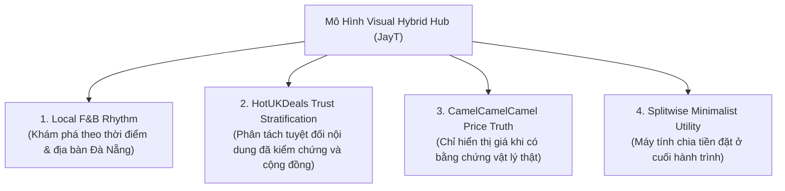

# JAYT VISUAL HYBRID HUB SPECIFICATION (091)
> **Sứ Mệnh**: JayT là trung tâm hỗ trợ người dân, sinh viên và dân văn phòng tại Đà Nẵng đưa ra quyết định tiết kiệm nhanh nhất hôm nay (ăn gì, đi đâu, xem gì rẻ hơn) theo mô hình **Visual Hybrid Hub** — Khám phá trước, công cụ sau, trung thực tuyệt đối.

---

## 1. 4 TRỤ CỘT CỦA MÔ HÌNH "VISUAL HYBRID HUB"



1. **Local F&B Rhythm**: Nhịp sống địa phương Đà Nẵng (Hôm nay ở Hải Châu · 11:15 → Ăn trưa công sở / Cà phê học bài / Xem phim rạp).
2. **HotUKDeals Trust Stratification**: Phân tách rạch ròi giữa deal đã đối soát và radar cộng đồng; cộng đồng báo về mặc định là `CHƯA XÁC MINH`.
3. **CamelCamelCamel Price Truth**: Tuyệt đối không đưa ra lời khuyên giá hay badge "đáy giá" nếu không có bằng chứng lịch sử đối soát trên đĩa.
4. **Splitwise Minimalist Utility**: Công cụ tính thực trả và chia tiền đặt ở cuối hành trình; 100% tính toán cục bộ.

---

## 2. CẤU TRÚC GIAO DIỆN CHUẨN JAYT V2 (DISCOVERY-FIRST)

```text
[ Khu vực ▼ ]  [ Sinh viên / Văn phòng ]  [ Nhu cầu ▼ ]
──────────────────────────────────────────────────────
Hôm nay ở Hải Châu · 11:15  [ Ăn trưa ] [ Cà phê ] [ Xem phim ] [ Đi lại ] [ Mua sắm ]

1. ƯU ĐÃI ĐÃ XÁC MINH HÔM NAY
   - Deal hiện hành có giá · điều kiện · hạn · địa điểm
   - Hoặc Honest Empty State hữu ích dẫn sang Watchlist nếu 0 deal approved

2. ĐỊA ĐIỂM NÊN THEO DÕI GẦN BẠN
   - Quán/rạp hot + địa chỉ thật + nút "Nguồn chính thức ↗"
   - Disclaimer: “JayT đã xác nhận địa điểm hoạt động tại Đà Nẵng; ưu đãi online chưa đủ dữ liệu để xác nhận. Hãy kiểm tra trực tiếp tại quán hoặc nguồn chính thức trước khi mua.”
   - Card chỉ dùng icon/logo trung tính, KHÔNG dùng ảnh sale, màu đỏ giảm giá, nút "Lấy mã".

3. CỘNG ĐỒNG BÁO VỀ
   - Honest Empty state: "Chưa có tín hiệu cộng đồng nào được gửi hôm nay..."
   - Hoặc tín hiệu thật do cộng đồng gửi (0 PII, nhãn "Chưa xác minh", không giá/mã/CTA mua).

4. CHÍNH SÁCH THÀNH VIÊN
   - Quy tắc tích điểm / hội viên có nguồn chứng cứ trên đĩa.

5. CÔNG CỤ PHỤ TRỢ (Cuối trang)
   - Tính thực trả · chia tiền nhóm · ví voucher cá nhân (Splitwise-style, 100% local calculation).
```

---

## 3. DESIGN TOKENS VÀ BẢNG MÀU PHÂN TẦNG

- **`--jayt-verified`**: Xanh thông đậm `#0F3327` & Xanh ngọc `#059669` (Dành riêng cho Ưu đãi đã xác minh).
- **`--jayt-watchlist`**: Xanh dương `#1D4ED8` & Nền `#EFF6FF` (Dành cho Địa điểm nên theo dõi).
- **`--jayt-community`**: Cam hổ phách `#B45309` & Nền `#FEF3C7` (Dành cho Radar cộng đồng).
- **`--jayt-loyalty`**: Tím thạch anh `#6D28D9` & Nền `#F5F3FF` (Dành cho Chính sách thành viên).
- **`--jayt-neutral`**: Xám tro `#475569` & Nền `#F8FAFC` (Dành cho Tiện ích phụ trợ).
- **Mobile-first Invariants**:
  - Touch target tối thiểu: `44px` (`min-height: 44px; min-width: 44px;`).
  - Single horizontal scrolling filter row: Cuộn mượt mà không vỡ layout trên viewport 390px.
  - Zero fake sale images / Zero unverified countdowns.
