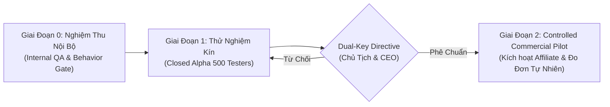

# KẾ HOẠCH TRIỂN KHAI KIỂM SOÁT (CONTROLLED ROLLOUT PLAN) — ĐÀ NẴNG 2026

**Mã văn bản:** `CONTROLLED_ROLLOUT_PLAN_DN_2026`  
**Căn cứ phê chuẩn:** `CHAIRMAN_DIRECTIVE_20260919_AUTHORIZE_UX_PHASE_AND_DANANG_READINESS` & `CEO_DISPATCH_20260919_JAYT_465_UX_INTERNAL_BEHAVIOR_AND_DANANG_READINESS`  
**Nguyên tắc cốt lõi:**  
1. `FEATURE1_CORE = SEALED` (Bảo toàn 5 Contracts, Route Resolver, Review Math).  
2. `PUBLIC_RELEASE = BLOCKED` (Chưa mở công khai rộng rãi).  
3. `AFFILIATE_ENABLED = FALSE` (Strictly fail-closed cho đến khi có Dual-Key Directive).  
4. **Giải trừ Vòng lặp Nghiệm thu:** "Đơn hàng tự nhiên đầu tiên" là cột mốc giám sát **sau khi kích hoạt (post-activation monitoring milestone)**, **không phải điều kiện tiên quyết trước kích hoạt (pre-activation prerequisite)**. Trước Dual-Key, toàn bộ xác thực thương mại chỉ sử dụng sandbox, dry-run attribution và non-commission verification.

---

## I. CÁC GIAI ĐOẠN TRIỂN KHAI (3 PHASES)

---

### GIAI ĐOẠN 0: NGHIỆM THU NỘI BỘ (HIỆN TẠI — JAYT-465)
- **Quy mô:** 100 kịch bản mua sắm nội bộ trên 12 cụm hành vi (12 tester ẩn danh).
- **Mục tiêu:**
  - Đo lường VSS Baseline (Verified Savings Success >= 85%).
  - 0 lỗi wrong redirect, 0 dead CTA, 0 state leak, 0 uncaught exception.
  - Tuân thủ 100% Luật 91/2025/QH15, Luật 122/2025/QH15, Luật 75/2025/QH15.
- **Trạng thái Affiliate:** `CONFIG.affiliate_enabled = false` (Khóa cứng).

---

### GIAI ĐOẠN 1: THỬ NGHIỆM KÍN ĐÀ NẴNG (CLOSED ALPHA — DỰ KIẾN JAYT-466)
- **Quy mô:** 500 sinh viên & nhân sự nội bộ thuộc 2 cụm:
  - Cụm Hòa Khánh (ĐH Bách Khoa, KTX Bách Khoa).
  - Cụm Hải Châu (ĐH Duy Tân, Software Park).
- **Mục tiêu:**
  - Kiểm tra độ chịu tải và độ mượt 60 FPS trên thiết bị di động thực tế.
  - Đánh giá khả năng hiểu đúng giá thực trả và tỷ lệ chia sẻ Zalo Deal Pass.
- **Chính sách Thương mại:** Vẫn duy trì `CONFIG.affiliate_enabled = false`. Mọi liên kết mở app sàn là link gốc sạch, không phát sinh hoa hồng.

---

### GIAI ĐOẠN 2: CONTROLLED COMMERCIAL PILOT (CẦN DUAL-KEY DIRECTIVE)
- **Điều kiện kích hoạt:**
  - Có văn bản phê chuẩn chung từ Chủ tịch và CEO (`DUAL_KEY_DIRECTIVE_COMMERCIAL_ACTIVATION`).
  - Giai đoạn 1 đạt VSS >= 90% và không có khiếu nại pháp lý nào.
- **Hành động kỹ thuật:**
  - Kích hoạt `CONFIG.affiliate_enabled = true`.
  - Giám sát đơn hàng tự nhiên đầu tiên (First Natural Attributed Order) theo quy trình:
    1. `IMPRESSION` -> `ROUTE_CLICK` -> `APP_OPENED` -> `NATURAL_ORDER`.
    2. Đối soát biên lai hoa hồng ghi nhận với nền tảng AccessTrade / Shopee / TikTok Shop Partner.
    3. Tuân thủ bất biến `CLICK != REVENUE` trong Outcome Contract.

---

## II. MA TRẬN PHÂN QUYỀN & RỦI RO

| Rủi ro tiềm ẩn | Biện pháp ngăn chặn | Cấp thẩm quyền kiểm soát |
| :--- | :--- | :--- |
| **Rò rỉ link affiliate khi chưa có phép** | Khóa cứng `CONFIG.affiliate_enabled = false` ở cấp mã nguồn SSOT, CI test fail-closed | CEO & Head of Architecture |
| **Quảng cáo vượt quá sự thật (Overclaim)** | Áp dụng Content Claim Policy, bắt buộc kiểm chứng nguồn hiện hành | ZQA Lead & Chief Compliance Officer |
| **Vỡ layout trên thiết bị người dùng** | Bộ test Playwright tự động kiểm thử đa trình duyệt | QA Division |
| **Vi phạm Luật Bảo vệ dữ liệu cá nhân** | Thu thập Zero PII, mã hóa định danh tester ngẫu nhiên | Data Protection Officer |
