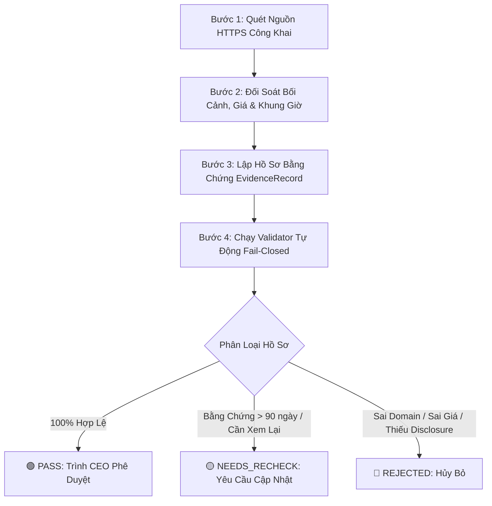

# JAYT CORP — BẢNG KIỂM BIÊN TẬP DEAL & NGUỒN CÔNG KHAI (EDITORIAL CHECKLIST)
**Mã hiệu:** `JAYT-ED-CHECKLIST-001`  
**Cấp độ an ninh:** `FAIL-CLOSED & ZERO DECEPTIVE DATA ENFORCED`  
**Áp dụng:** Toàn bộ dữ liệu đề xuất trước khi trình CEO phê duyệt nạp Catalog

---

## 1. Nguyên Tắc Cốt Lõi (Core Editorial Principles)

1. **100% Nguồn Công Khai & Minh Bạch**: Chỉ thu thập thông tin từ trang web chính thức (Landing page HTTPS), fanpage có tích xanh, ứng dụng giao đồ ăn lớn (ShopeeFood), hoặc rạp chiếu phim (Metiz, CGV). Nghiêm cấm thu thập qua kênh nội bộ không chính thức.
2. **Không Liên Hệ Merchant Ngoại Vi**: Quy trình ở giai đoạn hiện tại hoàn toàn dựa trên thông tin công khai; không gửi email, không gọi điện thoại, không ký hợp tác khi chưa có lệnh riêng của CEO.
3. **Phân Hạng Taxonomy `PROBING` Bắt Buộc**: 100% deal là dữ liệu khảo sát nguồn tham khảo (`PROBING`), không được tự nhận là `VERIFIED` hoặc đảm bảo chắc chắn còn hàng/còn giá tại quầy.
4. **Kiểm Tra Số Học Chiết Khấu**: Tỷ lệ `% giảm` phải chính xác tuyệt đối theo công thức số học `round((original_price - deal_price) * 100 / original_price)`.
5. **Tách Biệt Minh Bạch 2 Trụ Cột**:
   - `LOCAL_EXPERIENCE` (Trải nghiệm Đà Nẵng): Bắt buộc `DIRECT_DEAL` hoặc `NO_AFFILIATE`. Tuyệt đối cấm gắn affiliate link giả mạo.
   - `ONLINE_PLATFORM` (Sàn Online/Săn Mã): Bắt buộc `AFFILIATE_LINK` kèm thông báo minh bạch hoa hồng tiếp thị liên kết.

---

## 2. Quy Trình 5 Bước Biên Tập Hồ Sơ Candidate

### Bước 1: Xác Thực Tên Miền & Nguồn Dữ Liệu
- [ ] URL nguồn sử dụng giao thức `https://` (Tuyệt đối cấm `http://`).
- [ ] Tên miền nằm trong danh mục đã phê duyệt tại [`domain_catalog.json`](file:///D:/C%C3%B4ng%20Vi%E1%BB%87c%20MMO/OPC%20JayT/JayT-D%E1%BB%B1%20%C3%81n%20Gi%C3%A1%20Tr%E1%BB%8B%20C%E1%BB%99ng%20%C4%90%E1%BB%93ng/05_DEAL_AND_AFFILIATE/domain_catalog.json) với trạng thái `ACTIVE` và `is_enabled: true`.
- [ ] Trường hợp dùng subdomain (vd: `promo.domain.vn`), tên miền gốc phải có cấu hình `"allow_subdomains": true`.

### Bước 2: Đối Soát Bối Cảnh Đà Nẵng & Khung Giờ Hoạt Động
- [ ] Thuộc 1 trong 5 phân vùng quy hoạch tại Đà Nẵng (`ZONE_BK_SP`, `ZONE_HAI_CHAU_CBD`, `ZONE_HELIO_METIZ`, `ZONE_AN_DON_SON_TRA`, `ZONE_NGU_HANH_SON_UNI`).
- [ ] Nhóm đối tượng phù hợp (`student`, `office`, `family`, `group`).
- [ ] Khung giờ bắt đầu và kết thúc logic (`0 <= start_minutes < end_minutes <= 1440`).
- [ ] Ngày trong tuần hợp lệ (`days_of_week` chứa mảng số từ 1 đến 7).

### Bước 3: Lập Hồ Sơ Bằng Chứng (`EvidenceRecord`)
- [ ] Tạo mã định danh `evidence_ref` duy nhất theo chuẩn `EVID_<MERCHANT>_<YYYYMMDD>_<SUFFIX>`.
- [ ] Ghi nhận thời điểm kiểm tra `checked_at` có múi giờ rõ ràng (vd: `2026-08-21T03:40:00Z` hoặc `+07:00`).
- [ ] `checked_at` không được ở tương lai và không được quá 90 ngày (nếu quá 90 ngày $\rightarrow$ chuyển trạng thái `NEEDS_RECHECK`).
- [ ] Ghi chú (`notes`) dài tối thiểu 20 ký tự, mô tả rõ tình trạng khảo sát công khai và điều kiện cần kiểm tra tại điểm bán.

### Bước 4: Kiểm Tra Phân Loại Trụ Cột & Disclosure
- [ ] **LOCAL_EXPERIENCE**: `affiliate_type` là `DIRECT_DEAL` hoặc `NO_AFFILIATE`. Disclosure nêu rõ tính chất tham khảo, không khẳng định còn hiệu lực vĩnh viễn.
- [ ] **ONLINE_PLATFORM**: `affiliate_type` là `AFFILIATE_LINK`. Disclosure bắt buộc nêu rõ thông báo hoa hồng tiếp thị liên kết (`hoa hồng`, `affiliate`, `tiếp thị liên kết` hoặc `tài trợ`).

### Bước 5: Chạy Kiểm Thử Tự Động Fail-Closed
- [ ] Chạy lệnh kiểm tra: `python 05_DEAL_AND_AFFILIATE/candidate_review_evaluator.py`
- [ ] Xác nhận kết quả phân loại: Chỉ các hồ sơ đạt nhóm **`PASS`** mới được đưa vào danh sách trình duyệt CEO.

---

## 3. Tiêu Chí Xếp Hạng Đánh Giá (Evaluation Criteria)

| Nhóm Phân Loại | Tiêu Chí Đánh Giá | Quyền Hạn Xử Lý |
|---|---|:---:|
| **🟢 PASS** | • 100% trường hợp lệ theo JSON Schema. • Domain & Protocol HTTPS hợp lệ. • `checked_at` mới trong vòng 90 ngày có timezone. • Công thức giảm giá và ngày giờ khớp 100%. • Phân định affiliate và disclosure trung thực. | **Đủ điều kiện trình CEO phê duyệt** |
| **🟡 NEEDS_RECHECK** | • `checked_at` quá 90 ngày (bằng chứng cũ). • Thông tin khuyến mãi có ghi chú biến động theo mùa cần kiểm tra lại trước khi áp dụng. | **Tạm giữ ở pending_review, cấm đưa vào live feed** |
| **🔴 REJECTED** | • Tên miền chưa đăng ký hoặc subdomain trái phép. • Giao thức HTTP không an toàn. • Sai lệch công thức giá (`discount_pct`). • `LOCAL_EXPERIENCE` gắn affiliate giả mạo. • `ONLINE_PLATFORM` thiếu disclosure hoa hồng. • Trùng lặp `deal_id` hoặc `evidence_id`. | **Hủy bỏ hồ sơ, cấm phê duyệt** |
