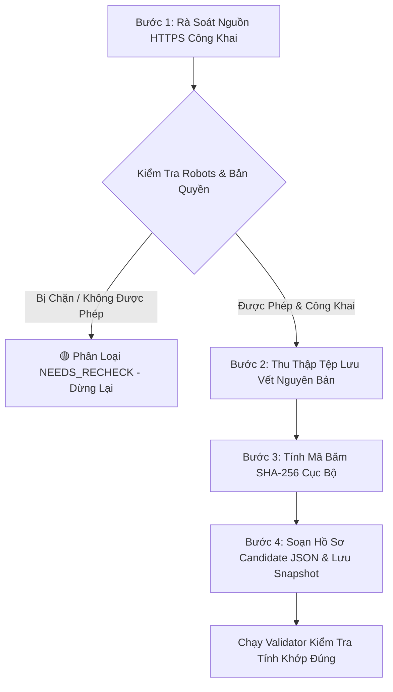

# JAYT CORP — QUY TRÌNH THU THẬP & LƯU VẾT NGUỒN CÔNG KHAI (PUBLIC SOURCE CAPTURE WORKFLOW)
**Mã hiệu:** `JAYT-SOP-CAPTURE-001`  
**Cấp độ an ninh:** `ETHICAL SCRAPING & ZERO BYPASS DISCIPLINE`  
**Áp dụng:** Toàn bộ nhân sự biên tập và kỹ sư rà soát dữ liệu danh mục deal

---

## 1. Các Nguyên Tắc Đạo Đức & Kỷ Luật Thu Thập (Ethical Boundaries)

1. **Tuyệt Đối Tôn Trọng Cơ Chế Bảo Vệ & `robots.txt`**:
   - Nghiêm cấm dùng tool/script để vượt `robots.txt`, bypass CAPTCHA, giải mã Cloudflare, hoặc tấn công vượt hàng rào chống bot.
   - Nghiêm cấm đăng nhập tài khoản riêng tư hoặc thu thập dữ liệu sau màn hình xác thực (Behind-login).
2. **Không Liên Hệ Merchant / Điểm Bán**:
   - Ở giai đoạn hiện tại, toàn bộ hoạt động chỉ giới hạn trong việc rà soát nguồn công khai. Không gọi điện, không gửi email, không đến khảo sát quầy khi chưa có lệnh ủy quyền bằng văn bản của CEO.
3. **Không Tạo Khẳng Định (Claim) Khi Không Có Chứng Từ Gốc**:
   - Nếu một ưu đãi chỉ được nghe qua truyền miệng, fanpage không chính thức hoặc nguồn tin không thể truy xuất tệp lưu vết $\rightarrow$ **Tuyệt đối cấm tạo deal**.
4. **Không Tự Động Nạp (Zero Auto-Import)**:
   - Toàn bộ hồ sơ candidate phải lưu tại `05_DEAL_AND_AFFILIATE/candidates/pending_review/`.
   - Cấm bất kỳ script tự động nào ghi trực tiếp vào `deals_feed.json` hoặc `evidence_store.json`.

---

## 2. Quy Trình 4 Bước Thu Thập Tệp Lưu Vết Hợp Lệ (Valid Capture Workflow)



### Bước 1: Rà Soát Nguồn HTTPS Công Khai
- Mở trang thông tin chương trình khuyến mãi bằng trình duyệt chuẩn (Chrome / Firefox / Edge).
- Kiểm tra tính an toàn tên miền: Tên miền phải nằm trong [`domain_catalog.json`](file:///D:/C%C3%B4ng%20Vi%E1%BB%87c%20MMO/OPC%20JayT/JayT-D%E1%BB%B1%20%C3%81n%20Gi%C3%A1%20Tr%E1%BB%8B%20C%E1%BB%99ng%20%C4%90%E1%BB%93ng/05_DEAL_AND_AFFILIATE/domain_catalog.json) với giao thức HTTPS.
- Kiểm tra `robots.txt` của website: Nếu trang bị `Disallow`, không cố gắng dùng bot quét tự động.

### Bước 2: Thu Thập Tệp Lưu Vết Nguyên Bản (Capture Artifact)
Chọn 1 trong các phương thức lưu vết được phê duyệt:
1. **`BROWSER_FULLPAGE_SCREENSHOT`**: Chụp ảnh toàn trang chứa đầy đủ tiêu đề, mức giá, điều kiện áp dụng và chân trang (Lưu định dạng `.png` hoặc `.jpg`).
2. **`PDF_DOCUMENT_SNAPSHOT`**: In trang khuyến mãi hoặc văn bản chính sách ra định dạng PDF nguyên bản (`.pdf`).
3. **`RAW_HTTPS_RESPONSE_PAYLOAD`**: Lưu mã nguồn HTML thô hoặc phản hồi JSON của endpoint công khai (`.html` hoặc `.json`).

*Lưu ý: Tệp lưu vết phải được đặt tên theo quy chuẩn: `snapshot_<MERCHANT>_<TOPIC>_<YYYYMMDD>.<ext>` và lưu vào `05_DEAL_AND_AFFILIATE/candidates/evidence_snapshots/`.*

### Bước 3: Tính Mã Băm SHA-256 Toàn Vẹn Cục Bộ
Chạy lệnh tính mã băm SHA-256 cho tệp vừa lưu:
```bash
python -c "import hashlib; print(hashlib.sha256(open('candidates/evidence_snapshots/<snapshot_file>', 'rb').read()).hexdigest())"
```
Ghi nhận mã băm 64 ký tự này vào trường `evidence_content_hash`.

### Bước 4: Lập Hồ Sơ Candidate JSON
Khai báo đầy đủ các trường bắt buộc trong tệp candidate JSON tại `candidates/pending_review/`:
- `source_specificity`: `"EXACT_OFFER_PAGE"`
- `capture_file`: Tên tệp lưu vết trong `evidence_snapshots/`
- `evidence_content_hash`: Mã băm SHA-256 vừa tính được
- `capture_method`: Phương thức thu thập tương ứng
- `artifact_mime_type`: MIME type chuẩn của tệp (`image/png`, `application/pdf`, `text/html`, v.v.)
- `artifact_source_url`: URL chính xác của trang đã chụp
- `observed_price_or_offer`: Giá/ưu đãi nhìn thấy trên tệp lưu vết
- `observed_conditions`: Điều kiện áp dụng nhìn thấy trên tệp lưu vết
- `expiry_basis`: Thời hạn kết thúc ghi rõ trong tệp lưu vết
- `captured_at`: Thời điểm chụp có timezone (`Z` hoặc `+07:00`)

---

## 3. Tiêu Chí Nghiệm Thu & Trình Duyệt CEO

Một hồ sơ chỉ được đưa vào báo cáo trình CEO phê duyệt nạp catalog chính thức khi đạt 100% các tiêu chí:
1. **Tính xác thực (Authenticity)**: Tệp lưu vết là ảnh chụp màn hình, PDF hoặc raw HTML/JSON hợp lệ (không phải tệp `.txt` tự tường thuật).
2. **Tính toàn vẹn (Integrity)**: Mã băm SHA-256 khớp 100% với tệp trên đĩa cứng.
3. **Tính nhất quán (Consistency)**: `artifact_source_url` khớp hoàn toàn với `source_url`.
4. **Tính minh bạch (Transparency)**: Có đầy đủ căn cứ giá, điều kiện và mốc thời hạn.
5. **Tính độc lập (Zero Merchant Contact)**: Hoàn toàn từ nguồn công khai hợp pháp.
