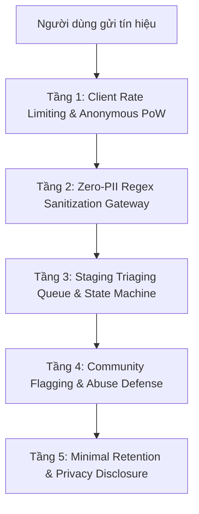

# ĐẶC TẢ KIẾN TRÚC TỐI THIỂU CHO COMMUNITY BACKEND (JAYT-117)
**Mã tài liệu**: `JAYT-SPEC-COMMUNITY-BACKEND-117` | **Trạng thái**: `ARCHITECTURE PREREQUISITE SPEC`  
**Chỉ thị CEO**: *Chỉ xây community backend khi có thiết kế tối thiểu gồm chống spam, báo xấu, trạng thái chưa kiểm chứng, lưu trữ tối thiểu và disclosure dữ liệu.*

---

## 1. MỤC TIÊU VÀ NGUYÊN TẮC THIẾT KẾ

Khi JayT nâng cấp từ mô hình *"Ghi chú trên thiết bị cá nhân"* sang *"Mạng chia sẻ tín hiệu cộng đồng dùng chung"*, hệ thống bắt buộc phải có 5 lớp phòng vệ để ngăn chặn spam, lừa đảo, rò rỉ dữ liệu cá nhân (PII) và tin đồn giả mạo.

---

## 2. 5 TẦNG KIẾN TRÚC PHÒNG VỆ CỐT LÕI

### Tầng 1: Chống Spam & Giới Hạn Tần Suất (Rate Limiting & Proof-of-Work)
- **Cơ chế**:
  - Giới hạn tối đa 3 tín hiệu / 1 giờ / 1 IP hoặc thiết bị.
  - Sử dụng Proof-of-Work nhẹ tại client (SHA-256 hash challenge) hoặc Cloudflare Turnstile vô hình để chặn bot tự động.
  - Từ chối các chuỗi ký tự lặp, link tiếp thị liên kết (affiliate token/ref parameter) hoặc từ khóa cờ bạc/lừa đảo.

### Tầng 2: Bộ Lọc Khử PII Bắt Buộc (Zero-PII Sanitization)
- **Quy định**:
  - Máy chủ không bao giờ lưu trữ số điện thoại, email, số CCCD, tài khoản ngân hàng hoặc địa chỉ nhà riêng của người gửi.
  - Hệ thống tự động thay thế bằng nhãn: `[SĐT ĐÃ XÓA]`, `[EMAIL ĐÃ XÓA]`, `[ĐỊNH DANH ĐÃ XÓA]`.

### Tầng 3: Trạng Thái Tín Hiệu & Quy Trình Kiểm Duyệt (State Machine)
Tất cả tín hiệu do người dùng gửi lên cộng đồng bắt buộc đi qua máy trạng thái nghiêm ngặt:

| Trạng thái | Ý nghĩa | Quyền hiển thị trên UI |
|---|---|---|
| `UNVERIFIED_SIGNAL` | Tín hiệu mới gửi, chưa qua đối soát | Hiển thị với Badge màu hổ phách ⚠️ **CHƯA ĐỐI SOÁT**, có cảnh báo rủi ro |
| `TRIAGED` | Đã được hệ thống gán phân loại ngành & cụm quận | Hiển thị trong hàng đợi đối soát |
| `EVIDENCE_CAPTURED` | Crawler/Đội ngũ đã chụp được trang nguồn chính thức | Chuyển sang Tier 1 (`VERIFIED_SAVINGS`) hoặc Tier 2 (`NEEDS_RECHECK`) |
| `REJECTED_SPAM` | Tín hiệu rác, sai sự thật hoặc hết hạn | Tự động ẩn vĩnh viễn khỏi mọi giao diện |

### Tầng 4: Cơ Chế Báo Xấu & Tự Động Thu Hồi (Abuse Reporting & Auto-hide)
- Mọi tín hiệu hiển thị đều có nút `Báo xấu 🚩` (Các lý do: *Sai giá*, *Quán đã đóng cửa*, *Lừa đảo/Spam*, *Lộ thông tin cá nhân*).
- **Ngưỡng tự động**:
  - Khi nhận ≥ 3 báo xấu từ 3 địa chỉ độc lập, tín hiệu **tự động bị ẩn ngay lập tức** để chờ quản trị viên đối soát.
  - Ghi nhận lịch sử báo xấu để điều chỉnh độ tin cậy của thiết bị gửi.

### Tầng 5: Chính Sách Lưu Trữ Tối Thiểu & Công Bố Dữ Liệu (Minimal Retention & Disclosure)
- **Thời gian lưu trữ**: Tín hiệu chưa xác minh chỉ tồn tại tối đa **7 ngày** trên hệ thống; sau 7 ngày nếu không có chứng cứ xác thực sẽ tự động xóa sạch.
- **Công bố minh bạch (Data Disclosure)**:
  - Bản tin footer và popup phải ghi rõ: *"Dữ liệu này do người dùng gửi lên, chưa qua đối soát chính thức từ thương hiệu. Vui lòng kiểm tra kỹ tại quán trước khi thanh toán."*

---

## 3. LỘ TRÌNH TRIỂN KHAI

- **Giai đoạn Hiện tại (Beta v3.234.0)**: Duy trì 100% Local-Only trên thiết bị cá nhân (trung thực tuyệt đối, không nhận vơ là mạng cộng đồng).
- **Giai đoạn Tiếp theo**: Chỉ mở Backend chia sẻ khi Tầng 1 đến Tầng 5 được kiểm thử tự động đạt 100% độ bao phủ.
