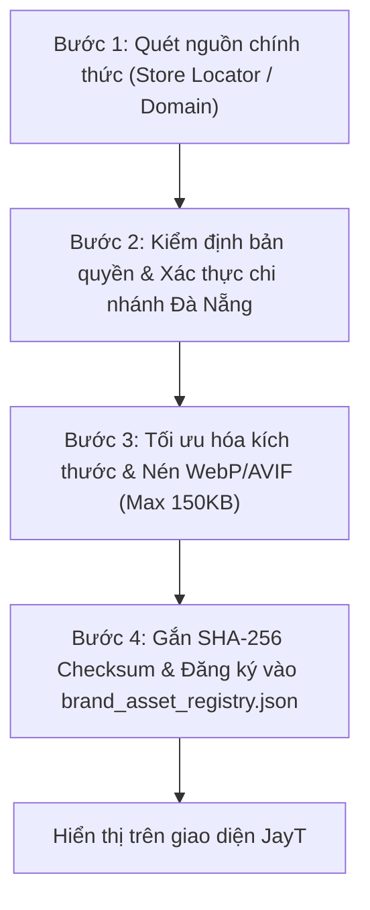

# ĐẶC TẢ KỸ THUẬT ASSET PIPELINE CHÍNH NGẠCH (JAYT-117)
**Mã tài liệu**: `JAYT-SPEC-ASSET-117` | **Trạng thái**: `CANONICAL SPECIFICATION`  
**Mục tiêu**: Thiết lập quy trình thu thập, xử lý và kiểm soát bản quyền tài sản hình ảnh chính thức cho JayT; nghiêm cấm 100% việc tạo ảnh AI giả mạo cửa hàng.

---

## 1. NGUYÊN TẮC BẤT BIẾN VỀ HÌNH ẢNH (NON-NEGOTIABLE INVARIANTS)

1. **Cấm tuyệt đối ảnh AI giả mạo cửa hàng**:
   - Nghiêm cấm sử dụng Midjourney, DALL-E, Stable Diffusion hoặc bất kỳ công cụ sinh ảnh nào để tạo mặt tiền quán, không gian bàn ghế, món ăn giả vờ là của các thương hiệu tại Đà Nẵng.
   - Việc hiển thị ảnh AI giả mạo sẽ phá hủy tính trung thực dữ liệu cốt lõi của JayT.

2. **Chỉ hiển thị ảnh chính thức từ nguồn có quyền**:
   - Ảnh chỉ được nhập vào hệ thống khi thuộc 1 trong 3 nhóm nguồn chính thức:
     - **Nhóm A (Brand Official Press Kit & Logo)**: Logo vector SVG, favicon chuẩn, hoặc ấn phẩm truyền thông do chính thương hiệu phát hành công khai.
     - **Nhóm B (Verified Store Locator Assets)**: Ảnh mặt bằng hoặc bản đồ chi nhánh chính thức từ hệ thống định vị điểm bán của website nhãn hàng (ví dụ: cgv.vn, highlands.com.vn).
     - **Nhóm C (Licensed Creative Commons / Open Data)**: Ảnh do cộng đồng tự chụp có giấy phép mở rõ ràng hoặc do chính đội ngũ khảo sát JayT chụp thực tế tại Đà Nẵng kèm tọa độ GPS.

3. **Giai đoạn chuyển tiếp (Fallback Strategy)**:
   - Khi chưa đủ điều kiện tải và xác minh bản quyền ảnh thật, hệ thống **bắt buộc sử dụng giao diện đồ họa CSS Monogram Crest**, mã màu hex gradient chuẩn của thương hiệu và icon biểu tượng ngành hàng.

---

## 2. QUY TRÌNH 4 BƯỚC THU THẬP TÀI SẢN (ASSET PIPELINE)

### Bước 1: Quét nguồn chính thức (Official Discovery)
- Khai thác tệp `meta[property="og:image"]`, favicon chất lượng cao hoặc đường dẫn ảnh trực tiếp từ leaf page đã capture.
- Ghi nhận đầy đủ URL gốc, tên miền nguồn và HTTP header `Content-Type`.

### Bước 2: Kiểm định bản quyền & Xác thực địa phương
- Kiểm tra ảnh có đại diện đúng thương hiệu và đúng chi nhánh tại Đà Nẵng hay không (ví dụ: CGV Vincom Đà Nẵng, Starlight Nguyễn Tri Phương).
- Nếu ảnh chứa thông tin nhạy cảm của khách hàng (khuôn mặt cá nhân), phải thực hiện làm mờ (blur) tại client/pipeline.

### Bước 3: Chuẩn hóa định dạng và kích thước
- Định dạng xuất: `.webp` hoặc `.svg` cho logo.
- Kích thước thẻ Hero/Card: tối đa 600×338px (tỉ lệ 16:9) hoặc 400×400px (1:1).
- Dung lượng tối đa: **không vượt quá 150 KB/ảnh** để đảm bảo tốc độ tải trang dưới 1 giây trên mạng di động 4G Đà Nẵng.

### Bước 4: Đăng ký vào SOT Registry
- Mỗi tệp ảnh sau khi xử lý được lưu vào thư mục `03_SOURCE_OF_TRUTH/assets/brands/`.
- Cập nhật định danh, mã băm SHA-256 và quyền sở hữu vào `brand_asset_registry.json`.

---

## 3. CHECKLIST KIỂM TOÁN TÀI SẢN TRƯỚC KHI RELEASE

- [ ] Ảnh có nguồn gốc từ domain chính thức hoặc do đội ngũ JayT trực tiếp chụp? (Yes)
- [ ] Không phải là ảnh do AI tạo dựng (No synthetic/hallucinated stores)? (Yes)
- [ ] Kích thước tệp ≤ 150 KB? (Yes)
- [ ] Đã có mã băm SHA-256 đối soát trên đĩa? (Yes)
- [ ] Đã có fallback CSS Monogram Crest khi tải ảnh lỗi? (Yes)
