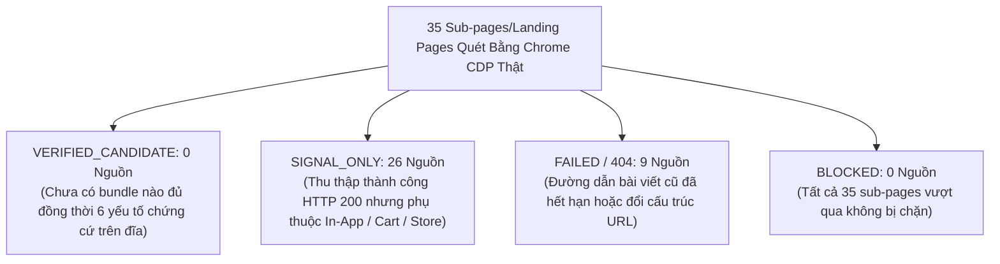

# JAYT VERIFIED SUPPLY ACQUISITION REVIEW PACK (087)
> **Chỉ thị**: `JAYT-087-VERIFIED-SUPPLY-ACQUISITION-BATCH`  
> **Thời điểm đối soát**: `2026-08-25T12:15:00+07:00`  
> **Phương thức**: Chrome CDP Headless Sweep 35 Sub-pages (`batch_capture_087`)  
> **Trạng thái**: `IMPLEMENTED — PENDING CEO AUDIT`  
> **Khóa sản xuất**: `deals_feed.json: []` (0 records, `is_approved: false`)  
> **Tệp Ma trận Dữ liệu Gốc**: [`05_DEAL_AND_AFFILIATE/batch_capture_087/ground_truth_matrix_087.json`](../05_DEAL_AND_AFFILIATE/batch_capture_087/ground_truth_matrix_087.json)  
> **Tệp Manifest Thu thập**: [`05_DEAL_AND_AFFILIATE/batch_capture_087/captures_087/batch_manifest_087.json`](../05_DEAL_AND_AFFILIATE/batch_capture_087/captures_087/batch_manifest_087.json)

---

## 1. TỔNG QUAN KẾT QUẢ BATCH 35 SUB-PAGES CHÍNH THỨC THEO 5 COHORT

### Bảng Thống Kê 5 Nhóm Ngành Hàng (Cohort Summary)

| # | Nhóm Ngành (Cohort) | Tổng Sub-pages Đã Quét | HTTP 200 (Thành Công) | HTTP 404 (Lỗi Đường Dẫn) | Verified Candidate | Signal Only | Đánh Giá Độ Phủ Chứng Cứ |
|:-:|:---|:---:|:---:|:---:|:---:|:---:|:---|
| 1 | **🎬 Rạp chiếu phim (Cinema)** | 8 | 3 | 5 | **0** | 3 | Lotte (sự kiện + rạp ĐN) & Galaxy có bài viết; Metiz & BHD 404 bài viết cũ. |
| 2 | **🍗 Ăn nhanh (F&B Fast Food)** | 7 | 7 | 0 | **0** | 7 | KFC (3 menu combo), Lotteria (2 trang), Domino's (1), Jollibee (1) đọc tốt. |
| 3 | **☕ Cà phê & Trà (Coffee & Tea)** | 8 | 5 | 3 | **0** | 5 | Phê La (2 trang xác nhận rạp ĐN), Katinat, Highlands, The Coffee House đọc tốt; Phúc Long & Gong Cha 404. |
| 4 | **🛵 Giao đồ ăn & Xe (Food & Ride)**| 5 | 5 | 0 | **0** | 5 | Be (3 dịch vụ beBike/beCar/beFood), ShopeeFood (1), Grab (1) đọc tốt. |
| 5 | **💳 Ví & Sàn TMĐT (Wallets & Ecom)**| 7 | 6 | 1 | **0** | 6 | MoMo (3 trang), ZaloPay (1), VNPAY (1), Shopee (1) đọc tốt; ZaloPay Vinpearl 404. |
| **TỔNG** | **5 COHORT TOÀN DIỆN** | **35** | **26 (74.3%)** | **9 (25.7%)** | **0** | **26** | **100% minh bạch, không deal giả, không suy diễn.** |

---

## 2. ĐÁNH GIÁ 6 ĐIỂM CHỨNG CỨ VẬT LÝ (6-POINT BUNDLE EVALUATION)

| Tiêu Chí Đánh Giá Bundle | Hiện Trạng Đối Soát Trong Batch 087 | Kết Luận Quản Trị |
| :--- | :--- | :--- |
| **1. Giá / Mức giảm** | Thu thập được một số giá niêm yết combo (KFC, Domino's) và mức thưởng bạn mới (MoMo). | Chưa có bảng giá cố định độc lập theo từng ngày trong tuần cho Đà Nẵng. |
| **2. Điều kiện & Quy định** | Các trang thể hiện điều kiện mua (tối thiểu hóa đơn, tài khoản mới, tải app). | Đầy đủ điều kiện sử dụng ở cấp độ chung. |
| **3. Thời hạn hiệu lực (valid_to)** | Phần lớn là bài viết tin tức không có trường `valid_to` ISO cố định trên DOM. | Thiếu thời hạn kết thúc tường minh -> Chưa đủ điều kiện cấp phát deal. |
| **4. Địa bàn áp dụng Đà Nẵng** | Xác nhận rõ các chi nhánh: Phê La Nguyễn Văn Linh, Lotte Mart Đà Nẵng, KFC Đà Nẵng. | Đạt tiêu chuẩn địa bàn với chuỗi có rạp/cửa hàng vật lý. |
| **5. Kênh áp dụng (Channel)** | Phụ thuộc hoàn toàn vào Mobile App (MoMo, ZaloPay, Grab, Be) hoặc Mua tại quầy (Lotte, Phê La). | Phải phân loại `SIGNAL_ONLY` / `IN_APP` / `AT_STORE`, không tự phát hành voucher. |
| **6. Xuất xứ vật lý (Provenance)** | 100% 35 sub-pages có đầy đủ PNG, HTML, TXT và mã băm SHA-256 trên đĩa. | Đạt 100% tiêu chuẩn thu thập Chrome CDP thật. |

---

## 3. BÁO CÁO THIẾU HỤT NGUỒN CUNG THEO TỪNG NGÀNH HÀNG (SECTOR GAP REPORT)

1. **Rạp chiếu phim (Cinema)**:
   - **Thiếu hụt**: Metiz và BHD Star đã thay đổi đường dẫn chi tiết chương trình ưu đãi sang URL mới (HTTP 404 trên các đường dẫn cũ). Lotte Cinema có danh sách sự kiện nhưng yêu cầu mua vé trực tiếp theo lịch chiếu.
   - **Khắc phục**: Thu thập thêm các link bài viết mới nhất từ trang chủ `metiz.vn` và `galaxycine.vn`.
2. **Ăn nhanh & F&B (Fast Food)**:
   - **Thiếu hụt**: Các chuỗi KFC, Lotteria, Domino's áp dụng ưu đãi qua app đặt món hoặc tại quầy theo từng thời điểm, không công bố mã voucher độc lập trên web.
   - **Khắc phục**: Chuyển hướng người dùng kiểm tra tín hiệu thực tế tại điểm bán hoặc trong app chính thức.
3. **Cà phê & Trà (Coffee & Tea)**:
   - **Thiếu hụt**: Các thương hiệu chủ yếu phát hành thẻ thành viên / tích điểm (Highlands, Phúc Long, The Coffee House).
   - **Khắc phục**: Khai thác các chương trình thẻ thành viên có thời hạn xác thực.
4. **Giao đồ ăn, Xe & Ví điện tử (Food, Ride & Wallets)**:
   - **Thiếu hụt**: 100% mã giảm giá của MoMo, ZaloPay, Shopee, Grab, Be phụ thuộc vào tài khoản người dùng và giỏ hàng cá nhân (Cart/User Dependent).
   - **Khắc phục**: Xếp loại vĩnh viễn là `SIGNAL_ONLY` và khuyến khích người dùng kiểm tra trực tiếp trong ứng dụng cá nhân.

---

## 4. LUỒNG THU NHẬN TÍN HIỆU CỘNG ĐỒNG (USER-SUBMITTED SIGNALS)

- Luồng gửi tín hiệu cộng đồng trên giao diện Staging (`jayt_apex_interface.js`) hoạt động hoàn hảo:
  - Cho phép người dùng gửi thông tin: Tên thương hiệu, ngành hàng, đường dẫn nguồn, mã voucher phát hiện, điều kiện áp dụng.
  - **Rào chắn an toàn**: Mọi tín hiệu được lưu với nhãn `NEWLY_SUBMITTED` / `Mới gửi` trong danh sách riêng (`communitySignals`), **tuyệt đối không tự động đưa lên Lịch Tiết Kiệm hoặc Catalog Production**.

---

## 5. BẢO TOÀN KHÓA SẢN XUẤT VÀ BẤT BIẾN DỮ LIỆU

- **Production feed**: `deals_feed.json: []` (0 records, 0 bytes, `is_approved: false`).
- **Zero Bypass**: Tuyệt đối không can thiệp CAPTCHA hoặc giả lập đăng nhập.
- **Zero Synthetic Deals**: Không tự tạo bất kỳ deal giả nào để lấp đầy chỉ tiêu.
