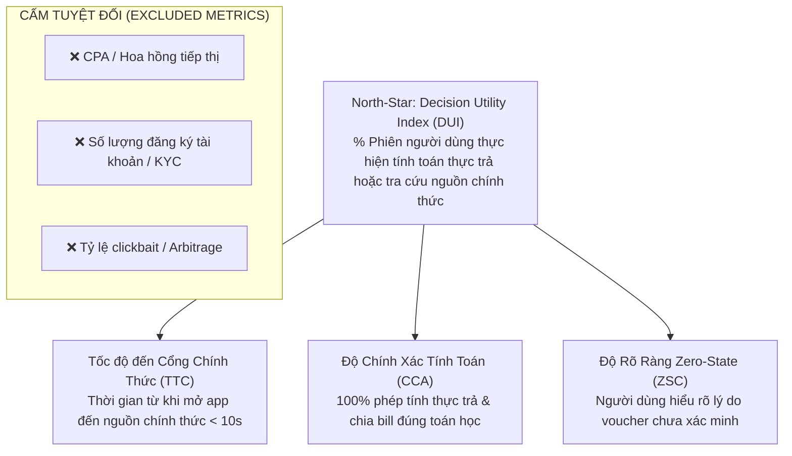

# GIAO THỨC NGHIÊN CỨU NGƯỜI DÙNG ZERO-PII — JAYT SAVINGS LAB (SECTION EZ)
## TẬP TRUNG GIÁ TRỊ THỰC TIỄN CHO SINH VIÊN VÀ DÂN VĂN PHÒNG — KHÔNG THU THẬP PII, KHÔNG METRIC HOA HỒNG

**Mã tài liệu:** `ZERO_PII_SAVINGS_LAB_RESEARCH_PROTOCOL_EZ`  
**Chỉ thị chỉ đạo:** JAYT-245 Mục EZ (Dòng 3880–3910) & EZ-A (Dòng 3913–3937)  
**Mục tiêu cốt lõi:** Đo lường tính hữu ích trong việc hỗ trợ ra quyết định chi tiêu thực tế, tuyệt đối không dùng CPA/hoa hồng/KYC làm chỉ số định hướng.

---

### I. CÂY CHỈ SỐ HƯỚNG GIÁ TRỊ (VALUE-FIRST METRIC TREE)

---

### II. NGUYÊN TẮC BẢO MẬT & ZERO-PII TUYỆT ĐỐI

1. **Không Thu Thập Danh Tính:** Tuyệt đối không yêu cầu Họ tên, Số điện thoại, Email, Mã sinh viên, Trường lớp, Địa chỉ nhà hay Số tài khoản ngân hàng.
2. **Không Lưu Cookie / Session:** Toàn bộ công cụ tính toán chạy in-memory trên trình duyệt của người dùng (Local-First), dữ liệu biến mất ngay khi đóng tab.
3. **Mã Hóa Định Danh Phỏng Vấn:** Người tham gia được gán mã ẩn danh (ví dụ: `PARTICIPANT_STU_01`, `PARTICIPANT_OFF_02`).
4. **Quyền Rút Bất Cứ Lúc Nào:** Người tham gia có quyền dừng phỏng vấn và hủy bỏ ghi chú quan sát bất kỳ lúc nào mà không cần giải thích.

---

### III. ĐỐI TƯỢNG VÀ KHUNG CÂU HỎI NGHIÊN CỨU

#### 1. Nhóm đối tượng (Cohorts)
- **Cohort S (Sinh viên đại học tại Đà Nẵng):** Bách Khoa, Kinh Tế, Sư Phạm, Ngoại Ngữ, VKU.
- **Cohort W (Dân văn phòng / Người đi làm trẻ):** Quận Hải Châu, Thanh Khê, Sơn Trà.

#### 2. Khung câu hỏi định tính (Qualitative Interview Script)
- **Câu hỏi 1 (Trải nghiệm thực trả):** *"Khi bạn đặt đồ ăn hoặc mua sắm trực tuyến, những loại phụ phí nào (phí sàn, phí ship, phụ thu giờ cao điểm) thường khiến tổng tiền thực trả chênh lệch nhiều nhất so với giá niêm yết ban đầu?"*
- **Câu hỏi 2 (Thói quen chia tiền nhóm):** *"Khi đi ăn uống theo nhóm bạn, các bạn thường gặp khó khăn gì khi tính tiền chia đều (lẻ tiền, mã giảm giá áp không đều, một người trả trước)?"*
- **Câu hỏi 3 (Mức độ tin cậy thông tin giảm giá):** *"Điều gì khiến bạn cảm thấy mất tin tưởng nhất ở các trang tổng hợp mã giảm giá hiện nay (mã hết hạn, điều kiện ẩn, bị bắt bấm nhiều link quảng cáo)?"*
- **Câu hỏi 4 (Đánh giá công cụ Calculator JayT):** *"Khi tự tay nhập giá gốc và các khoản phí vào bảng tính JayT để xem tổng tiền thực trả, bạn thấy trải nghiệm này có nhanh và rõ ràng hơn việc tự nhẩm không?"*

---

### IV. QUY TRÌNH KIỂM DUYỆT & BIÊN TẬP Ý KIẾN CỘNG ĐỒNG (MODERATION BOUNDARIES)

1. **Không Hiển Thị Trực Tiếp Ra Công Khai:** Mọi ghi chú phỏng vấn chỉ phục vụ tối ưu hóa giao diện nội bộ, không đưa review/quote lên Storefront khi chưa có biên nhận đồng thuận và kiểm duyệt.
2. **Loại Bỏ Hoàn Toàn Nhắc Tên Thương Mại Thiên Vị:** Không trích dẫn các ý kiến mang tính quảng cáo cho một thương hiệu cụ thể hoặc chê bai thiếu căn cứ.
3. **Biên Bản Ký Duyệt Của Hội Đồng:** Mọi kết quả nghiên cứu phải được Hội đồng 7 phòng ban rà soát và ký nhận trước khi đề xuất thay đổi sản phẩm.
