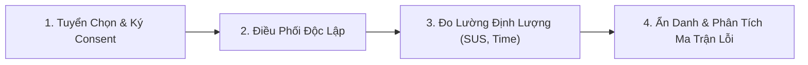

# QUY CHUẨN NGHIÊN CỨU NGƯỜI DÙNG THỰC ĐỊA CHUẨN HÓA (JAYT-118)
**Mã tài liệu**: `JAYT-PROTO-USABILITY-118` | **Trạng thái**: `CANONICAL OPERATIONAL PROTOCOL`  
**Chỉ thị CEO**: *Thực hiện usability test thật chỉ khi có người tham gia tự nguyện; lưu tối thiểu dữ liệu, ẩn danh trong báo cáo, ghi rõ phương pháp và cả phản hồi tiêu cực.*

---

## I. NGUYÊN TẮC ĐẠO ĐỨC & PHÁP LÝ BẮT BUỘC

1. **Sự Đồng Ý Tự Nguyện (Informed Consent)**:
   - Nghiên cứu chỉ được tiến hành khi người tham gia đã đọc và ký Phiếu Chấp Thuận Tham Gia Nghiên Cứu Tự Nguyện (bản giấy hoặc chữ ký số xác thực).
   - Người tham gia có quyền rút khỏi buổi kiểm thử bất kỳ lúc nào mà không cần giải thích lý do.
2. **Ẩn Danh Hóa Tuyệt Đối (Zero-PII Anonymization)**:
   - Báo cáo công khai tuyệt đối **không chứa**: Họ tên thật, số điện thoại, email, địa chỉ cụ thể hoặc tên công ty/trường học chính xác của người tham gia.
   - Mọi dữ liệu phải được mã hóa định danh: `PARTICIPANT_DN_01`, `PARTICIPANT_DN_02`...
3. **Chính Sách Lưu Trữ Dữ Liệu Tối Thiểu (Minimal Retention Policy)**:
   - Bản ghi âm/video màn hình thô (nếu có) phải được lưu trữ trong môi trường mã hóa cục bộ và tự động xóa vĩnh viễn sau **30 ngày** kể từ ngày công bố báo cáo.
4. **Ghi Nhận Đầy Đủ Phản Hồi Tiêu Cực & Thất Bại (Honest Friction Reporting)**:
   - Báo cáo bắt buộc phải liệt kê chi tiết: các điểm gây bối rối, tác vụ thất bại, thời gian chậm trễ và các phản hồi phê bình tiêu cực từ người dùng.

---

## II. QUY TRÌNH THỰC HIỆN 4 GIAI ĐOẠN

### Giai đoạn 1: Tuyển chọn & Xác thực Chấp thuận
- Đối tượng: Cư dân, học sinh, sinh viên, người đi làm sinh sống thực tế tại TP. Đà Nẵng.
- Mẫu phiếu chấp thuận chuẩn:
  > *"Tôi xác nhận tự nguyện tham gia buổi kiểm nghiệm trải nghiệm người dùng JayT. Tôi đồng ý để người điều phối quan sát thao tác trên màn hình phục vụ mục đích cải thiện sản phẩm. Dữ liệu của tôi sẽ được ẩn danh hoàn toàn."*

### Giai đoạn 2: Điều phối độc lập (Independent Moderation)
- Người điều phối độc lập không được gợi ý thao tác hoặc can thiệp vào quá trình người dùng khám phá.
- Phương pháp: *Think-Aloud Protocol* (Người dùng nói ra suy nghĩ trong lúc thao tác).

### Giai đoạn 3: Bộ chỉ số định lượng chuẩn hóa
- **Thời gian hoàn thành tác vụ (Time-on-Task)**: Tính bằng giây từ khi đọc đề bài đến khi hoàn tất hành động.
- **Tỷ lệ thành công không trợ giúp (Unassisted Success Rate)**: % tác vụ hoàn thành mà không cần hỏi người điều phối.
- **Tần suất lỗi thao tác (Error Frequency)**: Số lần bấm nhầm hoặc thao tác ngoài luồng dự kiến.
- **Thang đo mức độ dễ dùng (System Usability Scale - SUS)**: 10 câu hỏi chuẩn hóa quốc tế ISO 9241-11 thang điểm 100.

### Giai đoạn 4: Lập báo cáo & Phân loại điểm nghẽn (Friction Taxonomy)
- Mọi vấn đề phát hiện phải được xếp loại theo 3 cấp độ:
  - 🔴 **Blocker (Nghiêm trọng)**: Người dùng không thể hoàn thành tác vụ.
  - 🟡 **Friction (Gây khó chịu/chậm trễ)**: Người dùng hoàn thành nhưng mất nhiều thời gian do giao diện khó hiểu.
  - 🟢 **Minor (Góp ý nhỏ)**: Đề xuất cải thiện thẩm mỹ hoặc ngôn từ.

---

## III. MẪU BIÊN BẢN NGHIỆM THU NGHIÊN CỨU THỰC ĐỊA

Khi một đợt kiểm thử thực địa hoàn tất, tài liệu công bố bắt buộc phải đính kèm:
1. `Mã số chứng thực đợt nghiên cứu` (Study Protocol ID).
2. `Số lượng phiếu chấp thuận đã lưu trữ` (Verified Consent Count).
3. `Thông tin người điều phối độc lập` (Independent Moderator Organization).
4. `Bảng phân tích lỗi và trích dẫn phản hồi tiêu cực/tích cực nguyên văn`.
