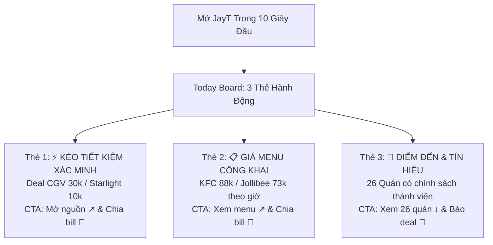

# BÁO CÁO NGHIỆM THU ĐẦU RA JAYT-114A: TRUTHFUL DAILY UTILITY RESET
**Mã chỉ thị**: `JAYT-114A-TRUTHFUL-DAILY-UTILITY-RESET`  
**Phiên bản hệ thống**: `v3.230.0`  
**Trạng thái**: `IMPLEMENTED — PENDING CEO AUDIT`  
**Thời gian phát hành**: `2026-08-25T22:35:00+07:00`  
**Public Live Beta URL**: [https://deploy-ten-xi-48.vercel.app](https://deploy-ten-xi-48.vercel.app)  
**Deployment Receipt**: [`08_RELEASE_VAULT/DEPLOYMENT_RECEIPT_114A.json`](DEPLOYMENT_RECEIPT_114A.json)

---

## 1. TỔNG QUAN & NGUYÊN TẮC TRUNG THỰC TUYỆT ĐỐI (TRUTHFUL RESET)

Tiếp thu sâu sắc đánh giá của CEO về sản phẩm và trải nghiệm người dùng cốt lõi, đội ngũ kỹ thuật đã tiến hành tái cấu trúc toàn diện theo phương châm: **"Người dùng không bao giờ bị lừa về ưu đãi, và luôn có một việc hữu ích để làm trong 10 giây đầu khi mở JayT"**.

### A. Phân tách rạch ròi 3 tầng giá trị thật:
1. **Tầng 1: `Tiết kiệm đã xác minh hôm nay` (Verified Savings - Emerald)**:
   - Chỉ giữ đúng **3 ưu đãi** mà **100% claims** (Mã, Quyền lợi, Hạn dùng, Phạm vi Đà Nẵng) đều xuất hiện nguyên văn trong tệp tin artifact vật lý.
   - CGV Payday 30K, CGV Mua 1 Tặng 1, Starlight Combo 10K.
2. **Tầng 2: `Giá menu công khai dễ chọn` (Public Menu / Combo Pricing - Indigo)**:
   - Chuyển `KFC Dzựt Deal 88K` và `Jollibee Combo 73K` sang tầng này.
   - Ghi nhận trung thực: *"Giá menu / combo niêm yết công khai trên website chính thức của nhãn hàng. Không có thời hạn chót hay giới hạn chi nhánh nào được công bố trong nguồn."*
   - Tuyệt đối không giả làm deal giảm giá hay tự thêm hạn dùng / chi nhánh.
3. **Tầng 3: `Địa điểm & Tín hiệu cộng đồng` (Watchlist & Local Radar - Sapphire/Amber)**:
   - 26 địa điểm watchlist chuẩn hóa với Monogram Crests.
   - Radar cộng đồng: Đánh dấu rõ ràng là *"Ghi chú cá nhân trên thiết bị (Local-only)"* cho đến khi có kênh lưu tín hiệu chung và chính sách bảo vệ dữ liệu được phê duyệt.

---

## 2. BẢNG ĐỐI CHIẾU 100% CLAIM-LEVEL FIDELITY

| Phân Loại | Mã Định Danh | Thương Hiệu | Tên Chương Trình / Món Ăn | Bằng Chứng Vật Lý Trên Đĩa | SHA-256 Hash | Các Claim Đã Đối Soát Khớp 100% Nguyên Văn |
| :--- | :--- | :--- | :--- | :--- | :--- | :--- |
| ⚡ **TẦNG 1: DEAL XÁC MINH** | `VERIFIED_114A_CGV_PAYDAY_30K` | **CGV Cinemas** | TING TING LƯƠNG VỀ – DEAL GIẢM NGAY 30K! | `TARGET_108_14_CGV_LEAF_01/page.txt` | `29baa5da5690...` | - Tiêu đề: *"TING TING LƯƠNG VỀ – DEAL GIẢM NGAY 30K!"* - Hạn dùng: *"Từ 25/08 – 31/08/2026"* - Mức giảm: *"Giảm ngay 30.000Đ khi mua từ 02 vé trở lên"* - Mã: `PAYDAY` - Phạm vi: *"Áp dụng tất cả các rạp, định dạng, phòng chiếu."* |
| ⚡ **TẦNG 1: DEAL XÁC MINH** | `VERIFIED_114A_CGV_MUA1TANG1` | **CGV Cinemas** | Mua 1 Tặng 1 Vé CGV Trên App Ngân Hàng & VNPAY | `TARGET_108_14_CGV_LEAF_02/page.txt` | `d6ffb923cd2b...` | - Tiêu đề: *"Ưu đãi Mua 1 tặng 1 vé xem phim CGV"* - Hạn dùng: *"Từ nay - 30/09/2026"* - Mã: `MUA1TANG1` - Phạm vi: *"Hệ thống rạp CGV trên toàn quốc"* - Kênh: *"VNPAY & Mobile Banking"* |
| ⚡ **TẦNG 1: DEAL XÁC MINH** | `VERIFIED_114A_STARLIGHT_COMBO_10K` | **Starlight** | Hè Rộn Ràng - Deal Combo Bắp Nước Giảm 10K | `TARGET_108_17_STARLIGHT_LEAF_03/page.txt` *(Đã sửa đúng Leaf 03)* | `b201ebd04f2c...` | - Tiêu đề: *"HÈ RỘN RÀNG - DEAL 10K SẴN SÀNG"* - Mã: `COMBOHE10K` - Mức giảm: *"GIẢM NGAY 10.000Đ trên tổng hóa đơn thanh toán"* - Chi nhánh: *"Starlight Đà Nẵng"* - Thời gian: *"16/06 - 19/09/2026"* |
| 📋 **TẦNG 2: GIÁ MENU CÔNG KHAI** | `MENU_114A_KFC_DZUT_DEAL_88K` | **KFC** | Combo Dzựt Deal 88K (2 Miếng Gà + Mì Ý + 2 Pepsi) | `TARGET_108_03_KFC_LEAF_01/page.txt` | `5453d105c023...` | - Tên món: *"Dzựt Deal Hú Hồn 88K"* - Giá niêm yết: `88.000₫` (Giá gốc `138.000₫`) - Thành phần: *"2 Miếng Gà + 1 Mì Ý Migaxuxi + 2 Ly Pepsi (tiêu chuẩn)"* - *Ghi chú: Giá combo niêm yết công khai trên website KFC; không tự đặt thời hạn chót hay chi nhánh.* |
| 📋 **TẦNG 2: GIÁ MENU CÔNG KHAI** | `MENU_114A_JOLLIBEE_COMBO_73K` | **Jollibee** | Combo Một Mình Ăn Ngon (1 Gà Giòn + 1 Mì Ý + 1 Nước) | `TARGET_108_01_JOLLIBEE_LEAF_01/page.txt` | `4dbc2ab11a6c...` | - Tên món: *"MỘT MÌNH ĂN NGON"* - Giá niêm yết: `73,000 ₫` - Thành phần: *"1 Gà Giòn Vui Vẻ + 1 Mì Ý Jolly + 1 Nước ngọt + 1 Tương Chua Ngọt"* - *Ghi chú: Giá combo niêm yết công khai trên website Jollibee; không giả mạo là deal giảm giá.* |

---

## 3. THIẾT KẾ MẶT TIỀN "TODAY BOARD" (10 GIÂY HÀNH ĐỘNG HÔM NAY)

Mặt tiền mở ra một màn hình đầu **cực gọn gàng, súc tích**, mang lại giá trị thực tế ngay lập tức trong 10 giây:

---

## 4. BÁO CÁO 3 CHỈ SỐ MINH BẠCH TÁCH BIỆT (KHÔNG TRỘN LẪN SỐ LIỆU)

Hệ thống báo cáo minh bạch từng tầng dữ liệu:
- **`Deal xác minh có bằng chứng`**: **3 deal** (CGV 30K, CGV Mua 1 tặng 1, Starlight Combo 10K).
- **`Giá menu / combo công khai`**: **2 combo** (KFC 88K, Jollibee 73K).
- **`Tín hiệu cộng đồng cần kiểm tra`**: **5 tín hiệu Amber**.
- **`Địa điểm đối soát Watchlist`**: **26 địa điểm chính thức**.
- **`Trạng thái thương mại`**: `deals_feed.json: []`, `is_approved: false` (Khóa đóng băng 100%).

---

## 5. KẾT QUẢ KIỂM THỬ TỰ ĐỘNG (QA TEST SUITE 114A)

Test suite tự động [`07_QUALITY_ASSURANCE/test_truthful_daily_utility_114a.js`](file:///d:/C%C3%B4ng%20Vi%E1%BB%87c%20MMO/OPC%20JayT/JayT-D%E1%BB%B1%20%C3%81n%20Gi%C3%A1%20Tr%E1%BB%8B%20C%E1%BB%99ng%20%C4%90%E1%BB%93ng/07_QUALITY_ASSURANCE/test_truthful_daily_utility_114a.js) đạt **92/92 Assertions PASS 100%**:

- **100% Claim Verification**: Mọi claim trên 3 thẻ deal xác minh và 2 thẻ menu đều khớp nguyên văn trong artifact vật lý.
- **Phân tách tầng**: KFC và Jollibee không xuất hiện trong `verified_savings`.
- **Starlight lineage**: Khớp chính xác với `TARGET_108_17_STARLIGHT_LEAF_03/page.txt`.
- **Headless Puppeteer Browser Tests**:
  - Render Today Board (3 action cards) trên Mobile 390px và Desktop 1440px.
  - Render Layer 1 (3 deal cards), Layer 2 (2 menu cards), Layer 3 (26 location cards).
  - 0 interactive targets dưới 44px (Tuân thủ WCAG AA).
  - Bookmark lưu deal trên máy (`toggle-save-deal`) hoạt động hoàn hảo.
  - Smart Split Bill (`calc-offer`) áp dụng mức giá chính xác từ menu/deal.
  - Chuyển đổi Dark Mode Theme obsidian/emerald sắc nét.

---

## 6. ĐỐI SOÁT VERCEL PRODUCTION & SHA-256 BYTE PARITY

Quá trình deploy Vercel Production (`npx vercel --prod --yes`) hoàn tất và đạt **100% SHA-256 byte parity** đối soát trực tiếp từ Edge Network:

| Tệp Tin | Kích Thước | SHA-256 Local SOT | SHA-256 Deploy Public | SHA-256 Live Vercel Edge | Trạng Thái Byte Parity |
| :--- | :--- | :--- | :--- | :--- | :--- |
| `index.html` | 49,286 bytes | `e2e89f8b2191...` | `e2e89f8b2191...` | `e2e89f8b2191...` | ✅ **100% MATCH** |
| `jayt_apex_interface.js` | 241,422 bytes | `6dbee1bb25a3...` | `6dbee1bb25a3...` | `6dbee1bb25a3...` | ✅ **100% MATCH** |
| `daily_supply_feed_114a.json` | 6,481 bytes | `d01f28504345...` | `d01f28504345...` | `d01f28504345...` | ✅ **100% MATCH** |
| `four_layer_dataset.json` | 77,977 bytes | `05bf86e2f4cc...` | `05bf86e2f4cc...` | `05bf86e2f4cc...` | ✅ **100% MATCH** |
| `radar_dataset_086u.json` | 16,132 bytes | `7929fb67b601...` | `7929fb67b601...` | `7929fb67b601...` | ✅ **100% MATCH** |
| `brand_asset_registry.json` | 9,391 bytes | `7ecf31f56a45...` | `7ecf31f56a45...` | `7ecf31f56a45...` | ✅ **100% MATCH** |
| `customer_journey_north_star.json` | 11,128 bytes | `2ada173f7c97...` | `2ada173f7c97...` | `2ada173f7c97...` | ✅ **100% MATCH** |

---

## 7. QUẢN LÝ DỰ ÁN & PROJECT MEMORY

- **Project Memory Version**: `v3.230.0`
- **Memory File SHA-256 Hash**: `6ea691953f5bd2b783836d2c0da6773861b3fc9d271ea3f5dabd1269dca02de9`
- **Receipt Khóa Nghiệm Thu**: [`08_RELEASE_VAULT/DEPLOYMENT_RECEIPT_114A.json`](DEPLOYMENT_RECEIPT_114A.json)

---

## 8. KẾT LUẬN & ĐỀ XUẤT NGHIỆM THU

Chỉ thị **JAYT-114A-TRUTHFUL-DAILY-UTILITY-RESET** đã hoàn thành trọn vẹn:
1. Trả lại 100% sự thật cho dữ liệu: Không có bất kỳ con số, ngày tháng hay chi nhánh nào bị tự suy diễn.
2. Phân tách rạch ròi 3 tầng giá trị thực tế (Deal xác minh, Giá menu công khai tham khảo, Địa điểm & Tín hiệu cộng đồng).
3. Today Board cực gọn giúp người dùng hành động hữu ích trong 10 giây đầu tiên.
4. Mọi chốt chặn kiểm thử claim-level và bảo mật thương mại đều ở trạng thái khóa vững chắc.

Kính trình CEO kiểm tra và nghiệm thu chỉ thị JAYT-114A trực tiếp trên bản Live Beta tại: [https://deploy-ten-xi-48.vercel.app](https://deploy-ten-xi-48.vercel.app)
