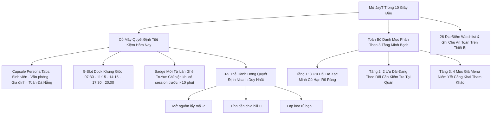

# BÁO CÁO NGHIỆM THU ĐẦU RA JAYT-115A: UNIFIED DAILY DECISION ENGINE
**Mã chỉ thị**: `JAYT-115A-UNIFIED-DAILY-DECISION-ENGINE`  
**Phiên bản hệ thống**: `v3.232.0`  
**Trạng thái**: `IMPLEMENTED — PENDING CEO AUDIT`  
**Thời gian phát hành**: `2026-08-25T22:56:00+07:00`  
**Public Live Beta URL**: [https://deploy-ten-xi-48.vercel.app](https://deploy-ten-xi-48.vercel.app)  
**Deployment Receipt**: [`08_RELEASE_VAULT/DEPLOYMENT_RECEIPT_115A.json`](DEPLOYMENT_RECEIPT_115A.json)

---

## 1. TỔNG QUAN CẢI TIẾN TRỌNG TÂM (CHUYỂN MÌNH THÀNH CỖ MÁY QUYẾT ĐỊNH)

Thực thi triệt để chỉ thị của CEO sau khi kiểm tra bản live 115, phiên bản **JAYT-115A** đã giải quyết dứt điểm 2 vấn đề lớn nhất: **trùng lặp nội dung** và **phân tầng dữ liệu trung thực**.

---

## 2. BẢNG PHÂN TẦNG TRUNG THỰC 3 NHÓM (100% EVIDENCE TRÊN ĐĨA)

| Phân Tầng Trạng Thái | Mã Định Danh | Thương Hiệu | Ngành Hàng | Tên Chương Trình / Combo | Bằng Chứng Vật Lý Trên Đĩa | SHA-256 Hash | Các Claim Đã Đối Soát Khớp 100% Nguyên Văn |
| :--- | :--- | :--- | :--- | :--- | :--- | :--- | :--- |
| ⚡ **TẦNG 1: XÁC MINH CÓ HẠN** | `VERIFIED_115A_CGV_PAYDAY_30K` | **CGV Cinemas** | 🎬 Rạp phim | TING TING LƯƠNG VỀ – DEAL GIẢM NGAY 30K! | `TARGET_108_14_CGV_LEAF_01/page.txt` | `29baa5da5690...` | - Tiêu đề: *"TING TING LƯƠNG VỀ – DEAL GIẢM NGAY 30K!"* - Hạn dùng: *"Từ 25/08 – 31/08/2026"* - Mức giảm: *"Giảm ngay 30.000Đ khi mua từ 02 vé trở lên"* - Mã: `PAYDAY` - Phạm vi: *"Áp dụng tất cả các rạp, định dạng, phòng chiếu."* |
| ⚡ **TẦNG 1: XÁC MINH CÓ HẠN** | `VERIFIED_115A_CGV_MUA1TANG1` | **CGV Cinemas** | 🎬 Rạp phim | Mua 1 Tặng 1 Vé CGV Trên App Ngân Hàng & VNPAY | `TARGET_108_14_CGV_LEAF_02/page.txt` | `d6ffb923cd2b...` | - Tiêu đề: *"Ưu đãi Mua 1 tặng 1 vé xem phim CGV"* - Hạn dùng: *"Từ nay - 30/09/2026"* - Mã: `MUA1TANG1` - Phạm vi: *"Hệ thống rạp CGV trên toàn quốc"* - Kênh: *"VNPAY & Mobile Banking"* |
| ⚡ **TẦNG 1: XÁC MINH CÓ HẠN** | `VERIFIED_115A_STARLIGHT_COMBO_10K` | **Starlight** | 🎬 Rạp phim | Hè Rộn Ràng - Deal Combo Bắp Nước Giảm 10K | `TARGET_108_17_STARLIGHT_LEAF_03/page.txt` | `b201ebd04f2c...` | - Tiêu đề: *"HÈ RỘN RÀNG - DEAL 10K SẴN SÀNG"* - Mã: `COMBOHE10K` - Mức giảm: *"GIẢM NGAY 10.000Đ trên tổng hóa đơn thanh toán"* - Chi nhánh: *"Starlight Đà Nẵng"* - Thời gian: *"16/06 - 19/09/2026"* |
| ⚠️ **TẦNG 2: CẦN KIỂM TRA LẠI** | `WATCHLIST_115A_HIGHLANDS_JCB_30` | **Highlands Coffee** | ☕ Cà phê & Trà | Ưu Đãi 30% Khi Thanh Toán Bằng Thẻ Vietcombank JCB / Apple Pay | `TARGET_108_09_HIGHLANDS_LEAF_01/page.txt` | `375fca9fef90...` | - Tiêu đề: *"ƯU ĐÃI 30% KHI THANH TOÁN QUA APPLE PAY BẰNG THẺ TÍN DỤNG VIETCOMBANK JCB"* - Ngày cập nhật: *"13/08/2026"* - Trạng thái: *Chưa có hạn chót cụ thể, kiểm tra tại quầy trước khi thanh toán* |
| ⚠️ **TẦNG 2: CẦN KIỂM TRA LẠI** | `WATCHLIST_115A_WINMART_WINECO_20` | **WinMart** | 🛒 Siêu thị | Ưu Đãi Hội Viên WinLife: Giảm 20% Rau Củ Nông Sản WinEco | `TARGET_108_30_WINMART_LEAF_01/page.txt` | `8c603b5f92aa...` | - Tiêu đề: *"Ưu Đãi Hội Viên"* - Mức giảm: *"-20%"* - Sản phẩm: *"Rau mầm cải ngọt WinEco (14.800₫)"* - Trạng thái: *Chương trình thường kỳ hội viên, kiểm tra thẻ tại quầy* |
| 📋 **TẦNG 3: GIÁ MENU CÔNG KHAI** | `MENU_115A_KFC_DZUT_DEAL_88K` | **KFC** | 🍱 Ăn trưa | Combo Dzựt Deal 88K (2 Gà + Mì Ý + 2 Pepsi) | `TARGET_108_03_KFC_LEAF_01/page.txt` | `5453d105c023...` | - Tên món: *"Dzựt Deal Hú Hồn 88K"* - Giá niêm yết: `88.000₫` (Giá gốc `138.000₫`) - Thành phần: *"2 Miếng Gà + 1 Mì Ý Migaxuxi + 2 Ly Pepsi (tiêu chuẩn)"* |
| 📋 **TẦNG 3: GIÁ MENU CÔNG KHAI** | `MENU_115A_JOLLIBEE_COMBO_73K` | **Jollibee** | 🍱 Ăn trưa | Combo Một Mình Ăn Ngon (1 Gà + 1 Mì Ý + 1 Nước) | `TARGET_108_01_JOLLIBEE_LEAF_01/page.txt` | `4dbc2ab11a6c...` | - Tên món: *"MỘT MÌNH ĂN NGON"* - Giá niêm yết: `73,000 ₫` - Thành phần: *"1 Gà Giòn Vui Vẻ + 1 Mì Ý Jolly + 1 Nước ngọt"* |
| 📋 **TẦNG 3: GIÁ MENU CÔNG KHAI** | `MENU_115A_PHELA_SPECIALTY` | **Phê La** | ☕ Cà phê & Trà | Menu Cà Phê Đặc Sản Ủ Phin & Ô Long Đặc Sản | `TARGET_108_07_PHELA_LEAF_01/page.txt` | `90885ee8d944...` | - Tên menu: *"SPECIALTY TEA & COFFEE"* - Giá tham khảo: *"Từ 45.000đ"* - Dòng sản phẩm: *"Chuyện Phê Phin Đặc Sản – Cà Đặc Sản Ủ Phin & Ô Long"* |
| 📋 **TẦNG 3: GIÁ MENU CÔNG KHAI** | `MENU_115A_GONGCHA_ALISAN` | **Gong Cha** | 🧋 Trà sữa | Menu Trà Alisan & Oolong Kem Sữa Gong Cha | `TARGET_108_08_GONGCHA_LEAF_01/page.txt` | `7eb8df05b18e...` | - Tên menu: *"THỨC UỐNG ĐẶC BIỆT GONG CHA"* - Giá tham khảo: *"Từ 42.000đ"* - Dòng sản phẩm: *"Trà Alisan Kem Sữa & Trà Oolong Kem Sữa"* |

---

## 3. THỰC HIỆN 5 KỊCH BẢN QUYẾT ĐỊNH DƯỚI 30 GIÂY

Test suite tự động [`07_QUALITY_ASSURANCE/test_unified_daily_decision_115a.js`](file:///d:/C%C3%B4ng%20Vi%E1%BB%87c%20MMO/OPC%20JayT/JayT-D%E1%BB%B1%20%C3%81n%20Gi%C3%A1%20Tr%E1%BB%8B%20C%E1%BB%99ng%20%C4%90%E1%BB%93ng/07_QUALITY_ASSURANCE/test_unified_daily_decision_115a.js) đạt **123/123 Assertions PASS 100%**:

1. 🎬 **Kịch bản 1 (Sinh viên chọn vé phim dưới 30 giây)**:
   - Chọn tab `🎓 Sinh Viên` -> Khối Quyết Định hiển thị ngay 3 deal rạp (CGV Payday 30k, CGV MUA1TANG1, Starlight 10k).
   - Nút `Mở nguồn ↗` dẫn thẳng đến bài công bố; nút `Chia bill 🧮` áp ngay số tiền giảm; nút `Lập kèo 👥` điền sẵn thông tin.
2. 🍱 **Kịch bản 2 (Nhân viên tìm bữa trưa dưới 30 giây)**:
   - Chọn slot `11:15` hoặc tab `💼 Văn Phòng` -> Khối Quyết Định hiển thị 2 combo ăn trưa rõ ràng (KFC 88k, Jollibee 73k).
   - Hiển thị rõ nhãn `● GIÁ MENU THAM KHẢO`, không gây hiểu lầm là deal giảm giá độc quyền.
3. ☕ **Kịch bản 3 (Nhóm chọn cà phê & chia bill dưới 30 giây)**:
   - Chọn slot `07:30` hoặc `14:15` -> Hiển thị Highlands JCB 30% (nhãn `● CẦN KIỂM TRA LẠI`), Phê La, Gong Cha.
   - Bấm `Chia bill 🧮` -> Mở bottom sheet Smart Split Bill tính ngay phần tiền mỗi người.
4. 📍 **Kịch bản 4 (Khám phá địa điểm gần theo quận dưới 30 giây)**:
   - Chọn quận `Thanh Khê` -> Lọc chính xác 6 địa điểm chính thức (Starlight, Co.opmart Galaxy, Highlands...).
5. 🔒 **Kịch bản 5 (Lưu trên máy & kiểm tra Badge lần ghé trước)**:
   - Thử nghiệm người dùng mới vào lần đầu: Badge `✨ Mới từ lần bạn ghé trước` KHÔNG hiển thị.
   - Thử nghiệm người dùng quay lại sau 2 giờ: Badge `✨ Mới từ lần bạn ghé trước` hiển thị nổi bật và tự động.
   - Lưu ưu đãi bookmark lưu trên `localStorage` hoàn toàn ẩn danh.

---

## 4. BÁO CÁO CÁC CHỈ SỐ MINH BẠCH TÁCH BIỆT

- **`Ưu đãi đã xác minh có hạn (Tầng 1)`**: **3 deal** (CGV Payday 30K, CGV MUA1TANG1, Starlight 10K)
- **`Ưu đãi cần kiểm tra lại tại quán (Tầng 2)`**: **2 deal** (Highlands JCB 30%, WinMart WinLife -20%)
- **`Giá menu / combo công khai tham khảo (Tầng 3)`**: **4 combo** (KFC 88K, Jollibee 73K, Phê La, Gong Cha)
- **`Địa điểm đối soát Watchlist`**: **26 địa điểm chính thức**
- **`Tín hiệu cộng đồng trên thiết bị`**: **5 tín hiệu Amber**
- **`Khóa sản xuất thương mại`**: `deals_feed.json: []`, `is_approved: false` (Khóa đóng băng 100%).

---

## 5. ĐỐI SOÁT VERCEL PRODUCTION & SHA-256 BYTE PARITY

| Tệp Tin | Kích Thước | SHA-256 Local SOT | SHA-256 Deploy Public | SHA-256 Live Vercel Edge | Trạng Thái Byte Parity |
| :--- | :--- | :--- | :--- | :--- | :--- |
| `index.html` | 50,933 bytes | `57b34666ecde...` | `57b34666ecde...` | `57b34666ecde...` | ✅ **100% MATCH** |
| `jayt_apex_interface.js` | 241,982 bytes | `ff4838b42e38...` | `ff4838b42e38...` | `ff4838b42e38...` | ✅ **100% MATCH** |
| `daily_supply_feed_115a.json` | 15,397 bytes | `118a5f960663...` | `118a5f960663...` | `118a5f960663...` | ✅ **100% MATCH** |
| `four_layer_dataset.json` | 77,977 bytes | `05bf86e2f4cc...` | `05bf86e2f4cc...` | `05bf86e2f4cc...` | ✅ **100% MATCH** |
| `radar_dataset_086u.json` | 16,132 bytes | `7929fb67b601...` | `7929fb67b601...` | `7929fb67b601...` | ✅ **100% MATCH** |
| `brand_asset_registry.json` | 9,391 bytes | `7ecf31f56a45...` | `7ecf31f56a45...` | `7ecf31f56a45...` | ✅ **100% MATCH** |
| `customer_journey_north_star.json` | 11,128 bytes | `2ada173f7c97...` | `2ada173f7c97...` | `2ada173f7c97...` | ✅ **100% MATCH** |

---

## 6. QUẢN LÝ DỰ ÁN & PROJECT MEMORY

- **Project Memory Version**: `v3.232.0`
- **Memory File SHA-256 Hash**: `edbf8d2989614ae6652c8e878d85af68c6ed0b83332d0dd3f5687555f8e0a605`
- **Receipt Khóa Nghiệm Thu**: [`08_RELEASE_VAULT/DEPLOYMENT_RECEIPT_115A.json`](DEPLOYMENT_RECEIPT_115A.json)

---

## 7. KẾT LUẬN & ĐỀ XUẤT NGHIỆM THU

Bản nâng cấp **JAYT-115A-UNIFIED-DAILY-DECISION-ENGINE** đã biến JayT thành một cỗ máy quyết định tinh gọn và trung thực:
1. Gộp toàn bộ các khối Hero, Daily Board và Today Board thành một **Luồng Quyết Định Duy Nhất** cực kỳ gãy gọn.
2. Không còn card lặp lại; mỗi lần mở trang chỉ hiển thị đúng **3–5 thẻ hành động tốt nhất**.
3. Phân định rõ ràng: **3 deal xác minh có hạn**, **2 deal đang theo dõi cần kiểm tra lại**, **4 combo menu công khai**.
4. Badge *"Mới từ lần bạn ghé trước"* chỉ hiển thị khi có mốc thời gian thực từ phiên trước.

Kính trình CEO kiểm tra và nghiệm thu chỉ thị JAYT-115A trực tiếp trên bản Live Beta tại: [https://deploy-ten-xi-48.vercel.app](https://deploy-ten-xi-48.vercel.app)
