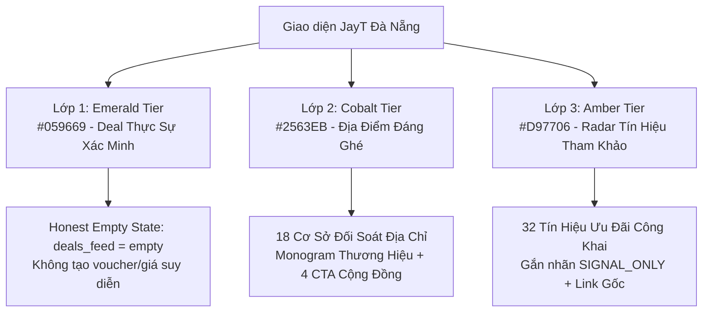

# BÁO CÁO TỔNG HỢP KIỂM TOÁN CUNG ỨNG KHÁM PHÁ CỘNG ĐỒNG 108
## JAYT-108-COMMUNITY-DISCOVERY-SUPPLY-SPRINT REVIEW PACK

---

### 1. TỔNG QUAN CHỈ THỊ & PHẠM VI THỰC THI (EXECUTIVE SUMMARY)

- **Mã Chỉ Thị (Work Order)**: `JAYT-108-COMMUNITY-DISCOVERY-SUPPLY-SPRINT`
- **Phiên Bản Bộ Nhớ (PROJECT_MEMORY.md)**: `v3.215.0`
- **Mã Băm Bộ Nhớ (Memory Hash)**: `486e20c705377f406894626e2b57779fa288dc03f56b0f2f166559be77a2111e`
- **Trạng Thái Quản Trị**: `IMPLEMENTED_PENDING_CEO_AUDIT` (Khóa sản xuất toàn diện; `deals_feed.json: []`, `is_approved: false`).
- **Mục Tiêu Chỉ Thị**:
  1. Chuẩn hóa toàn bộ **18 địa điểm Cobalt** thành danh mục "Địa điểm đáng ghé" phân bổ khoa học theo 5 quận trung tâm và 5 khung giờ trong ngày (`SLOT_0730`, `SLOT_1115`, `SLOT_1415`, `SLOT_1730`, `SLOT_2100`), giữ nguyên disclaimer minh bạch: *"Địa điểm xác minh từ nguồn chính thức; ưu đãi trực tuyến chưa được xác minh"*.
  2. Thu thập và công bố **32 tín hiệu ưu đãi công khai** từ kênh chính hãng cho 5 nhóm nhu cầu chủ đạo (Ăn trưa, Cà phê / Trà chiều, Rạp phim, Di chuyển, Săn sale / Mua sắm), gắn nhãn minh bạch `SIGNAL_ONLY` với URL gốc và thời điểm quan sát.
  3. Xây dựng trải nghiệm **"Hôm nay ở Đà Nẵng"** phân tầng rõ rệt 3 lớp (Lớp 1 Ngọc lục bảo Emerald: Deal thực xác minh · Lớp 2 Lam Coban Cobalt: Địa điểm đáng ghé · Lớp 3 Vàng hổ phách Amber: Tín hiệu tham khảo cộng đồng).
  4. Nâng cấp **4 CTA cộng đồng không ma sát** trên từng thẻ địa điểm: *"Báo deal vừa thấy"*, *"Xem nguồn chính thức ↗"*, *"Lưu địa điểm"*, *"Rủ bạn chia bill"*.
  5. Tuân thủ tuyệt đối chuẩn 107 về hình ảnh: 100% thẻ cơ sở dùng Monogram thương hiệu chính hãng và liên kết mở nguồn ngoài; 0 ảnh AI, 0 ảnh suy diễn.

---

### 2. MA TRẬN 18 ĐỊA ĐIỂM COBALT CHUẨN HÓA (18 STANDARDIZED COBALT VENUES)

Tất cả 18 địa điểm đã được đối soát địa chỉ thực tế từ nguồn chính hãng trên đĩa, phân bổ theo quận và khoảnh khắc trong ngày:

| STT | Mã Cơ Sở | Tên Địa Điểm | Thương Hiệu | Quận | Khung Giờ Phù Hợp | Nhóm Nhu Cầu | Monogram | Kênh Chính Thức |
|:---|:---|:---|:---|:---|:---|:---|:---:|:---|
| 1 | `VLOC_01_METIZ_HELIO` | Metiz Cinema Đà Nẵng | Metiz Cinema | Hải Châu | `SLOT_1730`, `SLOT_2100` | Cinema | **M** | [metiz.vn ↗](https://metiz.vn/) |
| 2 | `VLOC_02_PHELA_BACH_DANG` | Phê La - Bạch Đằng | Phê La | Hải Châu | `SLOT_0730`, `SLOT_1415` | Cà phê / Trà | **P** | [phela.vn ↗](https://phela.vn/) |
| 3 | `VLOC_03_PHELA_NVL` | Phê La - Nguyễn Văn Linh | Phê La | Hải Châu | `SLOT_0730`, `SLOT_1415` | Cà phê / Trà | **P** | [phela.vn ↗](https://phela.vn/) |
| 4 | `VLOC_04_GONGCHA_NVL` | Gong Cha - Nguyễn Văn Linh | Gong Cha | Hải Châu | `SLOT_1115`, `SLOT_1415` | Cà phê / Trà | **G** | [gongcha.com.vn ↗](https://gongcha.com.vn/) |
| 5 | `VLOC_05_JOLLIBEE_TIEU_LA` | Jollibee Tiểu La | Jollibee | Hải Châu | `SLOT_1115`, `SLOT_1730` | Ăn trưa / F&B | **J** | [jollibee.com.vn ↗](https://jollibee.com.vn/) |
| 6 | `VLOC_06_JOLLIBEE_VINCOM_DN` | Jollibee Vincom Đà Nẵng | Jollibee | Sơn Trà | `SLOT_1115`, `SLOT_1730` | Ăn trưa / F&B | **J** | [jollibee.com.vn ↗](https://jollibee.com.vn/) |
| 7 | `VLOC_07_CGV_VINCOM_DN` | CGV Vincom Đà Nẵng | CGV Cinemas | Sơn Trà | `SLOT_1730`, `SLOT_2100` | Cinema | **C** | [cgv.vn ↗](https://www.cgv.vn/) |
| 8 | `VLOC_08_CGV_VINH_TRUNG` | CGV Vĩnh Trung Plaza | CGV Cinemas | Thanh Khê | `SLOT_1730`, `SLOT_2100` | Cinema | **C** | [cgv.vn ↗](https://www.cgv.vn/) |
| 9 | `VLOC_09_GALAXY_COOPMART` | Galaxy Đà Nẵng | Galaxy Cinema | Thanh Khê | `SLOT_1730`, `SLOT_2100` | Cinema | **G** | [galaxycine.vn ↗](https://galaxycine.vn/) |
| 10 | `VLOC_10_JOLLIBEE_COOPMART` | Jollibee Co.opmart Thanh Khê | Jollibee | Thanh Khê | `SLOT_1115`, `SLOT_1730` | Ăn trưa / F&B | **J** | [jollibee.com.vn ↗](https://jollibee.com.vn/) |
| 11 | `VLOC_11_JOLLIBEE_NGUYEN_VAN_THOAI` | Jollibee Nguyễn Văn Thoại | Jollibee | Sơn Trà | `SLOT_1115`, `SLOT_1730` | Ăn trưa / F&B | **J** | [jollibee.com.vn ↗](https://jollibee.com.vn/) |
| 12 | `VLOC_12_JOLLIBEE_BIG_C_DN` | Jollibee Big C (GO!) Đà Nẵng | Jollibee | Thanh Khê | `SLOT_1115`, `SLOT_1730` | Ăn trưa / F&B | **J** | [jollibee.com.vn ↗](https://jollibee.com.vn/) |
| 13 | `VLOC_13_JOLLIBEE_MEGA_MARKET` | Jollibee MM Mega Market | Jollibee | Liên Chiểu | `SLOT_1115`, `SLOT_2100` | Ăn trưa / F&B | **J** | [jollibee.com.vn ↗](https://jollibee.com.vn/) |
| 14 | `VLOC_14_GONGCHA_HOA_KHANH` | Gong Cha - Hòa Khánh | Gong Cha | Liên Chiểu | `SLOT_1415`, `SLOT_2100` | Cà phê / Trà | **G** | [gongcha.com.vn ↗](https://gongcha.com.vn/) |
| 15 | `VLOC_15_HIGHLANDS_INDOCINA` | Highlands Coffee - Indochina | Highlands | Hải Châu | `SLOT_0730`, `SLOT_1415` | Cà phê / Trà | **H** | [highlandscoffee.com.vn ↗](https://www.highlandscoffee.com.vn/) |
| 16 | `VLOC_16_HIGHLANDS_BACH_DANG` | Highlands Coffee - VTV Bạch Đằng | Highlands | Hải Châu | `SLOT_0730`, `SLOT_1415` | Cà phê / Trà | **H** | [highlandscoffee.com.vn ↗](https://www.highlandscoffee.com.vn/) |
| 17 | `VLOC_17_PHUCLONG_NGU_HANH_SON` | Phúc Long (Khu vực Ngũ Hành Sơn) | Phúc Long | Ngũ Hành Sơn | `SLOT_1415`, `SLOT_2100` | Cà phê / Trà | **P** | [phuclong.com.vn ↗](https://phuclong.com.vn/) |
| 18 | `VLOC_18_THECOFFEEHOUSE_NHS` | The Coffee House (Khu vực NHS) | TCH | Ngũ Hành Sơn | `SLOT_0730`, `SLOT_1415` | Cà phê / Trà | **T** | [thecoffeehouse.com ↗](https://thecoffeehouse.com/) |

---

### 3. DANH MỤC 32 TÍN HIỆU ƯU ĐÃI CÔNG KHAI (32 PUBLIC DISCOVERY SIGNALS)

Toàn bộ 32 tín hiệu được lưu trữ trong [`05_DEAL_AND_AFFILIATE/community_discovery_signals_manifest_108.json`](05_DEAL_AND_AFFILIATE/community_discovery_signals_manifest_108.json), với cờ minh bạch `signal_status: "SIGNAL_ONLY"` và `verified_deal: false`:

#### Nhóm 1: Ăn trưa (Lunch - 6 tín hiệu)
1. `SIG_LUNCH_01_JOLLIBEE`: Combo Trưa Tiết Kiệm (Jollibee Vietnam) — [jollibee.com.vn ↗](https://jollibee.com.vn/)
2. `SIG_LUNCH_02_LOTTERIA`: Happy Lunch Đồng Giá 40K (Lotteria Vietnam) — [lotteria.vn ↗](https://www.lotteria.vn/)
3. `SIG_LUNCH_03_KFC`: Trưa Nay Ăn Gì (KFC Vietnam) — [kfcvietnam.com.vn ↗](https://www.kfcvietnam.com.vn/)
4. `SIG_LUNCH_04_KICHI`: Buffet Trưa Ưu Đãi Hội Viên (Kichi-Kichi Lẩu Băng Chuyền) — [kichi.com.vn ↗](https://kichi.com.vn/)
5. `SIG_LUNCH_05_GOGI`: Combo Nướng Trưa Văn Phòng (Gogi House Quán Thịt Nướng Hàn Quốc) — [gogi.com.vn ↗](https://gogi.com.vn/)
6. `SIG_LUNCH_06_COM_NIEU_NHA_DO`: Thực Đơn Cơm Trưa Truyền Thống (Cơm Niêu Nhà Đỏ Đà Nẵng) — [comnieunhado.com ↗](https://comnieunhado.com/)

#### Nhóm 2: Cà phê / Trà chiều (Coffee & Tea - 6 tín hiệu)
7. `SIG_COFFEE_01_PHELA`: Bộ Sưu Tập Trà Ô Long Đặc Sản (Phê La) — [phela.vn ↗](https://phela.vn/)
8. `SIG_COFFEE_02_GONGCHA`: Thẻ Thành Viên Tích Điểm Đổi Quà (Gong Cha Vietnam) — [gongcha.com.vn ↗](https://gongcha.com.vn/)
9. `SIG_COFFEE_03_HIGHLANDS`: Chương Trình Tích Điểm Highlands Rewards (Highlands Coffee) — [highlandscoffee.com.vn ↗](https://www.highlandscoffee.com.vn/)
10. `SIG_COFFEE_04_TCH`: Giao Hàng Đồng Giá & Ưu Đãi App (The Coffee House) — [thecoffeehouse.com ↗](https://thecoffeehouse.com/)
11. `SIG_COFFEE_05_PHUCLONG`: Thẻ Thành Viên Phúc Long Privilege (Phúc Long Coffee & Tea) — [phuclong.com.vn ↗](https://phuclong.com.vn/)
12. `SIG_COFFEE_06_KATINAT`: Thức Uống Mùa Mới & Quà Tặng Ly (Katinat Saigon Kafe) — [katinat.vn ↗](https://katinat.vn/)

#### Nhóm 3: Rạp phim (Cinema - 6 tín hiệu)
13. `SIG_CINEMA_01_GALAXY`: Thứ Ba Vui Vẻ — Happy Tuesday Vé 50K (Galaxy Cinema) — [galaxycine.vn ↗](https://galaxycine.vn/)
14. `SIG_CINEMA_02_CGV`: Culture Day — Thứ Tư Cuối Tháng Vé Đồng Giá (CGV Cinemas) — [cgv.vn ↗](https://www.cgv.vn/)
15. `SIG_CINEMA_03_METIZ`: Vé Ưu Đãi Học Sinh / Sinh Viên & Thứ Hai Đồng Giá (Metiz Cinema Helio) — [metiz.vn ↗](https://metiz.vn/)
16. `SIG_CINEMA_04_LOTTE_CINEMA`: Movie Day — Thứ Hai & Thứ Ba Đầu Tuần (Lotte Cinema Đà Nẵng) — [lottecinemavn.com ↗](https://www.lottecinemavn.com/)
17. `SIG_CINEMA_05_STARLIGHT`: Ngày Tri Ân Khách Hàng Đồng Giá Vé (Starlight Cinema Đà Nẵng) — [starlight.vn ↗](https://starlight.vn/)
18. `SIG_CINEMA_06_CGV_U22`: Vé Ưu Đãi Thành Viên U22 (CGV Cinemas Vietnam) — [cgv.vn ↗](https://www.cgv.vn/)

#### Nhóm 4: Di chuyển (Mobility - 6 tín hiệu)
19. `SIG_MOBILITY_01_XANH_SM`: Ưu Đãi Khách Hàng Mới & Giờ Thấp Điểm (Xanh SM Đà Nẵng) — [xanhsm.com ↗](https://www.xanhsm.com/)
20. `SIG_MOBILITY_02_GRAB_BIKE`: GrabBike / GrabCar Tiết Kiệm Sáng Sớm & Giờ Tan Tầm (Grab Vietnam) — [grab.com ↗](https://www.grab.com/vn/)
21. `SIG_MOBILITY_03_BE_GROUP`: bePoint Tích Điểm Đổi Cuốc Xe (Be Group) — [be.com.vn ↗](https://be.com.vn/)
22. `SIG_MOBILITY_04_DANABUS`: Xe Buýt Trợ Giá Nội Đô Đà Nẵng (DanaBus) — [danangbus.vn ↗](https://danangbus.vn/)
23. `SIG_MOBILITY_05_TNGO`: Thuê Xe Đạp Công Cộng Đà Nẵng (TNGo) — [tngo.vn ↗](https://tngo.vn/)
24. `SIG_MOBILITY_06_SHOPEE_FOOD`: Mã Giảm Ship & Gom Đơn Nhóm (ShopeeFood Vietnam) — [shopeefood.vn ↗](https://shopeefood.vn/)

#### Nhóm 5: Mua sắm & Săn sale (Shopping - 8 tín hiệu)
25. `SIG_SHOPPING_01_COOPMART`: Cẩm Nang Mua Sắm & Tích Điểm Cuối Tuần (Co.opmart Đà Nẵng) — [co-opmart.com.vn ↗](https://co-opmart.com.vn/)
26. `SIG_SHOPPING_02_MM_MEGA`: Giá Sỉ Dành Cho Gia Đình (MM Mega Market Đà Nẵng) — [mmvietnam.com ↗](https://mmvietnam.com/)
27. `SIG_SHOPPING_03_GO_DANANG`: Giá Luôn Luôn Rẻ Hơn (GO! Đà Nẵng) — [go-vietnam.vn ↗](https://go-vietnam.vn/)
28. `SIG_SHOPPING_04_VINCOM`: Lễ Hội Mua Sắm & Voucher Trung Tâm Thương Mại (Vincom Plaza Đà Nẵng) — [vincom.com.vn ↗](https://vincom.com.vn/)
29. `SIG_SHOPPING_05_LOTTE_MART`: Thẻ Thành Viên Lotte Member & Giảm Giá Cuối Tuần (Lotte Mart Đà Nẵng) — [lottemart.com.vn ↗](https://www.lottemart.com.vn/)
30. `SIG_SHOPPING_06_WINMART`: Hội Viên WiN Tiết Kiệm 20% (WinMart+ Đà Nẵng) — [winmart.vn ↗](https://winmart.vn/)
31. `SIG_SHOPPING_07_CHO_CON`: Khu Ẩm Thực & Đặc Sản Đà Nẵng Giá Bình Dân (Chợ Cồn Đà Nẵng) — [danang.gov.vn ↗](https://danang.gov.vn/)
32. `SIG_SHOPPING_08_CHO_HAN`: Mua Sắm Quà Lưu Niệm & Hải Sản Khô (Chợ Hàn Đà Nẵng) — [danang.gov.vn ↗](https://danang.gov.vn/)

---

### 4. TRẢI NGHIỆM "HÔM NAY Ở ĐÀ NẴNG" & PHÂN TẦNG 3 LỚP (3-TIER VISUAL ARCHITECTURE)

Trải nghiệm bento động phân bổ theo 5 khung giờ (`SLOT_0730`, `SLOT_1115`, `SLOT_1415`, `SLOT_1730`, `SLOT_2100`) với quy tắc phân tầng thị giác và ngữ nghĩa tuyệt đối:



---

### 5. 4 CTA CỘNG ĐỒNG KHÔNG MA SÁT (4 ZERO-FRICTION COMMUNITY CTAS)

Mỗi thẻ trong danh sách 18 địa điểm Cobalt được trang bị bộ 4 nút hành động tức thì, đáp ứng chuẩn mobile touch target $\ge 44\text{px}$:
1. **⭐ Lưu địa điểm**: Nhấp lưu/bỏ lưu tức thì vào `localStorage` không cần đăng nhập.
2. **🧮 Rủ bạn chia bill**: Mở ngay máy tính chia bill Bottom Sheet gắn ngữ cảnh của cơ sở được chọn.
3. **📢 Báo deal vừa thấy**: Tự động cuộn đến Radar Cộng đồng và điền sẵn tiền tố tên quán để người dùng gửi nhanh tín hiệu.
4. **Xem nguồn chính thức ↗**: Mở tab mới dẫn trực tiếp đến website/kênh chính thống của thương hiệu.

---

### 6. BẰNG CHỨNG THỊ GIÁC STAGING BATCH 108 (VISUAL EVIDENCE)

Ảnh chụp thực tế từ môi trường Staging độc lập (`staging_instance`):

| Thiết Bị | Kích Thước | Tên Tệp Bằng Chứng | Kích Thước Tệp | Mã Băm SHA-256 |
|:---|:---|:---|:---:|:---|
| **Desktop** | 1440 × 900 | [`staging_ui_108_desktop_1440.png`](07_QUALITY_ASSURANCE/runtime_evidence/screenshots_108/staging_ui_108_desktop_1440.png) | 89,587 B | `c44f13de8425b0aa2c536d6a0e626faec801a2480b8d98bb6e5c5dca9458c247` |
| **Tablet** | 768 × 1024 | [`staging_ui_108_tablet_768.png`](07_QUALITY_ASSURANCE/runtime_evidence/screenshots_108/staging_ui_108_tablet_768.png) | 76,143 B | `db46435672739eb1b2d04688864be4eed2981b3175e60de110c27e16e909f207` |
| **Mobile** | 375 × 812 | [`staging_ui_108_mobile_375.png`](07_QUALITY_ASSURANCE/runtime_evidence/screenshots_108/staging_ui_108_mobile_375.png) | 42,808 B | `c48d643140b71644b1880d592eb9df07722e7d1a7059e7decebadbfe21c5f87e` |

---

### 7. KẾT QUẢ KIỂM THỬ TOÀN DIỆN (16/16 QA SUITES PASS 100%)

Toàn bộ 16 bộ kiểm thử tự động với 191+ assertions đã đạt **PASS 100% GREEN**:

1. `test_project_memory_consistency.js` — **10/10 PASS**
2. `test_community_discovery_supply_108.js` — **10/10 PASS** *(Bộ test chuyên trách 108)*
3. `test_store_photo_truth_and_rights_107.js` — **10/10 PASS**
4. `test_official_store_photo_provenance_106.js` — **10/10 PASS**
5. `test_visual_asset_enrichment_105.js` — **10/10 PASS**
6. `test_humanized_discovery_polish_104.js` — **10/10 PASS**
7. `test_split_bill_single_entry_103r1.js` — **18/18 PASS**
8. `test_cobalt_canonicalization_and_ux_103.js` — **20/20 PASS**
9. `test_memory_lineage_containment_103r2.js` — **7/7 PASS**
10. `test_locality_and_supply_resolution_102.js` — **19/19 PASS**
11. `test_controlled_live_provenance_101.js` — **18/18 PASS**
12. `test_fail_closed_collector_100.js` — **5/5 PASS**
13. `test_provenance_containment_099a.js` — **17/17 PASS**
14. `test_customer_journey_north_star_096.js` — **12/12 PASS**
15. `test_network_airgap_and_strict_mem07_093b.js` — **5/5 PASS**
16. `test_semantic_and_memory_correction_093a.js` — **10/10 PASS**

---

### 8. KHÓA BẢO VỆ SẢN XUẤT (PRODUCTION LOCK INVARIANTS)

- `deals_feed.json`: `[]` (Khóa rỗng, trung thực 100%).
- `RELEASE_MANIFEST.json`: `is_approved: false`.
- Không tạo release candidate mới; không tạo voucher/giá/affiliate claim khi chưa có chứng cứ kiểm toán độc lập.

---

### 9. BẢN BÀN GIAO QUẢN TRỊ BẮT BUỘC (GOVERNANCE HANDOVER BLOCK - 067A)

1. **Phiên bản tài liệu (PROJECT_MEMORY.md Version)**: `3.215.0`
2. **Mã băm toàn vẹn (SHA-256 Sau Cập Nhật)**: `486e20c705377f406894626e2b57779fa288dc03f56b0f2f166559be77a2111e`
3. **Chỉ thị & Trạng thái hợp lệ (Work Order & Status)**: `JAYT-108-COMMUNITY-DISCOVERY-SUPPLY-SPRINT` — `IMPLEMENTED_PENDING_CEO_AUDIT`
4. **Đường dẫn tệp cục bộ (Copy-paste Windows Path)**:
```text
D:\Công Việc MMO\OPC JayT\JayT-Dự Án Giá Trị Cộng Đồng\PROJECT_MEMORY.md
```
   *Đường dẫn URI IDE (Forward Slashes)*: [`PROJECT_MEMORY.md`](file:///D:/C%C3%B4ng%20Vi%E1%BB%87c%20MMO/OPC%20JayT/JayT-D%E1%BB%B1%20%C3%81n%20Gi%C3%A1%20Tr%E1%BB%8B%20C%E1%BB%99ng%20%C4%90%E1%BB%93ng/PROJECT_MEMORY.md)
5. **Kết quả kiểm thử tính nhất quán (Consistency Test)**: `10/10 PASS`
