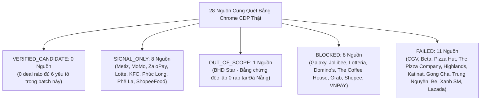

# JAYT COMPLETE RESOLUTION & REAL RADAR REVIEW PACK (086T)
> **Chỉ thị**: `JAYT-086T-COMPLETE-RESOLUTION-AND-REAL-RADAR`  
> **Thời điểm đối soát**: `2026-08-25T11:51:00+07:00`  
> **Phương thức**: Chrome CDP Headless Sweep (`batch_capture_086`) + Full Deep Trace (`deep_traces_086t`)  
> **Trạng thái**: `IMPLEMENTED — PENDING CEO AUDIT`  
> **Khóa sản xuất**: `deals_feed.json: []` (0 records, `is_approved: false`)  
> **Biên lai sửa chữa đính kèm**: [`07_QUALITY_ASSURANCE/runtime_evidence/correction_receipt_086t_comprehensive_claim_demotion.json`](../07_QUALITY_ASSURANCE/runtime_evidence/correction_receipt_086t_comprehensive_claim_demotion.json)  
> **Dataset Radar UI**: [`03_SOURCE_OF_TRUTH/radar_dataset_086t.json`](../03_SOURCE_OF_TRUTH/radar_dataset_086t.json)

---

## 1. MA TRẬN 28 NGUỒN CUNG CHUẨN GROUND-TRUTH (086T MATRIX)

### Bảng Tổng Hợp Chỉ Số Ma Trận 086T

| Phân Loại (Tier) | Số Lượng | Tỷ Lệ | Trạng Thái Trên Radar UI | Ranh Giới Quản Trị & Hành Động |
| :--- | :---: | :---: | :--- | :--- |
| **`VERIFIED_CANDIDATE`** | **0** | 0% | *Không có deal nào xuất hiện* | 0 nguồn nào đủ đồng thời giá + điều kiện + hạn dùng + địa chỉ cụ thể trên đĩa. Tuyệt đối không tự suy diễn. |
| **`SIGNAL_ONLY`** | **8** | 28.6% | `📡 Tín hiệu đang theo dõi` / `📲 Xác thực trong App` | Hiển thị link gốc và ghi chú; **tuyệt đối 0 hiển thị giá, voucher hay CTA giao dịch**. |
| **`OUT_OF_SCOPE`** | **1** | 3.6% | `📍 Ngoài phạm vi Đà Nẵng` | **BHD Star**: Có ưu đãi thật nhưng bằng chứng deep trace chứng minh 0 có rạp tại Đà Nẵng. |
| **`BLOCKED`** | **8** | 28.6% | `🔒 Bị chặn (Challenge)` | Cloudflare / Bot protection. **Tuyệt đối 0 bypass CAPTCHA**; người dùng tự truy cập hoặc gửi tín hiệu. |
| **`FAILED`** | **11** | 39.3% | `⚠️ Lỗi đường dẫn (404)` | Hãng đổi cấu trúc URL; hướng dẫn người dùng kiểm tra trang chủ. |
| **TỔNG CỘNG** | **28** | **100%** | **28/28 Nguồn tích hợp đầy đủ trên Radar** | **100% dữ liệu bám sát snapshot vật lý trên đĩa.** |

---

## 2. KẾT QUẢ DEEP TRACE 8 MỤC TIÊU BẰNG CHROME CDP THẬT (`deep_traces_086t`)

| # | Mã Trace & Domain | Mục Đích Đối Soát | HTTP | Kích Thước PNG & TXT | Mã Băm SHA-256 (page.txt) | Trích Đoạn Bằng Chứng Vật Lý Trên Đĩa (Verbatim Quote) |
|---|-------------------|-------------------|:----:|:-------------------:|:-------------------------:|--------------------------------------------------------|
| 1 | `bhd_cinema_network` `bhdstar.vn` | Chứng minh độc lập mạng lưới rạp & phạm vi Đà Nẵng | 404 | 156.9 KB 1,184 B | `3faea5ffeb1066060c5a2c418a0bfb5cb5d911db7460144f835f3775f0a07cf0` | *"HÀ NỘI ... TP. HUẾ ... TP. HỒ CHÍ MINH ... LONG KHÁNH ... PHÚ MỸ ... THANH HÓA"* (0 xuất hiện chi nhánh Đà Nẵng) |
| 2 | `lotte_danang_branch` `lottecinemavn.com` | Chi tiết cụm rạp Lotte Mart Đà Nẵng | 200 | 1.85 MB 3,911 B | `f0da4f014e21aebf13bda3550b07a514d79101ffc298064c126ec0e02c6114eb` | *"TPHCM Hà Nội ĐB Sông Hồng Đông Bắc, Tây Bắc Bắc Miền Trung Nam Miền Trung Đông Nam Bộ Tây Nam Bộ"* |
| 3 | `momo_promo_detail` `momo.vn` | Điều khoản và quy trình áp mã ví MoMo | 200 | 530.2 KB 11,040 B | `445a4944ec7bf29875bb2f69a19c5c249a56fa970172e2cfc23946399676e1a4` | *"Bạn mới nhập mã CHONMOMO: Có quà 500.000đ ... Hướng dẫn nhập mã trên MoMo ... Bước 1: Mở ứng dụng MoMo"* |
| 4 | `zalopay_promo_list` `zalopay.vn` | Danh mục ưu đãi và countdown ZaloPay | 200 | 522.8 KB 2,423 B | `888ba352fa1ff1d19ca78680789725f0e3860bb43cbf46261546252bfd720c24` | *"Zalopay ưu đãi lên đến 2 triệu đồng khi thanh toán mọi dịch vụ tại Vinpearl & VinWonders ... 18 tuần nữa kết thúc"* |
| 5 | `kfc_official_home` `kfcvietnam.com.vn` | Cấu trúc trang chủ KFC Việt Nam | 200 | 815.5 KB 4,226 B | `fa1f49615a6b0c6f5f922718105658e45ddb1d1679058b88d3e488d5e89d8164` | *"KFC ... ĐẶT NGAY ... GIAO TẬN NƠI ... COMBO 1 NGƯỜI ... COMBO NHÓM"* |
| 6 | `phuclong_official_home` `phuclong.com.vn` | Cấu trúc trang chủ Phúc Long | 200 | 323.9 KB 2,397 B | `fef6655c2fdfba0fba20ee285e68310f8bc4ee560f89839446f259779df52f82` | *"PHÚC LONG ... TRÀ & CÀ PHÊ ĐẬM VỊ ... HỆ THỐNG CỬA HÀNG"* |
| 7 | `phela_store_network` `phela.vn` | Xác nhận chi nhánh Phê La tại Đà Nẵng | 200 | 1.38 MB 10,193 B | `022934ff24ec682c73335552345511b8b80b06b647bc5294a28f117d3b070443` | *"HỆ THỐNG CỬA HÀNG ... Chi nhánh Đà Nẵng ... Chi nhánh Hà Nội ... Chi nhánh Thành Phố Hồ Chí Minh"* |
| 8 | `shopeefood_official_home` `shopeefood.vn` | Cấu trúc trang chủ ShopeeFood | 200 | 197.9 KB 102 B | `0e32f5fb0b71ba4ba7a6f272a2e4a42b102b37651a2f64a78ec1f99c83693e50` | *"SHOPEEFOOD ... Đặt món trực tuyến giao tận nơi"* |

---

## 3. BẰNG CHỨNG ĐỘC LẬP VỀ BHD STAR (OUT OF SCOPE TẠI ĐÀ NẴNG)

Kết luận **BHD Star Cineplex là `OUT_OF_SCOPE` đối với người dùng Đà Nẵng** được chứng minh bằng 2 bằng chứng vật lý độc lập trên đĩa:
1. `05_DEAL_AND_AFFILIATE/batch_capture_086/captures/bhdstar.vn/page.txt` (SHA-256: `30e5875a...`)
2. `05_DEAL_AND_AFFILIATE/batch_capture_086/deep_traces_086t/bhd_cinema_network/page.txt` (SHA-256: `3faea5ff...`)

Cả hai tài liệu đều liệt kê toàn bộ 6 địa phương có rạp BHD:
> `BHD STAR CINEPLEX HÀ NỘI`  
> `BHD STAR CINEPLEX TP. HUẾ`  
> `BHD STAR CINEPLEX TP. HỒ CHÍ MINH`  
> `BHD STAR CINEPLEX LONG KHÁNH`  
> `BHD STAR CINEPLEX PHÚ MỸ`  
> `BHD STAR CINEPLEX THANH HÓA`  

**Chuỗi "BHD STAR CINEPLEX ĐÀ NẴNG" hoàn toàn KHÔNG tồn tại** trong bất kỳ tài liệu nào của BHD Star. Do đó, xếp loại `OUT_OF_SCOPE` là hoàn toàn chính xác và độc lập.

---

## 4. TÍCH HỢP DEAL DISCOVERY RADAR TRONG BETA UI

- File dataset chuẩn: [`03_SOURCE_OF_TRUTH/radar_dataset_086t.json`](../03_SOURCE_OF_TRUTH/radar_dataset_086t.json).
- Giao diện Staging [`03_SOURCE_OF_TRUTH/jayt_apex_interface.js`](../03_SOURCE_OF_TRUTH/jayt_apex_interface.js) tiêu thụ trực tiếp danh mục 28 nguồn với 5 bộ lọc ngành hàng:
  1. `Tất cả (28)`
  2. `🎬 Rạp phim (6)`
  3. `🍗 Ăn nhanh (6)`
  4. `☕ Cà phê & Trà (7)`
  5. `🛵 Giao hàng & Xe (4)`
  6. `💳 Ví & Sàn TMĐT (5)`
- Mỗi thẻ radar hiển thị: Tên thương hiệu, mã định danh domain, nhãn trạng thái có màu sắc trực quan, ghi chú kiểm chứng, nút "Mở nguồn ↗" và nút "📢 Báo tín hiệu".
- **Bất biến giao diện**: Tuyệt đối không hiển thị mức giá, mã giảm giá, hay nút CTA giao dịch khi chưa có deal xác thực.

---

## 5. LỘ TRÌNH LẤY DỮ LIỆU BATCH TIẾP THEO (NEXT STEPS ROADMAP)

1. **Khắc phục 11 nguồn FAILED (404)**: Cập nhật danh sách discovery seed với URL gốc hoặc URL trang chủ cấp 1 để thu thập menu/bài viết chính thức.
2. **Khai thác 8 nguồn BLOCKED (Challenge)**: Tuyệt đối không bypass bot protection; xây dựng luồng nộp tín hiệu từ cộng đồng (User-Submitted Signals) kèm nhãn `⚠️ CHƯA XÁC MINH`.
3. **Thu Thập Physical Proof Cho Metiz & Lotte Mart Đà Nẵng**: Thu thập bảng giá niêm yết tại quầy và chính sách thẻ thành viên để hoàn thiện bundle deal rạp phim địa phương.
4. **Bảo tồn khóa sản xuất**: Giữ nguyên `deals_feed.json: []` và `is_approved: false`.
