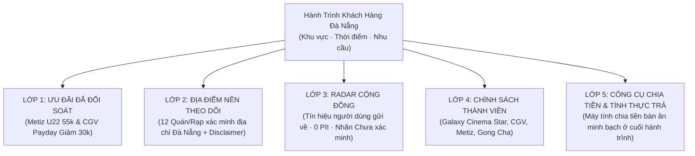

# JAYT CUSTOMER JOURNEY FIRST & FOUR-LAYER COMMUNITY HUB REVIEW PACK (090)
> **Chỉ thị**: `JAYT-090-CUSTOMER-JOURNEY-FIRST-COMMUNITY-HUB`  
> **Thời điểm đối soát**: `2026-08-25T13:35:00+07:00`  
> **Triết lý North Star**: *"Nó có giúp sinh viên hoặc dân văn phòng Đà Nẵng ra quyết định tiết kiệm nhanh hơn, mà vẫn nói đúng sự thật không?"*  
> **Trạng thái**: `IMPLEMENTED — PENDING CEO AUDIT`  
> **Khóa sản xuất**: `deals_feed.json: []` (0 records, `is_approved: false`)  
> **Tài liệu SSOT 11 Scenarios**: [`03_SOURCE_OF_TRUTH/CUSTOMER_JOURNEY_NORTH_STAR.md`](../03_SOURCE_OF_TRUTH/CUSTOMER_JOURNEY_NORTH_STAR.md), [`03_SOURCE_OF_TRUTH/customer_journey_north_star.json`](../03_SOURCE_OF_TRUTH/customer_journey_north_star.json)  
> **Dataset 4 Lớp Trung Thực**: [`03_SOURCE_OF_TRUTH/four_layer_dataset.json`](../03_SOURCE_OF_TRUTH/four_layer_dataset.json)  
> **Giao diện Khách hàng**: [`03_SOURCE_OF_TRUTH/jayt_apex_interface.js`](../03_SOURCE_OF_TRUTH/jayt_apex_interface.js), [`03_SOURCE_OF_TRUTH/index.html`](../03_SOURCE_OF_TRUTH/index.html)

---

## 1. BẢNG TỔNG HỢP KIẾN TRÚC 4 LỚP HIỂN THỊ (FOUR-LAYER CONTRACT)

### Bảng Phân Tầng Bằng Chứng & Quy Tắc Quản Trị

| Lớp hiển thị | Nhãn Giao Diện / Badge | Nội dung được phép | Không được phép | Điểm đến / Dữ liệu thực tế |
|:---|:---|:---|:---|:---|
| **1. Ưu đãi đã đối soát** | `ƯU ĐÃI ĐÃ ĐỐI SOÁT` (Xanh ngọc `#10b981`) | Giá, điều kiện, hạn dùng, chi nhánh Đà Nẵng, kênh nhận | Claim ngoài evidence, tự ý publish | Metiz Cinema U22 (55k/vé T3-T5 tại Số 01 Đường 2/9 ĐN) & CGV Payday (Giảm 30k 25-31/08 tại Tầng 4 Vincom Plaza ĐN). Trạng thái: `PENDING_CEO_REVIEW`. |
| **2. Điểm đến nên theo dõi** | `ĐIỂM ĐẾN NÊN THEO DÕI` (Xanh dương `#3b82f6`) | Tên quán/rạp, địa chỉ cụ thể, khu vực, nguồn chính thức, disclaimer chuẩn | Giá, mã, mức giảm, "deal hot", countdown giả | 12 điểm đến Đà Nẵng (Metiz Helio, CGV Vincom, CGV Vĩnh Trung, Galaxy Coopmart, Phê La Bạch Đằng, Phê La Nguyễn Văn Linh, Gong Cha Nguyễn Văn Linh, Jollibee Vincom/Tiểu La/Lý Thái Tổ, Highlands, Domino's). Disclaimer: *"JayT đã xác nhận địa điểm hoạt động tại Đà Nẵng; ưu đãi online chưa đủ dữ liệu để xác nhận. Hãy kiểm tra trực tiếp tại quán hoặc nguồn chính thức trước khi mua."* |
| **3. Cộng đồng báo về** | `CỘNG ĐỒNG BÁO VỀ` (Cam hổ phách `#f59e0b`) | Link/tín hiệu do người dùng gửi, thời gian gửi | Tự nâng thành deal, thu thập PII | Tín hiệu đóng góp từ người dùng địa phương, mặc định nhãn `CHƯA XÁC MINH`, 0 lưu/thu thập PII. |
| **4. Chính sách thành viên** | `CHÍNH SÁCH THÀNH VIÊN` (Tím thạch anh `#8b5cf6`) | Quy tắc tích điểm/quyền lợi có nguồn, điều kiện thẻ | CTA mua hàng hoặc deal cụ thể chưa đủ điều kiện | Galaxy Cinema Star (1 Star = 1k VND), CGV FanC/VIP, Metiz Member 2026 (Tích 7-10% & vé sinh nhật), Gong Cha Boba. |
| **5. Công cụ chia tiền** | `CÔNG CỤ CHIA TIỀN` (Xanh thông `#0F3327`) | Tổng bill, voucher, phụ phí, số người, thực trả mỗi người | Khuyến mãi ảo | Máy tính toán thực trả minh bạch đặt ở cuối hành trình. |

---

## 2. 11 TÌNH HUỐNG THỰC TẾ CỦA NGƯỜI ĐÀ NẴNG (CUSTOMER JOURNEYS)

1. **Sinh viên săn vé xem phim ngày thường**: Metiz Cinema U22 (55.000đ/vé) tại Helio Center Số 01 Đường 2/9, Hải Châu.
2. **Dân văn phòng Hải Châu tìm bữa trưa**: Mạng lưới Jollibee, chuỗi F&B Hải Châu với địa chỉ thực tế và đối soát trực tiếp.
3. **Nhóm bạn trẻ tụ tập trà sữa**: Phê La 36-38 Bạch Đằng, Gong Cha 01 Nguyễn Văn Linh, Phê La 35-41 Nguyễn Văn Linh.
4. **Cặp đôi xem phim cuối tuần**: CGV Payday giảm 30K (Tầng 4 Vincom Plaza Ngô Quyền) / Galaxy Cinema Coopmart (478 Điện Biên Phủ).
5. **Nhóm bạn săn deal Pizza Thứ Ba**: Domino's Pizza Thứ Ba Mua 1 Tặng 1 kèm danh sách điểm theo dõi tại Đà Nẵng.
6. **Gia đình ăn gà rán cuối tuần**: Jollibee Vincom Ngô Quyền, 32 Tiểu La, 99 Lý Thái Tổ.
7. **Freelancer tìm cà phê làm việc**: Highlands Coffee, Phê La Đà Nẵng với thông tin địa chỉ chính thức.
8. **Nhóm bạn chia tiền bàn ăn**: Công cụ Chia Tiền & Tính Thực Trả ở cuối hành trình.
9. **Đi lại giờ cao điểm**: Radar tín hiệu xe công nghệ (chỉ hiển thị khi có provenance cùng thời điểm, 0 bịa mã).
10. **Người dân phát hiện ưu đãi quán quen**: Radar Cộng Đồng gửi tín hiệu nhanh (mặc định Chưa xác minh, 0 PII).
11. **Kiểm tra quyền lợi hội viên**: Bảng quyền lợi Galaxy Cinema Star, CGV FanC/VIP, Metiz Member 2026, Gong Cha Boba.

---

## 3. CÁC NGUYÊN TẮC BẢO VỆ BẤT BIẾN (NEGATIVE INVARIANTS)

- **Zero Forbidden Hardcoded Terms**: Không chứa ví dụ 45K, 30K, mã `AHAI30K`, `KATINAT25`, khung giờ giả, hay claim `đáy 90 ngày`.
- **Zero Unverified Price/Code in Layer 2 & Layer 3**: Lớp Điểm đến nên theo dõi và Radar cộng đồng hoàn toàn không chứa giá, mã hoặc mức giảm unverified.
- **Production Lock**: `deals_feed.json: []` (0 records, `is_approved: false`).
- **Hash Parity**: 100% SHA-256 parity cho `four_layer_dataset.json`, `jayt_apex_interface.js`, `index.html` giữa Source of Truth, Deploy, và Staging.
