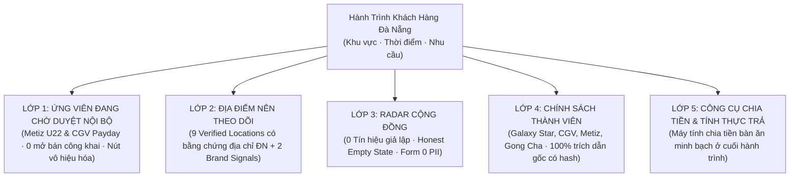

# JAYT TRUTHFUL COMMUNITY HUB REMEDIATION REVIEW PACK (090A)
> **Chỉ thị**: `JAYT-090A-TRUTHFUL-COMMUNITY-HUB-REMEDIATION`  
> **Thời điểm đối soát**: `2026-08-25T13:42:00+07:00`  
> **Triết lý North Star**: *"Nó có giúp sinh viên hoặc dân văn phòng Đà Nẵng ra quyết định tiết kiệm nhanh hơn, mà vẫn nói đúng sự thật không?"*  
> **Trạng thái**: `IMPLEMENTED — PENDING CEO AUDIT`  
> **Khóa sản xuất**: `deals_feed.json: []` (0 records, `is_approved: false`)  
> **Tài liệu SSOT 11 Scenarios**: [`03_SOURCE_OF_TRUTH/CUSTOMER_JOURNEY_NORTH_STAR.md`](../03_SOURCE_OF_TRUTH/CUSTOMER_JOURNEY_NORTH_STAR.md), [`03_SOURCE_OF_TRUTH/customer_journey_north_star.json`](../03_SOURCE_OF_TRUTH/customer_journey_north_star.json)  
> **Dataset 4 Lớp Trung Thực**: [`03_SOURCE_OF_TRUTH/four_layer_dataset.json`](../03_SOURCE_OF_TRUTH/four_layer_dataset.json)  
> **Giao diện Khách hàng**: [`03_SOURCE_OF_TRUTH/jayt_apex_interface.js`](../03_SOURCE_OF_TRUTH/jayt_apex_interface.js), [`03_SOURCE_OF_TRUTH/index.html`](../03_SOURCE_OF_TRUTH/index.html)

---

## 1. BẢNG TỔNG HỢP KHẮC PHỤC DATA CONTRACT 4 LỚP TRUNG THỰC (090A)



### Bảng Phân Tầng Bằng Chứng & Quy Tắc Quản Trị Sau Remediation

| Lớp hiển thị | Nhãn Giao Diện / Badge | Phân Nhóm / Tầng Dữ Liệu | Bằng Chứng Vật Lý Bắt Buộc | Trạng Thái Hiển Thị / Rào Chắn |
|:---|:---|:---|:---|:---|
| **1. Ứng viên chờ duyệt nội bộ** | `ỨNG VIÊN ĐANG CHỜ DUYỆT NỘI BỘ` (Cam đậm `#D97706`) | 2 Ứng viên: Metiz Cinema U22 (55k) & CGV Payday (Giảm 30k) | Đầy đủ 5 mảnh chứng cứ gốc trên đĩa (`captures_088/`, `captures_088a/`, `captures_088b/`) | **Không mở bán thương mại**. Nút CTA bị vô hiệu hóa: `🔒 Đang chờ CEO Audit`. |
| **2. Địa điểm nên theo dõi** | `ĐỊA ĐIỂM NÊN THEO DÕI` (Xanh dương `#1D4ED8`) | **Tầng 1: `verified_locations` (9 điểm)**: Metiz Helio, CGV Vincom, CGV Vĩnh Trung, Galaxy Coopmart, Phê La Bạch Đằng, Gong Cha Nguyễn Văn Linh, Jollibee Vincom/Tiểu La/Lý Thái Tổ | Trích dẫn địa chỉ nguyên văn + Đường dẫn tệp artifact + SHA-256 + Thời gian capture | Disclaimer chuẩn: *"JayT đã xác nhận địa điểm hoạt động tại Đà Nẵng; ưu đãi online chưa đủ dữ liệu để xác nhận. Hãy kiểm tra trực tiếp tại quán hoặc nguồn chính thức trước khi mua."* (0 giá/mã). |
| | `THƯƠNG HIỆU THEO DÕI` (Xám tro `#475569`) | **Tầng 2: `brand_signals_only` (2 thương hiệu)**: Highlands Coffee, Domino's Pizza | Chưa có địa chỉ chi nhánh cụ thể trên đĩa | Nhãn trung thực: *"Thương hiệu đang theo dõi — Chưa có dữ liệu địa chỉ chi nhánh cụ thể trên đĩa"*. |
| **3. Radar cộng đồng** | `RADAR CỘNG ĐỒNG` (Cam hổ phách `#B45309`) | **Honest Empty State (`items: []`)** | 0 tín hiệu giả lập tự sinh | Hiển thị thông điệp trống trung thực: *"Chưa có tín hiệu cộng đồng nào được gửi hôm nay..."* + Form gửi link/mô tả không thu thập PII. |
| **4. Chính sách thành viên** | `CHÍNH SÁCH THÀNH VIÊN` (Tím thạch anh `#6D28D9`) | 4 Chính sách: Galaxy Cinema Star, CGV FanC/VIP, Metiz Member, Gong Cha Boba | 100% bắt buộc trích dẫn nguyên văn + artifact_path + SHA-256 | Hiển thị trích dẫn điều khoản chính thức, link điều khoản, 0 CTA mua thương mại. |
| **5. Công cụ chia tiền** | `CÔNG CỤ CHIA TIỀN` (Xanh thông `#0F3327`) | Máy tính thực trả bàn ăn | Thuật toán toán học chuẩn | Tính toán số tiền mỗi người góp sau voucher và phụ phí. |

---

## 2. KẾT QUẢ ĐỐI SOÁT VÀ BỘ KIỂM THỬ 090A (8/8 PASS)

```text
======================================================
🧪 [JAYT-090A-TEST] Khởi chạy bộ kiểm thử Truthful Community Hub Remediation 090A...

  [TEST_01_ZERO_SIMULATED_COMMUNITY_SIGNALS_AND_HONEST_EMPTY_STATE]: [PASS] (Xóa 100% tín hiệu giả lập, Honest Empty State)
  [TEST_02_WATCHLIST_TWO_TIER_SPLIT_AND_MANDATORY_EVIDENCE_POINTERS]: [PASS] (Tách 9 Verified Locations có bằng chứng & 2 Brand Signals)
  [TEST_03_LOYALTY_CLAIMS_MANDATORY_BYTE_FOR_BYTE_QUOTE_PROOF]: [PASS] (100% quyền lợi hội viên có trích dẫn gốc & hash)
  [TEST_04_LAYER_1_PENDING_INTERNAL_REVIEW_STATUS_AND_DISABLED_CTA]: [PASS] (Layer 1 labeled Pending Review, nút disabled, 0 buy CTA)
  [TEST_05_FULL_TEXT_SCAN_FORBIDS_UNVERIFIED_PRICES_CODES_COUNTDOWNS_IN_LAYERS_2_3_4]: [PASS] (0 giá, mã, countdowns trong Lớp 2-4)
  [TEST_06_DOM_RENDER_VALIDATES_BADGES_DISCLAIMERS_AND_ZERO_OUTBOUND_PURCHASE_LINKS]: [PASS] (DOM render xác nhận disclaimer & 0 outbound purchase link)
  [TEST_07_ASSET_AND_DATASET_BYTE_FOR_BYTE_PARITY]: [PASS] (100% Parity SoT === Deploy === Staging)
  [TEST_08_PRODUCTION_INVARIANTS_LOCKED]: [PASS] (deals_feed.json: [], is_approved: false)

🟢 [TRUTHFUL-COMMUNITY-HUB-090A-SUMMARY] Kết quả kiểm thử: 8/8 PASS!
======================================================
```
