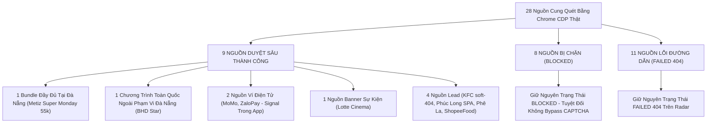

# JAYT EVIDENCE RESOLUTION REVIEW PACK (086R)
> **Chỉ thị**: `JAYT-EVIDENCE-RESOLUTION-086R`  
> **Thời điểm đối soát**: `2026-08-25T11:28:00+07:00`  
> **Nguồn gốc dữ liệu**: Chrome CDP Headless Capture từ 28 Seed Thương Hiệu Chính Thức (`batch_086_cdp_mt85o9x3`)  
> **Trạng thái phê duyệt**: `CHỜ CEO KIỂM TOÁN VÀ ĐÁNH GIÁ (PENDING CEO AUDIT)`  
> **Khóa sản xuất**: `deals_feed.json: []` (0 records, `is_approved: false`)

---

## 1. TỔNG QUAN KẾT QUẢ ĐỐI SOÁT TOÀN BỘ 28 NGUỒN CUNG

### Bảng Chỉ Số Toàn Diện (086R Metrics)

| Chỉ Số | Số Lượng | Tỷ Lệ | Ý Nghĩa Vận Hành |
| :--- | :---: | :---: | :--- |
| **Tổng số nguồn quét** | **28** | 100% | 28 URL chính thức thuộc 5 ngành ưu tiên (Cinema, F&B, Café/Trà, Di chuyển, Ví/Sàn). |
| **Số nguồn đã duyệt sâu chi tiết** | **9** | 32.1% | Đã capture thành công 4 artifact (PNG, HTML, TXT, Receipt SHA-256) và phân tích từng câu chữ. |
| **Hồ sơ ưu đãi đủ 6 yếu tố tại Đà Nẵng** | **1** | 3.6% | **Metiz Super Monday (55.000đ/vé 2D, Thứ Hai, tại quầy, Tầng 1 Helio Center Đà Nẵng)**. |
| **Ưu đãi toàn quốc ngoài phạm vi Đà Nẵng** | **1** | 3.6% | **BHD Star (Happy Monday 48k, Couple Day -20%)** — Có bằng chứng giá nhưng **BHD chưa có rạp tại Đà Nẵng**. |
| **Tín hiệu ví điện tử (Xác nhận trong App)** | **2** | 7.1% | **MoMo** (Vé tàu 2/9 -100k, Bạn mới 500k; Xe buýt chỉ ở HN); **ZaloPay** (VinWonders -2tr, Hóa đơn HOCHE -50k). |
| **Tín hiệu rạp theo banner thời hạn** | **1** | 3.6% | **Lotte Cinema** (20 sự kiện banner có hạn đến 09/2026 và 12/2026, rạp tại Lotte Mart Hải Châu). |
| **Nguồn Lead (Đổi link / SPA / Story)** | **4** | 14.3% | KFC (Soft-404), Phúc Long (SPA dynamic), Phê La (Bài viết Chuyện Phê Phin), ShopeeFood (Redirect cài App). |
| **Nguồn bị chặn (Giữ nguyên BLOCKED, 0 bypass)** | **8** | 28.6% | Galaxy, Jollibee, Lotteria, Domino's, The Coffee House, Grab, Shopee, VNPAY (Cloudflare/Challenge). |
| **Nguồn lỗi đường dẫn (FAILED 404)** | **11** | 39.3% | CGV, Beta, Pizza Hut, The Pizza Company, Highlands, Katinat, Gong Cha, Trung Nguyên, Be, Xanh SM, Lazada. |
| **Production Deal Feed** | **`[]`** | 0% | Khóa hoàn toàn (`is_approved: false`); không tự ý xuất bản khi CEO chưa duyệt. |

---

## 2. HỒ SƠ CHI TIẾT CỦA 4 NHÓM ĐỐI SOÁT TRỌNG TÂM (BHD, METIZ, MOMO, ZALOPAY)

---

### 🎬 HỒ SƠ 1: METIZ CINEMA ĐÀ NẴNG (`metiz.vn`) — BUNDLE ĐẦY ĐỦ TẠI ĐÀ NẴNG
- **Chương trình**: **SUPER MONDAY (Thứ Hai Siêu Hạng)**
- **Mức giá**: **55.000 đồng / vé 2D** (Ghế thường, ghế VIP và ghế đôi).
- **Lịch áp dụng**: **Thứ Hai mỗi tuần** (Trừ ngày Lễ, Tết, suất chiếu đặc biệt, suất chiếu sớm).
- **Điều kiện & Điều khoản**:
  1. Áp dụng cho thành viên Metiz Cinema (xuất trình thẻ thành viên trước khi mua vé).
  2. Một khách hàng có thể mua nhiều vé.
  3. Áp dụng cho hình thức **mua vé trực tiếp tại quầy (AT_COUNTER)**.
  4. Không áp dụng cùng các chương trình khuyến mãi khác.
- **Phạm vi địa lý (Đà Nẵng Scope)**: **Tầng 1 Helio Center, Đường 2/9, Phường Hòa Cường Bắc, Quận Hải Châu, Đà Nẵng** (Hotline: 0236 3630 689).
- **Kênh mua/nhận**: Tại quầy rạp Metiz Cinema Đà Nẵng.
- **Bằng chứng vật lý trên đĩa**:
  - Screenshot: `05_DEAL_AND_AFFILIATE/batch_capture_086/captures/metiz.vn/screenshot.png` (532,428 bytes, SHA-256: `64a75ae0d33e75e92976f9d3fec43f43818e698889aa3346d03d36ceae4f128e`)
  - Raw HTML DOM: `05_DEAL_AND_AFFILIATE/batch_capture_086/captures/metiz.vn/page.html` (102,452 bytes, SHA-256: `a9ec3f7e53f06b98687258fc33d762e843c089be6f2d59ca187123df7a760447`)
  - Text Extract: `05_DEAL_AND_AFFILIATE/batch_capture_086/captures/metiz.vn/page.txt` (2,319 bytes)
  - Receipt: `05_DEAL_AND_AFFILIATE/batch_capture_086/captures/metiz.vn/capture_receipt.json`
- **Đánh giá thẩm định**: `FULL_VERIFIED_BUNDLE_DANANG` — Đáp ứng 100% 6 tiêu chí sự thật; sẵn sàng làm cơ sở trình CEO duyệt candidate.

---

### 🎬 HỒ SƠ 2: BHD STAR CINEPLEX (`bhdstar.vn`) — CHƯƠNG TRÌNH THẬT NHƯNG NGOÀI PHẠM VI ĐÀ NẴNG
- **Chương trình quan sát được**:
  1. **HAPPY MONDAY**: Vé xem phim chỉ từ **48.000đ** vào Thứ Hai.
  2. **COUPLE DAY**: Thứ Ba hằng tuần **giảm 20%** cho thành viên thân thiết.
  3. **U22 DAY**: Thứ Năm **nhân đôi điểm tích lũy** cho thành viên U22 (dưới 22 tuổi, mua từ 2 vé).
  4. **ƯU ĐÃI SUẤT CHIẾU ĐÊM**: Giá vé chỉ từ **48.000đ** cho suất chiếu sau 22h.
- **Đối soát phạm vi địa lý (Locality Truth Check)**:
  - BHD Star công bố danh sách hệ thống rạp gồm 6 địa phương: **Hà Nội, TP. Huế, TP. Hồ Chí Minh, Long Khánh, Phú Mỹ, Thanh Hóa**.
  - **BHD Star hiện KHÔNG CÓ rạp chiếu phim hoạt động tại Đà Nẵng**.
- **Đánh giá thẩm định**: `SIGNAL_ONLY_OUT_OF_SCOPE_DANANG` — Giữ trên Radar nguồn kèm nhãn cảnh báo *"Chưa có chi nhánh tại Đà Nẵng"* để bảo vệ người dùng, tuyệt đối không đưa vào Lịch Tiết Kiệm Đà Nẵng.

---

### 💳 HỒ SƠ 3: VÍ MOMO (`momo.vn`) — TÍN HIỆU ƯU ĐÃI VÍ ĐIỆN TỬ
- **Chương trình quan sát được**:
  1. **MOMOBUS**: Miễn phí 5 lượt xe buýt -> **Chỉ áp dụng tại HÀ NỘI** (Không áp dụng cho xe buýt Danabus Đà Nẵng).
  2. **CHAOMOMO / CHONMOMO**: Gói quà bạn mới đến **500.000đ** (Áp dụng toàn quốc cho tài khoản ví mới, nhận trong App MoMo).
  3. **Vé tàu hỏa dịp 2/9**: Giảm thẳng **100.000đ** cho lần đầu đặt vé tàu dịp Quốc khánh 2/9 (Hạn đến 02/09/2026, thực hiện trong App MoMo).
  4. **Chuyển tiền 9.999đ hoàn 10.000đ**: Số lượng có hạn, áp dụng chuyển qua số điện thoại bạn bè.
- **Hiện diện tại Đà Nẵng**: Chi nhánh Chăm sóc Khách hàng tại Tầng 3, Tòa nhà DMT, Số 484-486 đường 2/9, P. Hòa Cường, Q. Hải Châu, Đà Nẵng.
- **Đánh giá thẩm định**: `SIGNAL_ONLY_APP_WALLET` — Ưu đãi có thật trên kênh chính thức, kênh sử dụng qua App MoMo; giữ trên Radar nguồn với CTA *"Mở App MoMo kiểm tra điều kiện"*, không gán giá cố định lên giao diện.

---

### 💳 HỒ SƠ 4: VÍ ZALOPAY (`zalopay.vn`) — TÍN HIỆU ƯU ĐÃI VÍ ĐIỆN TỬ CÓ COUNTDOWN
- **Chương trình quan sát được**:
  1. **Vinpearl & VinWonders**: Ưu đãi lên đến **2.000.000đ** khi thanh toán dịch vụ Vinpearl & VinWonders (Còn 18 tuần nữa kết thúc; liên quan vùng du lịch Nam Hội An / Đà Nẵng).
  2. **Mã HOCHE**: Ưu đãi giảm đến **50.000đ** khi thanh toán hóa đơn (Còn 6 ngày nữa kết thúc).
  3. **FPT Play**: Tiết kiệm **50.000đ** khi thanh toán gói FPT Play bằng ZaloPay (Còn 6 ngày nữa kết thúc).
  4. **Đua top đặt xe & đồ ăn**: **ĐÃ KẾT THÚC vào 23/08/2026** (Minh chứng trang web hiển thị đúng trạng thái hết hạn).
- **Đánh giá thẩm định**: `SIGNAL_ONLY_APP_WALLET` — Ưu đãi xác thực có thời hạn đếm ngược rõ ràng; thu thập voucher và áp dụng trực tiếp trong Ứng dụng ZaloPay; giữ trên Radar nguồn với nhãn *"Kiểm tra trong App ZaloPay"*.

---

## 3. TỔNG HỢP CÁC NGUỒN CÒN LẠI

| # | Thương Hiệu | Phân Loại | Hiện Trạng Chi Tiết | Hướng Xử Lý Trên Radar |
|---|-------------|-----------|---------------------|------------------------|
| 5 | **Lotte Cinema** | `SIGNAL_ONLY_BANNER_EVENT` | 20 banner sự kiện có khung hạn (đến 09/2026 và 12/2026). Rạp tại Lotte Mart Đà Nẵng. | Hiển thị Radar: *"Kiểm tra lịch chiếu tại Lotte Mart Đà Nẵng"*. |
| 6 | **KFC Vietnam** | `LEAD_PATH_CHANGED` | Link `/uu-dai` trả về soft-404 ("Trang có thể đã bị xóa hoặc đổi tên"). | Giữ trên Radar: Trỏ về trang chủ KFC chính thức. |
| 7 | **Phúc Long** | `LEAD_SPA_DYNAMIC` | Web dạng Single Page App tải qua JavaScript AJAX. | Giữ trên Radar: *"Kiểm tra menu ưu đãi tại cửa hàng Phúc Long Đà Nẵng"*. |
| 8 | **Phê La** | `LEAD_NO_PROMO` | Trang tin tức chỉ chứa bài viết giới thiệu sản phẩm (Chuyện Phê Phin). | Giữ trên Radar: Dẫn về trang tin tức chính thức. |
| 9 | **ShopeeFood** | `LEAD_APP_REDIRECT` | Trang bộ sưu tập web chuyển hướng sang trang cài đặt App. | Giữ trên Radar: *"Kiểm tra mã giảm giá trong Ứng dụng ShopeeFood"*. |
| 10–17 | **Galaxy, Jollibee, Lotteria, Domino's, The Coffee House, Grab, Shopee, VNPAY** | `BLOCKED_CHALLENGE` | Bị Cloudflare / Access Challenge chặn truy cập headless. | **TUYỆT ĐỐI KHÔNG BYPASS**: Giữ nguyên trạng thái `BLOCKED` trên radar, dẫn link chính thức để người dùng tự xác nhận. |
| 18–28 | **CGV, Beta, Pizza Hut, Pizza Company, Highlands, Katinat, Gong Cha, Trung Nguyên, Be, Xanh SM, Lazada** | `FAILED_404_PATH_CHANGED` | HTTP 404 do hãng thay đổi cấu trúc URL khuyến mãi. | Giữ trên Radar với URL gốc của thương hiệu. |

---

## 4. BẢO TOÀN NGUYÊN TẮC BẤT BIẾN

1. **Không tự tạo deal / Không suy diễn**: Chỉ có 1 bundle Metiz Super Monday đạt đầy đủ 6 yếu tố tại Đà Nẵng. Toàn bộ các nguồn còn lại được phân loại trung thực là `SIGNAL_ONLY`, `LEAD`, `OUT_OF_SCOPE` hoặc `BLOCKED`.
2. **Không bypass CAPTCHA**: 8 nguồn challenge được bảo toàn nhãn `BLOCKED` 100%.
3. **Khóa sản xuất bất biến**: `deals_feed.json: []` (`is_approved: false`).
