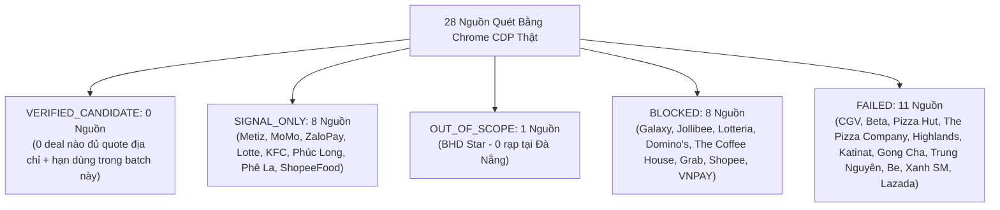

# JAYT GROUND-TRUTH EVIDENCE REVIEW PACK (086S)
> **Chỉ thị**: `JAYT-086S-EVIDENCE-GROUNDED-RESOLUTION-AND-RADAR-UI`  
> **Thời điểm đối soát**: `2026-08-25T11:34:00+07:00`  
> **Phương thức**: Chrome CDP Headless Capture (`batch_086_cdp_mt85o9x3`) + Deep Trace (`deep_traces_086s`)  
> **Trạng thái**: `IMPLEMENTED — PENDING CEO AUDIT`  
> **Khóa sản xuất**: `deals_feed.json: []` (0 records, `is_approved: false`)  
> **Biên lai sửa chữa đính kèm**: [`07_QUALITY_ASSURANCE/runtime_evidence/correction_receipt_086s_demotion_of_unverified_claims.json`](../07_QUALITY_ASSURANCE/runtime_evidence/correction_receipt_086s_demotion_of_unverified_claims.json)

---

## 1. MA TRẬN PHÂN LOẠI 28 NGUỒN CUNG CHUẨN GROUND-TRUTH (086S MATRIX)

### Bảng Tổng Hợp Chỉ Số Ma Trận 086S

| Phân Loại (Tier) | Số Lượng | Tỷ Lệ | Định Nghĩa Quản Trị & Ranh Giới |
| :--- | :---: | :---: | :--- |
| **`VERIFIED_CANDIDATE`** | **0** | 0% | 0 nguồn nào trong batch này có trích đoạn nguyên văn chứa đồng thời cả 6 yếu tố (mức giá + điều kiện + hạn hiệu lực + địa chỉ cụ thể tại Đà Nẵng). |
| **`SIGNAL_ONLY`** | **8** | 28.6% | Có trích đoạn thông tin thật nhưng thiếu địa chỉ cụ thể trong block, hoặc là ưu đãi ví/app cần xác thực trong ứng dụng di động. |
| **`OUT_OF_SCOPE`** | **1** | 3.6% | **BHD Star**: Có bằng chứng giá thật (48k, -20%) nhưng BHD chưa có chi nhánh hoạt động tại Đà Nẵng. |
| **`HISTORICAL_ONLY`** | **0** | 0% | Toàn bộ 28 nguồn được đánh giá trên capture hiện tại 086 (không sử dụng candidate cũ để nâng hạng). |
| **`BLOCKED`** | **8** | 28.6% | Bị Cloudflare/Access Challenge chặn. **Tuyệt đối không bypass CAPTCHA**; giữ nguyên trên radar. |
| **`FAILED`** | **11** | 39.3% | HTTP 404 do hãng thay đổi cấu trúc URL khuyến mãi, hoặc HTTP 0 lỗi kết nối. |
| **TỔNG CỘNG** | **28** | **100%** | **Toàn bộ 28 nguồn được kiểm kê đầy đủ, 0 nguồn bị bỏ sót.** |

---

## 2. BẢNG CHI TIẾT 9 NGUỒN CAPTURE THẬT VỚI TRÍCH ĐOẠN NGUYÊN VĂN & MÃ BĂM

| # | Thương Hiệu & Domain | Phân Loại | Đường Dẫn Artifact & SHA-256 | Thời Điểm Capture | Trích Đoạn Nguyên Văn Nguồn (Verbatim Quote) | Các Trường Còn Thiếu (Missing Fields) |
|---|----------------------|:---------:|------------------------------|:-----------------:|---------------------------------------------|---------------------------------------|
| 1 | **Metiz Cinema Đà Nẵng** (`metiz.vn`) | `SIGNAL_ONLY` | `captures/metiz.vn/page.txt` `daf2af203f1747a9311c6bb614fa55d867e76fe65964b4ef413e3e29b2eeae2b` | `2026-08-25T04:19:40Z` | *"SUPER MONDAY (THỨ HAI SIÊU HẠNG) ... giá cực kỳ ưu đãi 55.000 đồng/ vé 2D. Điều kiện & điều khoản: 1. Chương trình áp dụng cho thành viên Metiz Cinema. Vui lòng xuất trình thẻ thành viên trước khi mua vé... 3. Áp dụng cho hình thức mua vé trực tiếp tại rạp... Hotline: 0236 3630 689"* | `LITERAL_STREET_ADDRESS_IN_PROMO_TEXT` `EXPLICIT_EXPIRATION_DATE_IN_BLOCK` |
| 2 | **BHD Star Cineplex** (`bhdstar.vn`) | `OUT_OF_SCOPE` | `captures/bhdstar.vn/page.txt` `30e5875a301b273bd573bdb879355a604e519388ce046c6be75ec752172fb892` | `2026-08-25T04:19:35Z` | *"HÀ NỘI ... TP. HUẾ ... TP. HỒ CHÍ MINH ... LONG KHÁNH ... PHÚ MỸ ... THANH HÓA ... COUPLE DAY – THỨ BA HẰNG TUẦN: GIẢM 20% ... HAPPY MONDAY – ƯU ĐÃI XEM PHIM CHỈ TỪ 48K TẠI BHD STAR"* | `DANANG_LOCALITY_PHYSICAL_PRESENCE` *(BHD chưa có rạp tại Đà Nẵng)* |
| 3 | **Ví MoMo** (`momo.vn`) | `SIGNAL_ONLY` | `captures/momo.vn/page.txt` `11b9ada8b652fe7969158c8e4b881c97680ebe16733efce729c09ec4bf17b655` | `2026-08-25T04:22:24Z` | *"Bạn mới nhập mã CHONMOMO: Có quà 500.000đ giảm nhiều dịch vụ ... Lần đầu đặt vé tàu hỏa trên MoMo: Giảm thẳng 100.000đ dịp 2/9 ... Tải MoMo, nhập MOMOBUS: Miễn phí 5 lượt đi xe buýt tại Hà Nội ... Đà Nẵng: Tầng 3, Tòa nhà DMT, Số 484-486 đường 2/9"* | `MERCHANT_SPECIFIC_LOCAL_TERMS` `IN_APP_VOUCHER_CODE_VALIDATION` |
| 4 | **Ví ZaloPay** (`zalopay.vn`) | `SIGNAL_ONLY` | `captures/zalopay.vn/page.txt` `0c615a85f1cef4c041872459ca228edb745422e25309527d0f3456bc6856bd52` | `2026-08-25T04:22:31Z` | *"Zalopay ưu đãi lên đến 2 triệu đồng khi thanh toán mọi dịch vụ tại Vinpearl & VinWonders ... 18 tuần nữa kết thúc ... Nhập mã HOCHE - Nhận ưu đãi khủng đến 50.000đ ... 6 ngày nữa kết thúc ... Đua top đặt xe và đồ ăn ... Đã kết thúc 23 tháng tám 2026"* | `MERCHANT_SPECIFIC_LOCAL_TERMS` `IN_APP_VOUCHER_CODE_VALIDATION` |
| 5 | **Lotte Cinema Vietnam** (`lottecinemavn.com`) | `SIGNAL_ONLY` | `captures/lottecinemavn.com/page.txt` `61d0380f0614db9b440d06fab1ef4bad0354958d1942206475373567fa698279` | `2026-08-25T04:19:30Z` | *"16/08/2026 ~ 17/09/2026 ... 15/08/2026 ~ 28/02/2027 ... 01/08/2026 ~ 31/12/2026 ... CÔNG TY TNHH LOTTE CINEMA VIỆT NAM"* | `TEXT_PROMO_TERMS_IN_RAW_DOM` `PRICE_AND_SEAT_CONDITION_BREAKDOWN` |
| 6 | **KFC Vietnam** (`kfcvietnam.com.vn`) | `SIGNAL_ONLY` | `captures/kfcvietnam.com.vn/page.txt` `4e4c29e6e3b4b6a6792e99a2e0958bb8c0378a0f94eb9f87d892a974c76a59db` | `2026-08-25T04:19:54Z` | *"RẤT TIẾC! CHÚNG TÔI XIN LỖI Trang bạn đang truy cập có thể đã bị xóa, đã thay đổi tên hoặc tạm thời không có."* | `ACTIVE_PROMOTION_URL_STRUCTURE` `PRICE_AND_DISCOUNT_CLAIMS` |
| 7 | **Phúc Long Coffee & Tea** (`phuclong.com.vn`) | `SIGNAL_ONLY` | `captures/phuclong.com.vn/page.txt` `3bc134ee4281ea1c4ad568ff44a099ad8e39050304e6a4f052f997d8cc0ed443` | `2026-08-25T04:20:13Z` | *"Trang chủ ... Sản phẩm ... Cửa hàng ... Hộp thư ... Tài khoản ... /tin-tuc/khuyen-mai"* | `DYNAMIC_PROMOTION_TEXT_IN_DOM` `PRICE_AND_DISCOUNT_CLAIMS` |
| 8 | **Phê La** (`phela.vn`) | `SIGNAL_ONLY` | `captures/phela.vn/page.txt` `1b70d376f3aec6c323c6c3d5f8fee4fe44070046afdda6d71aeeaadf3ea89e4a` | `2026-08-25T04:20:25Z` | *"Chuyện Phê Phin Đặc Sản – Cà Đặc Sản Ủ Phin ... [Chuyện Phê Phin Đặc Sản] Lần đầu tiên Cà Phê Đặc Sản kết hợp cùng Ô Long Đặc Sản Việt Nam"* | `VOUCHER_OR_DISCOUNT_PROGRAM` `PROMOTION_TERMS_AND_CONDITIONS` |
| 9 | **ShopeeFood Vietnam** (`shopeefood.vn`) | `SIGNAL_ONLY` | `captures/shopeefood.vn/page.txt` `407172dd630c7fc8656aed92f566c5acf3b82758e4190858a45fad33ce30c3a5` | `2026-08-25T04:21:48Z` | *"SHOPEEFOOD ... CHÀO BẠN ... Món ngon quán đỉnh bao la, đặt đơn bạn nhé ShopeeFood giao liền!"* | `WEB_BASED_VOUCHER_LIST` `DISCOUNT_TERMS_IN_BROWSER` |

---

## 3. DANH SÁCH 8 NGUỒN BỊ CHẶN (BLOCKED — TUYỆT ĐỐI 0 BYPASS)

| # | Thương Hiệu | Domain | Ngành | Lý Do Bị Chặn | Chính Sách Quản Trị |
|---|-------------|--------|-------|---------------|----------------------|
| 10 | **Galaxy Cinema** | `galaxycine.vn` | CINEMA | Cloudflare Challenge / CAPTCHA | **Giữ nguyên BLOCKED trên Radar; Tuyệt đối không bypass.** |
| 11 | **Jollibee Vietnam** | `jollibee.com.vn` | FNB_FASTFOOD | Cloudflare Challenge / CAPTCHA | **Giữ nguyên BLOCKED trên Radar; Tuyệt đối không bypass.** |
| 12 | **Lotteria Vietnam** | `lotteria.vn` | FNB_FASTFOOD | Cloudflare Challenge / CAPTCHA | **Giữ nguyên BLOCKED trên Radar; Tuyệt đối không bypass.** |
| 13 | **Domino's Pizza Vietnam** | `dominos.vn` | FNB_FASTFOOD | Cloudflare Challenge / CAPTCHA | **Giữ nguyên BLOCKED trên Radar; Tuyệt đối không bypass.** |
| 14 | **The Coffee House** | `thecoffeehouse.com` | COFFEE_TEA | Cloudflare Challenge / CAPTCHA | **Giữ nguyên BLOCKED trên Radar; Tuyệt đối không bypass.** |
| 15 | **Grab Vietnam / GrabFood** | `grab.com` | FOOD_AND_RIDE | Cloudflare Challenge / CAPTCHA | **Giữ nguyên BLOCKED trên Radar; Tuyệt đối không bypass.** |
| 16 | **Shopee Vietnam** | `shopee.vn` | ECOMMERCE_WALLETS | Cloudflare Challenge / CAPTCHA | **Giữ nguyên BLOCKED trên Radar; Tuyệt đối không bypass.** |
| 17 | **VNPAY-QR** | `vnpay.vn` | ECOMMERCE_WALLETS | Cloudflare Challenge / CAPTCHA | **Giữ nguyên BLOCKED trên Radar; Tuyệt đối không bypass.** |

---

## 4. DANH SÁCH 11 NGUỒN LỖI ĐƯỜNG DẪN (FAILED 404/0)

| # | Thương Hiệu | Domain | Ngành | Mã Lỗi HTTP | Ghi Chú |
|---|-------------|--------|-------|:-----------:|---------|
| 18 | CGV Cinemas Vietnam | `cgv.vn` | CINEMA | 404 | Đổi cấu trúc URL khuyến mãi |
| 19 | Beta Cinemas | `betacinemas.vn` | CINEMA | 404 | Đổi cấu trúc URL khuyến mãi |
| 20 | Pizza Hut Vietnam | `pizzahut.vn` | FNB_FASTFOOD | 404 | Đổi cấu trúc URL khuyến mãi |
| 21 | The Pizza Company | `thepizzacompany.vn` | FNB_FASTFOOD | 404 | Đổi cấu trúc URL khuyến mãi |
| 22 | Highlands Coffee | `highlandscoffee.com.vn` | COFFEE_TEA | 404 | Đổi cấu trúc URL khuyến mãi |
| 23 | Katinat Saigon Kafe | `katinat.vn` | COFFEE_TEA | 404 | Đổi cấu trúc URL khuyến mãi |
| 24 | Gong Cha Vietnam | `gongcha.com.vn` | COFFEE_TEA | 404 | Đổi cấu trúc URL khuyến mãi |
| 25 | Trung Nguyên Legend | `trungnguyenlegend.com` | COFFEE_TEA | 404 | Đổi cấu trúc URL khuyến mãi |
| 26 | Be Group | `be.com.vn` | FOOD_AND_RIDE | 404 | Đổi cấu trúc URL khuyến mãi |
| 27 | Xanh SM | `xanhsm.com` | FOOD_AND_RIDE | 404 | Đổi cấu trúc URL khuyến mãi |
| 28 | Lazada Vietnam | `lazada.vn` | ECOMMERCE_WALLETS | 0 | Lỗi kết nối / Anti-scraping socket drop |

---

## 5. ĐỀ XUẤT CHO BATCH TIẾP THEO

1. **Về Nguồn Cung Đã Thu Thập**:
   - Duy trì toàn bộ 28 nguồn trên **Deal Discovery Radar** của giao diện Beta Staging với trạng thái minh bạch (`Nguồn chính thức`, `Kiểm tra trong App`, `Ngoài phạm vi Đà Nẵng`).
   - Tuyệt đối không hiển thị giá/mã/voucher giả trên giao diện công khai khi chưa có bundle đầy đủ.
2. **Về Bổ Sung Bằng Chứng**:
   - Với 11 nguồn FAILED: Cập nhật URL trang chủ chính thức hoặc sub-path mới trong discovery seed.
   - Với 8 nguồn BLOCKED: Cho phép người dùng cộng đồng nộp link/mã qua biểu mẫu nộp tín hiệu kèm nhãn `⚠️ CHƯA XÁC MINH`.
3. **Bảo Toàn Khóa Sản Xuất**:
   - `deals_feed.json: []` (`is_approved: false`).
