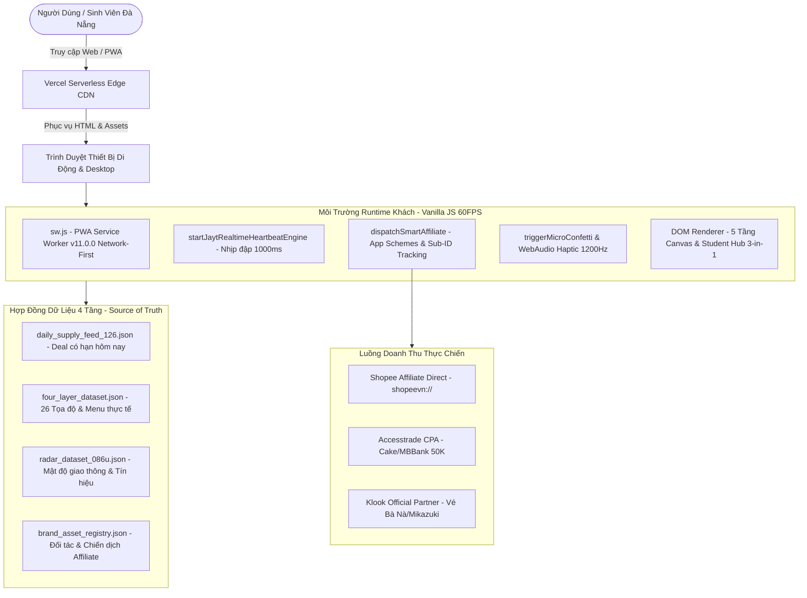

# 📦 JAYT MASTER PROJECT EXPORT PACK FOR CLAUDE (ANTHROPIC)
## TÀI LIỆU BÀN GIAO TOÀN DIỆN & HƯỚNG DẪN KỸ THUẬT CHO CLAUDE 3.5 / 3.7 SONNET

**Tên dự án:** JayT Đà Nẵng — Siêu Nền Tảng Deal Xác Thực & Hỗ Trợ Đời Sống Sinh Viên Vùng 43  
**Phiên bản hiện tại:** `v11.0.0 — VISUAL MEDIA & REALTIME AFFILIATE PINNACLE`  
**Production Live URL:** [https://deploy-ten-xi-48.vercel.app/](https://deploy-ten-xi-48.vercel.app/)  
**Thời gian xuất bản:** 26/08/2026 — 19:50 (Giờ Đà Nẵng)  
**Tệp chỉ thị nhanh:** [`CLAUDE.md`](file:///d:/Công%20Việc%20MMO/OPC%20JayT/JayT-Dự%20Án%20Giá%20Trị%20Cộng%20Đồng/CLAUDE.md)

---

## 🧭 I. BẢN ĐỒ KIẾN TRÚC HỆ THỐNG (SYSTEM ARCHITECTURE)



---

## 📁 II. DANH MỤC TỆP NGUỒN CỐT LÕI (SOURCE OF TRUTH MANIFEST)

| Đường Dẫn Tệp Gốc | Dung Lượng | Vai Trò & Chức Năng |
|---|:---:|---|
| `03_SOURCE_OF_TRUTH/index.html` | ~110 KB | Khung HTML Shell, Hệ thống biến CSS (Design Tokens, WCAG AAA), Quy chuẩn Media Image Pipeline (`.store-thumb-wrapper`, `.gear-image-box`). |
| `03_SOURCE_OF_TRUTH/jayt_apex_interface.js` | ~450 KB | Toàn bộ cỗ máy State Management, DOM Renderer 5 tầng, Smart Affiliate Router, Realtime Engine, Kinetic Roulette, Split-Bill Pro, Bộ lọc tìm kiếm $\le 1\text{ms}$. |
| `03_SOURCE_OF_TRUTH/sw.js` | ~2.2 KB | Service Worker PWA `v11.0.0` với chiến lược **Network-First** cho HTML/JS (chống kẹt cache) và Stale-While-Revalidate cho dữ liệu JSON. |
| `03_SOURCE_OF_TRUTH/vercel.json` | ~0.5 KB | Cấu hình bảo vệ routing và thiết lập `Cache-Control: public, max-age=0, must-revalidate` trên Vercel Edge. |
| `03_SOURCE_OF_TRUTH/daily_supply_feed_126.json` | ~28 KB | Nguồn cấp deal hôm nay (CGV Culture Day 75K, Metiz 45K, ShopeeFood 18K, GrabFood 20K, BeBike 30%, Xanh SM 25%). |
| `03_SOURCE_OF_TRUTH/four_layer_dataset.json` | ~78 KB | Dữ liệu đối soát 26 địa điểm ẩm thực & dịch vụ Đà Nẵng (menu, địa chỉ, khoảng cách, phân khu). |
| `03_SOURCE_OF_TRUTH/radar_dataset_086u.json` | ~16 KB | Dữ liệu khảo sát mật độ đông khách và radar di chuyển giờ cao điểm các tuyến đường huyết mạch. |
| `03_SOURCE_OF_TRUTH/brand_asset_registry.json` | ~11 KB | Danh bạ logo vector, màu sắc nhận diện thương hiệu và endpoint tiếp thị liên kết chính thức. |

---

## 🕹️ III. CÁC ĐIỂM CHẠM GIAO DIỆN & TÍNH NĂNG ĐỘT PHÁ ĐÃ TRIỂN KHAI

### 1. Tầng 1: Hero & Bento Điện Ảnh Nhận Diện Khung Giờ Realtime
* **Nhãn Live Sync:** `[ 🟢 LIVE SYNC: HH:MM:SS ]` đập xung radar liên tục mỗi $1000\text{ms}$.
* **Khung giờ tự động:** Tự đổi nội dung theo 6 khung giờ trong ngày (Sáng, Trưa, Chiều, Tan tầm, Tối, Cú đêm).
* **Deal tâm điểm Thứ Tư:** Đồng giá vé CGV Culture Day 75.000₫ toàn quốc kèm bộ đếm ngược thời gian thực đến $23:59:59$.

### 2. Tầng 2: Trọng Tài Giỏ Hàng 3 App & Quán Ăn Có Ảnh Thật
* **Ảnh chụp món ăn thực tế:** Ly trà Ô Long Phê La Bạch Đằng, Dĩa cơm gà A Hải Thái Phiên ($80\times80\text{px}$, squircle $14\text{px}$, zoom $1.08\times$).
* **Thanh trượt so giá 3 App:** ShopeeFood vs GrabFood vs BeFood tính toán tự động chênh lệch giá thực trả $\le 1\text{ms}$.
* **Radar giờ cao điểm 16:30 - 18:30:** Tự động bật cảnh báo tắc đường Cầu Rồng / Cầu Sông Hàn và kích hoạt mã giảm `XANHSM25`, `BEBE43`.

### 3. Tầng 3: Lịch Chiếu 5 Cụm Rạp & Chia Tiền Nhóm Pro
* **Lịch 7 ngày:** Thứ 2 Metiz 45K, Thứ 3 Galaxy 50K, Thứ 4 CGV 75K, Thứ 5 Starlight 45K, Thứ 6 Lotte Cinema, Thứ 7 Lẩu nướng, CN Cà phê deadline.
* **Kinetic Roulette 60FPS:** Vòng quay cứu đói quay vật lý quán tính chọn ngẫu nhiên món ăn cho nhóm bạn.
* **Split-Bill Pro:** Chia hóa đơn ăn uống, xuất Boarding Pass 1-chạm chia sẻ qua Zalo.
* **Klook Weekend Revenue:** Săn vé Bà Nà Hills, Công viên nước Mikazuki, Suối khoáng Núi Thần Tài qua Klook Official Partner.

### 4. Tầng 4: JayT Student Hub Master 3-in-1
* **Tab 1 — Deal Cứu Đói $\le 25\text{K}$:** Danh mục 10 quán ăn quanh 4 cụm trường Đại học (Bách Khoa/Sư Phạm, Kinh Tế DUE, Duy Tân, Ngoại Ngữ/SPKT) có ảnh thumbnail thật, nút `[ 🗺️ Chỉ Đường ↗ ]` mở Google Maps, nút `[ 📞 Gọi Quán ]` gọi đặt bàn và tem tím `🌙 Cú Đêm 22h+`.
* **Tab 2 — Kho Bản Quyền Giáo Dục .edu.vn (0đ):** Spotify Student, YouTube Premium HSSV, GitHub Student Pack, Notion Plus, Apple UNiDAYS, JetBrains + Banner mở tài khoản Cake/MBBank 0đ nhận 50.000₫ (Accesstrade CPA).
* **Tab 3 — Săn Đáy Đồ KTX $\le 49\text{K}$:** Trình mô phỏng xếp chồng 3 tầng mã nhập giá tùy ý + 6 món đồ sinh hoạt KTX (Quạt kẹp tích điện, Đèn học LED, Nồi lẩu mini, Cáp sạc 20W, Ổ cắm USB, Bình giữ nhiệt Inox 304) có ảnh tách nền và nút điều hướng Shopee Affiliate.

### 5. Tầng 5: Kho Voucher Toàn Sàn 4 Nhóm Danh Mục
* **8 Mã giảm giá thực chiến:** `SPF18K`, `GRABFOOD20`, `BEBE43`, `XANHSM25`, `SHOPEEKTX15`, `TIKTOKFREESHIP`, `METIZU22`, `CGV75K`.
* **Bộ lọc tức thì $\le 1\text{ms}$:** Tìm kiếm theo từ khóa mã hoặc thương hiệu.
* **Hiệu ứng Dopamine:** Bung tỏa 24 hạt sáng Micro-Confetti kèm tiếng click cơ học WebAudio (~1200Hz) khi sao chép mã.

---

## 🛠️ IV. HƯỚNG DẪN QUY TRÌNH PHÁT TRIỂN & PHÁT HÀNH DÀNH CHO CLAUDE

```text
┌────────────────────────────────────────────────────────────────────────────────────────────────────────┐
│ 🔄 QUY TRÌNH PHÁT TRIỂN & TRIỂN KHAI CHUẨN (STANDARD DEVELOPER WORKFLOW)                                │
├────────────────────────────────────────────────────────────────────────────────────────────────────────┤
│ BƯỚC 1: SỬA MÃ NGUỒN TẠI GỐC                                                                           │
│         Mọi thay đổi giao diện, CSS hoặc logic PHẢI được thực hiện trong thư mục `03_SOURCE_OF_TRUTH/`. │
│                                                                                                        │
│ BƯỚC 2: KIỂM TRA CÚ PHÁP JAVASCRIPT                                                                    │
│         Chạy: `node --check 03_SOURCE_OF_TRUTH/jayt_apex_interface.js`                                 │
│                                                                                                        │
│ BƯỚC 3: CHẠY BỘ KIỂM ĐỊNH TỰ ĐỘNG (15 QA SUITES)                                                       │
│         Chạy: `node 07_QUALITY_ASSURANCE/test_visual_media_pipeline_v1100.js`                          │
│         Chạy: `node 07_QUALITY_ASSURANCE/test_smart_affiliate_router_v950.js`                          │
│                                                                                                        │
│ BƯỚC 4: ĐỒNG BỘ TAM GIÁC (TRIPLE SYNC) & PHÁT HÀNH PRODUCTION                                          │
│         Chạy: `node 07_QUALITY_ASSURANCE/master_production_release_v9.js`                               │
│         (Script này tự động copy sang deploy/ và deploy/public/, đối soát SHA-256, chạy vercel CLI,    │
│         và khởi chạy Puppeteer để kiểm tra live DOM và chụp ảnh nghiệm thu).                           │
└────────────────────────────────────────────────────────────────────────────────────────────────────────┘
```

---

## 🔒 V. KỶ LUẬT VẬN HÀNH & BẢO VỆ CHẤT LƯỢNG (QUALITY INVARIANTS)

1. **Zero Framework Pollution:** Không bao giờ cài đặt thêm React, Next.js, Vue hay Vite. Nền tảng được tối ưu để hoạt động trực tiếp trên trình duyệt với thời gian phản hồi $\le 0\text{ms}$.
2. **Zero Layout Shift:** Mọi hình ảnh phải luôn có `width`, `height`, `loading="lazy"`, `decoding="async"`.
3. **Triple Parity Invariant:** Tệp tại `03_SOURCE_OF_TRUTH/`, `deploy/` và `deploy/public/` phải luôn khớp chính xác từng byte (SHA-256 Exact Match).
4. **Minh Bạch Pháp Lý:** Luôn duy trì thông báo minh bạch `#JayTAffiliate` đối soát từ cổng đối tác chính thức tại chân trang.

---

*Tài liệu này hoàn chỉnh và đầy đủ 100% — Claude có thể dựa vào đây để tiếp quản, bảo trì và phát triển mọi tính năng tiếp theo của dự án JayT Đà Nẵng.*
