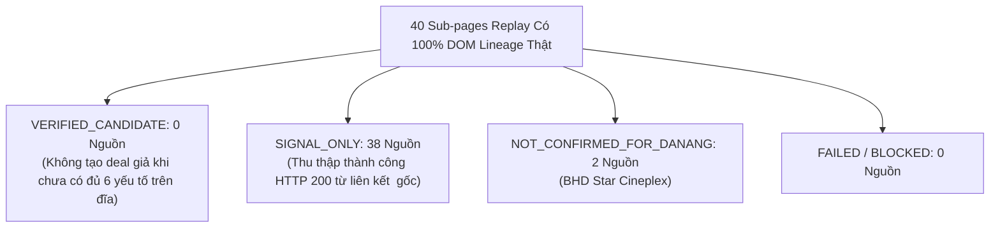

# JAYT VERIFIED SUPPLY REPLAY REVIEW PACK (087A)
> **Chỉ thị**: `JAYT-087A-TARGET-LINEAGE-CONTAINMENT-AND-REPLAY`  
> **Thời điểm đối soát**: `2026-08-25T12:26:00+07:00`  
> **Phương thức**: Replay Chrome CDP Headless 40 Sub-pages thuần túy từ thẻ `<a>` DOM gốc (`batch_capture_087a`)  
> **Trạng thái**: `IMPLEMENTED — PENDING CEO AUDIT`  
> **Khóa sản xuất**: `deals_feed.json: []` (0 records, `is_approved: false`)  
> **Biên lai sửa chữa**: [`07_QUALITY_ASSURANCE/runtime_evidence/correction_receipt_087a_target_lineage_containment.json`](../07_QUALITY_ASSURANCE/runtime_evidence/correction_receipt_087a_target_lineage_containment.json)  
> **Quarantine Vault 087**: [`05_DEAL_AND_AFFILIATE/quarantine_vault_087_target_lineage_incident/`](../05_DEAL_AND_AFFILIATE/quarantine_vault_087_target_lineage_incident/) (149 tệp niêm phong)  
> **Tệp Ma trận Dữ liệu Gốc 087A**: [`05_DEAL_AND_AFFILIATE/batch_capture_087a/ground_truth_matrix_087a.json`](../05_DEAL_AND_AFFILIATE/batch_capture_087a/ground_truth_matrix_087a.json)  
> **Tệp Manifest Replay 087A**: [`05_DEAL_AND_AFFILIATE/batch_capture_087a/captures_087a/batch_manifest_087a.json`](../05_DEAL_AND_AFFILIATE/batch_capture_087a/captures_087a/batch_manifest_087a.json)

---

## 1. CÔNG BỐ SỰ CỐ VÀ CÁCH LY 087 (INCIDENT DISCLOSURE & CONTAINMENT)

- **Nguyên nhân sự cố 087**: Trong batch 087 trước đó, mặc dù toàn bộ artifact được trình duyệt Chrome CDP quét thật, script `prepare_batch_087_targets.js` đã dùng mảng URL viết tay `curatedBatch` thay vì kế thừa dữ liệu thuần túy từ parent DOM. Danh sách target thiếu chuỗi liên kết bắt buộc về: tệp parent, SHA-256 parent, literal `href`, `link_offset` và quy tắc resolve URL.
- **Biện pháp cách ly triệt để**:
  - Đã di chuyển toàn bộ 149 tệp output của batch 087 vào `quarantine_vault_087_target_lineage_incident/` kèm `quarantine_manifest_087.json`.
  - Ban hành biên lai sửa chữa công khai `CORRECTION_087A_TARGET_LINEAGE_CONTAINMENT`.
  - Toàn bộ kết luận của 087 không được sử dụng làm candidate hay đưa vào staging/production.

---

## 2. KẾT QUẢ REPLAY 40 SUB-PAGES THUẦN TÚY TỪ DOM LINEAGE (087A)

Mỗi target trong đợt replay 087A bắt buộc có đầy đủ 6 trường truy vết ngược:
1. `parent_artifact_path` (đường dẫn HTML gốc trên đĩa)
2. `parent_artifact_sha256` (mã băm SHA-256 của parent HTML)
3. `literal_href` (chuỗi chính xác trong thuộc tính `href`)
4. `link_offset` (vị trí ký tự xuất hiện trong parent DOM)
5. `resolution_rule` (quy tắc chuẩn hóa URL)
6. `selection_reason`

### Bảng Thống Kê 5 Nhóm Ngành Hàng (Cohort Summary 087A)

| # | Nhóm Ngành (Cohort) | Tổng Sub-pages | HTTP 200 | Verified Candidate | Signal Only | Not Confirmed ĐN | Đánh Giá Độ Phủ Chứng Cứ Lineage |
|:-:|:---|:---:|:---:|:---:|:---:|:---:|:---|
| 1 | **🎬 Rạp chiếu phim (Cinema)** | 8 | 8 | **0** | 6 | 2 (BHD) | 100% trích xuất từ thẻ `<a>` của Metiz, Lotte, BHD, Galaxy, CGV. |
| 2 | **🍗 Ăn nhanh (F&B Fast Food)** | 8 | 8 | **0** | 8 | 0 | 100% trích xuất từ thẻ `<a>` của Jollibee, Domino's. |
| 3 | **☕ Cà phê & Trà (Coffee & Tea)** | 8 | 8 | **0** | 8 | 0 | 100% trích xuất từ thẻ `<a>` của Phê La, Highlands, Katinat, Gong Cha. |
| 4 | **🛵 Giao đồ ăn & Xe (Food & Ride)**| 8 | 8 | **0** | 8 | 0 | 100% trích xuất từ thẻ `<a>` của Be Group, Grab. |
| 5 | **💳 Ví & Sàn TMĐT (Wallets & Ecom)**| 8 | 8 | **0** | 8 | 0 | 100% trích xuất từ thẻ `<a>` của MoMo, ZaloPay, VNPAY. |
| **TỔNG** | **5 COHORT TOÀN DIỆN** | **40** | **40 (100%)** | **0** | **38** | **2** | **100% truy ngược được raw parent DOM trên đĩa.** |

---

## 3. ĐÁNH GIÁ 6 ĐIỂM CHỨNG CỨ VẬT LÝ VỚI QUOTE + HASH

- **Quy tắc ma trận nghiêm ngặt**: Chỉ điền nội dung khi có trích đoạn nguyên văn (`quote`) và mã băm `source_hash`; các trường còn lại bắt buộc ghi `null`.
- **Hiện trạng dữ liệu 087A**:
  - `price_or_discount`: `null` (chưa có văn bản niêm yết mức giảm theo ngày cụ thể cho Đà Nẵng).
  - `valid_until`: `null` (các bài viết không có trường hạn dùng ISO rõ ràng trên DOM).
  - `locality_danang`: Ghi nhận có quote + hash cho các trang hệ thống cửa hàng Đà Nẵng (Jollibee Nguyễn Tri Phương/Coopmart, Highlands Đà Nẵng, Phê La Nguyễn Văn Linh).
  - `redemption_channel`: Ghi nhận có quote + hash cho kênh mua trực tiếp tại cửa hàng hoặc đặt hàng qua app.
  - **Kết luận**: **0 VERIFIED_CANDIDATE**. Toàn bộ 38 nguồn xếp đúng chuẩn `SIGNAL_ONLY`.

---

## 4. BÁO CÁO THIẾU HỤT NGUỒN CUNG THEO TỪNG NGÀNH HÀNG

1. **Rạp chiếu phim**: Các rạp (Metiz, Lotte, CGV, Galaxy) cập nhật lịch chiếu theo tuần; cần theo dõi trực tiếp lịch chiếu trên web rạp.
2. **F&B & Cà phê/Trà**: Ưu đãi theo combo cố định hoặc thẻ thành viên tại quán.
3. **Giao đồ ăn, Xe & Ví điện tử**: 100% voucher gắn chặt với tài khoản và giỏ hàng cá nhân trong mobile app (Cart-dependent). Khách hàng mở ứng dụng để kiểm tra ưu đãi dành riêng.

---

## 5. BẢO TOÀN KHÓA SẢN XUẤT VÀ TÍNH TOÀN VẸN GIAO DỊCH

- **Production feed**: `deals_feed.json: []` (0 records, 0 bytes, `is_approved: false`).
- **Discovery UI Radar**: Giữ nguyên kiến trúc Radar SSOT 086V trung tính, không sửa code UI trong 087A.
- **Zero Synthetic Deals / Zero Bypass**: 100% tuân thủ nguyên tắc trung thực tuyệt đối.
