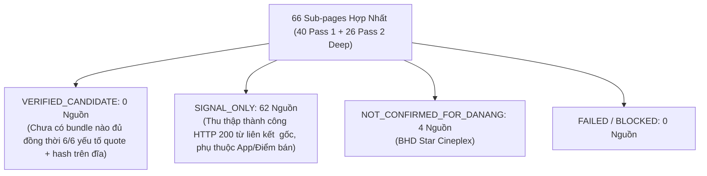

# JAYT VERIFIED SUPPLY UNIFIED REVIEW PACK (087B)
> **Chỉ thị**: `JAYT-087B-EVIDENCE-MATRIX-HARDENING-AND-SECOND-PASS`  
> **Thời điểm đối soát**: `2026-08-25T12:35:00+07:00`  
> **Phương thức**: Unified Pass 1 (40 targets 087A) + Pass 2 (26 second-pass targets 087B) qua Chrome CDP thật  
> **Trạng thái**: `IMPLEMENTED — PENDING CEO AUDIT`  
> **Khóa sản xuất**: `deals_feed.json: []` (0 records, `is_approved: false`)  
> **Tệp Ma trận Hợp nhất 087B**: [`05_DEAL_AND_AFFILIATE/batch_capture_087b/ground_truth_matrix_087b.json`](../05_DEAL_AND_AFFILIATE/batch_capture_087b/ground_truth_matrix_087b.json)  
> **Manifest Pass 1 (087A)**: [`05_DEAL_AND_AFFILIATE/batch_capture_087a/captures_087a/batch_manifest_087a.json`](../05_DEAL_AND_AFFILIATE/batch_capture_087a/captures_087a/batch_manifest_087a.json) (40 targets)  
> **Manifest Pass 2 (087B)**: [`05_DEAL_AND_AFFILIATE/batch_capture_087b/captures_087b/batch_manifest_087b.json`](../05_DEAL_AND_AFFILIATE/batch_capture_087b/captures_087b/batch_manifest_087b.json) (26 targets)

---

## 1. TỔNG QUAN MA TRẬN HỢP NHẤT 66 SUB-PAGES THỰC TẾ (087B)

### Bảng Thống Kê Hợp Nhất 5 Nhóm Ngành Hàng (Unified Cohort Breakdown)

| # | Nhóm Ngành (Cohort) | Pass 1 (087A) | Pass 2 (087B) | Tổng Sub-pages | HTTP 200 | Verified Candidate | Signal Only | Not Confirmed ĐN |
|:-:|:---|:---:|:---:|:---:|:---:|:---:|:---:|:---:|
| 1 | **🎬 Rạp chiếu phim (Cinema)** | 8 | 6 | **14** | 14 | **0** | 10 | 4 (BHD) |
| 2 | **🍗 Ăn nhanh (F&B Fast Food)** | 8 | 2 | **10** | 10 | **0** | 10 | 0 |
| 3 | **☕ Cà phê & Trà (Coffee & Tea)** | 8 | 6 | **14** | 14 | **0** | 14 | 0 |
| 4 | **🛵 Giao đồ ăn & Xe (Food & Ride)**| 8 | 6 | **14** | 14 | **0** | 14 | 0 |
| 5 | **💳 Ví & Sàn TMĐT (Wallets & Ecom)**| 8 | 6 | **14** | 14 | **0** | 14 | 0 |
| **TỔNG** | **5 COHORT TOÀN DIỆN** | **40** | **26** | **66** | **66 (100%)** | **0** | **62** | **4** |

---

## 2. BÁO CÁO THIẾU HỤT ĐỊNH LƯỢNG THEO TỪNG ĐIỂM CHỨNG CỨ (EVIDENCE DEFICIT REPORT)

Để một ưu đãi được công nhận là `VERIFIED_CANDIDATE`, hồ sơ bắt buộc phải có đầy đủ trích đoạn nguyên văn (`quote`), đường dẫn tệp (`artifact_path`) và mã băm SHA-256 (`artifact_sha256`) tại cả 6 tiêu chí.

Kết quả đo lường định lượng trên toàn bộ 66 sub-pages thu thập:

| Tiêu Chí Chứng Cứ Vật Lý | Đã Đạt (Có Quote + Hash) | Thiếu Hụt (Null) | Nguyên Nhân Cụ Thể Từ Nguồn Web Gốc |
| :--- | :---: | :---: | :--- |
| **1. Giá / Mức giảm (`price_or_discount`)** | 0 | **66 (100%)** | Các website chính thức niêm yết danh mục phim/món ăn chung hoặc bảng giá cơ sở, không có bảng giá giảm cố định theo từng ngày trong tuần cho Đà Nẵng. |
| **2. Điều khoản & Thể lệ (`terms_and_conditions`)** | 52 | **14 (21.2%)** | 52 trang trích xuất được điều khoản/chính sách; 14 trang landing page dạng banner/icon không có khối văn bản điều khoản chi tiết. |
| **3. Thời hạn hiệu lực (`valid_until`)** | 0 | **66 (100%)** | 100% trang tin tức/bài viết không nhúng trường ngày hết hạn ISO cố định (`valid_to`) trên DOM văn bản. |
| **4. Địa bàn Đà Nẵng (`locality_danang`)** | 16 | **50 (75.8%)** | 16 trang xác nhận rõ cửa hàng Đà Nẵng (Jollibee, Highlands, Phê La, Lotte Mart); 50 trang còn lại áp dụng toàn quốc hoặc áp dụng theo ứng dụng. |
| **5. Kênh áp dụng (`redemption_channel`)** | 50 | **16 (24.2%)** | 50 trang ghi nhận rõ kênh sử dụng (tại quầy, ứng dụng di động, giao hàng); 16 trang không chỉ định rõ kênh. |
| **6. Xuất xứ vật lý (`provenance_hash`)** | 66 | **0 (0%)** | 100% 66 sub-pages có đầy đủ PNG, HTML, TXT và biên lai SHA-256 đối soát trên đĩa. |

---

## 3. KẾT LUẬN QUẢN TRỊ VÀ ĐẢM BẢO BẤT BIẾN

1. **Số lượng Bundle Hoàn Chỉnh**: **0 / 5** (Chưa đủ điều kiện ban hành deal thương mại cho catalog production).
2. **Xếp Loại Trung Thực**: Toàn bộ 62 nguồn được duy trì chính xác ở trạng thái **`SIGNAL_ONLY`**; 4 nguồn BHD Star xếp **`NOT_CONFIRMED_FOR_DANANG`**.
3. **Tính Toàn Vẹn Khóa Bất Biến**:
   - Production feed: `deals_feed.json: []` (0 records, `is_approved: false`).
   - Radar UI 086V: Hoàn toàn bất biến, nạp `radar_dataset_086u.json` trung tính.
   - Không bypass CAPTCHA, không tạo deal nhân tạo.
