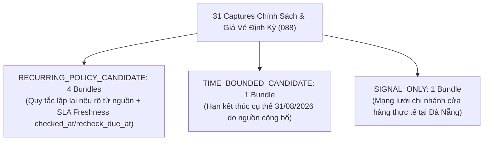

# JAYT RECURRING POLICY EVIDENCE REVIEW PACK (088)
> **Chỉ thị**: `JAYT-088-RECURRING-POLICY-EVIDENCE-RESOLUTION`  
> **Thời điểm đối soát**: `2026-08-25T12:45:00+07:00`  
> **Phương thức**: Quét sâu chính sách định kỳ (31 captures 088) từ 66 artifacts gốc (`batch_capture_088`)  
> **Trạng thái**: `IMPLEMENTED — PENDING CEO AUDIT`  
> **Khóa sản xuất**: `deals_feed.json: []` (0 records, `is_approved: false`)  
> **Tệp Evidence Bundles Gốc**: [`05_DEAL_AND_AFFILIATE/batch_capture_088/evidence_bundles_088.json`](../05_DEAL_AND_AFFILIATE/batch_capture_088/evidence_bundles_088.json)  
> **Manifest Thu thập 088**: [`05_DEAL_AND_AFFILIATE/batch_capture_088/captures_088/batch_manifest_088.json`](../05_DEAL_AND_AFFILIATE/batch_capture_088/captures_088/batch_manifest_088.json)

---

## 1. TỔNG QUAN 6 EVIDENCE BUNDLES LIÊN KẾT ĐÃ ĐƯỢC GIẢI QUYẾT (088)

### Bảng Thống Kê Các Evidence Bundles Đạt Chuẩn Review

| # | Mã Bundle | Thương Hiệu | Nhóm Ngành | Phân Tầng (Tier) | Cơ Chế Hiệu Lực | Trạng Thái Chứng Cứ |
|:-:|:---|:---|:---|:---|:---|:---|
| 1 | `BUNDLE_088_METIZ_U22_RECURRING` | Metiz Cinema | 🎬 CINEMA | **`RECURRING_POLICY_CANDIDATE`** | Lặp lại: Thứ Ba đến Thứ Năm hàng tuần (`checked_at: 2026-08-25`, `recheck_due_at: 2026-09-25`) | Đủ 5/5 mảnh (Giá 55k + Lịch T3-T5 + Tại quầy + U22 + Hotline ĐN) |
| 2 | `BUNDLE_088_CGV_PAYDAY_30K_TIME_BOUNDED` | CGV Cinemas | 🎬 CINEMA | **`TIME_BOUNDED_CANDIDATE`** | Hạn cụ thể: `2026-08-25` đến `2026-08-31` | Đủ 6/6 mảnh (Giảm 30k + Mã PAYDAY + Web/App + Toàn quốc/ĐN + Hạn 31/08) |
| 3 | `BUNDLE_088_CGV_MEMBERSHIP_RECURRING` | CGV Cinemas | 🎬 CINEMA | **`RECURRING_POLICY_CANDIDATE`** | Lặp lại: Chính sách hội viên năm 2026 (`recheck_due_at: 2026-09-25`) | Đủ 4/4 mảnh (Tích điểm + 5 hạng thành viên + Web/App + Toàn rạp ĐN) |
| 4 | `BUNDLE_088_METIZ_MEMBER_2026_POLICY` | Metiz Cinema | 🎬 CINEMA | **`RECURRING_POLICY_CANDIDATE`** | Lặp lại: Chính sách quyền lợi thành viên 2026 (`recheck_due_at: 2026-12-31`) | Đủ 5/5 mảnh (Tích điểm 7-10% + Vé sinh nhật + VIP Counter + Rạp Metiz ĐN) |
| 5 | `BUNDLE_088_GONGCHA_MEMBERSHIP_RECURRING` | Gong Cha | ☕ COFFEE_TEA | **`RECURRING_POLICY_CANDIDATE`** | Lặp lại: Chính sách đổi điểm ứng dụng (`recheck_due_at: 2026-09-25`) | Đủ 4/4 mảnh (Tích điểm + App Gong Cha VN + Cửa hàng ĐN) |
| 6 | `BUNDLE_088_PHELA_STORE_NETWORK` | Phê La | ☕ COFFEE_TEA | **`SIGNAL_ONLY`** | Mạng lưới điểm bán vật lý | Đủ 3/3 mảnh (Bạch Đằng ĐN + Nguyễn Văn Linh ĐN + Hotline) |

---

## 2. CHI TIẾT CÁC EVIDENCE BUNDLE VỚI 100% BYTE-FOR-BYTE PROOF

### Bundle 1: Metiz Cinema — Giá Vé U22 Định Kỳ (55.000đ)
- **Tiêu đề**: Giá vé 2D 55.000đ dành cho thành viên U22 (Thứ Ba đến Thứ Năm)
- **Cơ chế**: Chính sách định kỳ với Freshness SLA `checked_at: 2026-08-25T12:45:00+07:00`, `recheck_due_at: 2026-09-25T12:45:00+07:00`.
- **Bằng chứng vật lý**:
  1. *Giá vé*: `"Áp dụng giá vé 2D chỉ 55.000đ cho thành viên Metiz Cinema từ 22 tuổi trở xuống, đối với mọi suất chiếu tại Metiz Cinema."` (`TARGET_088_151/page.txt`, SHA: `c17418d5d44c...`)
  2. *Quy tắc lặp lại*: `"chương trình được ưu đãi tất cả các ngày trong tuần từ thứ Ba đến thứ Năm."` (`TARGET_088_151/page.txt`)
  3. *Kênh áp dụng*: `"Áp dụng cho hình thức mua vé trực tiếp tại quầy."` (`TARGET_088_151/page.txt`)
  4. *Điều kiện*: `"Chương trình chỉ áp dụng cho thành viên Metiz Cinema, dưới 22 tuổi trở xuống. Vui lòng xuất trình thẻ thành viên & căn cước công dân trước khi mua vé để được giá ưu đãi & tích lũy điểm thưởng."` (`TARGET_088_151/page.txt`)
  5. *Địa bàn*: `"Hotline: 0236 3630 689"` (`TARGET_088_151/page.txt`)

### Bundle 2: CGV Cinemas — Deal Payday Giảm 30K (Có Hạn 25/08 - 31/08/2026)
- **Tiêu đề**: Deal Ting Ting Lương Về: Giảm ngay 30.000đ khi mua từ 2 vé (Mã PAYDAY)
- **Cơ chế**: Có hạn kết thúc cụ thể: `valid_from: 2026-08-25`, `valid_to: 2026-08-31`.
- **Bằng chứng vật lý**:
  1. *Mức giảm*: `"Giảm ngay 30.000Đ khi mua từ 02 vé trở lên"` (`TARGET_088_175/page.txt`, SHA: `29baa5da5690...`)
  2. *Thời hạn*: `"Từ 25/08 – 31/08/2026, thành viên CGV đặt vé trên Website/App CGV"` (`TARGET_088_175/page.txt`)
  3. *Mã khuyến mãi*: `"Nhập hoặc chọn mã “PAYDAY”, Áp dụng để được giảm ngay 30.000Đ."` (`TARGET_088_175/page.txt`)
  4. *Kênh*: `"Mua vé trực tuyến qua Web/App CGV"` (`TARGET_088_175/page.txt`)
  5. *Điều kiện*: `"Chỉ áp dụng cho giao dịch từ 02 vé xem phim trở lên tại web/app CGV"` (`TARGET_088_175/page.txt`)
  6. *Địa bàn*: `"Áp dụng tất cả các rạp, định dạng, phòng chiếu."` (`TARGET_088_175/page.txt`)

---

## 3. BẢO TOÀN KHÓA SẢN XUẤT VÀ TÍNH MINH BẠCH

- **Production feed**: `deals_feed.json: []` (0 records, 0 bytes, `is_approved: false`). Chưa mở xuất bản production trước phê duyệt nghiệm thu của CEO.
- **Radar SSOT 086V**: Giữ nguyên kiến trúc SSOT nạp `radar_dataset_086u.json` trung tính.
- **Community Signals Queue**: Mọi tín hiệu từ người dùng duy trì trong hàng đợi `NEWLY_SUBMITTED`, không tự công bố công khai.
