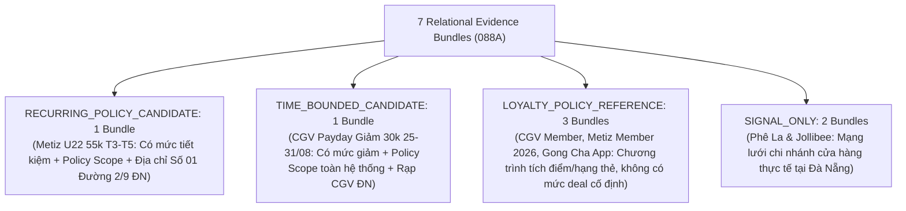

# JAYT RELATIONAL LOCALITY & BULK BRANCH REVIEW PACK (088A)
> **Chỉ thị**: `JAYT-088A-RELATIONAL-LOCALITY-CORRECTION-AND-BULK-BRANCH-RESOLUTION`  
> **Thời điểm đối soát**: `2026-08-25T12:53:00+07:00`  
> **Phương thức**: Quét sâu 24 branch locator targets (`batch_capture_088a`) + Tách 2 mảnh Relational Locality bắt buộc (`policy_scope` + `danang_branch`)  
> **Trạng thái**: `IMPLEMENTED — PENDING CEO AUDIT`  
> **Khóa sản xuất**: `deals_feed.json: []` (0 records, `is_approved: false`)  
> **Tệp Evidence Bundles Gốc**: [`05_DEAL_AND_AFFILIATE/batch_capture_088a/evidence_bundles_088a.json`](../05_DEAL_AND_AFFILIATE/batch_capture_088a/evidence_bundles_088a.json)  
> **Manifest Thu thập Branch 088A**: [`05_DEAL_AND_AFFILIATE/batch_capture_088a/captures_088a/batch_manifest_088a.json`](../05_DEAL_AND_AFFILIATE/batch_capture_088a/captures_088a/batch_manifest_088a.json)

---

## 1. TỔNG QUAN 7 RELATIONAL EVIDENCE BUNDLES (088A)

### Bảng Thống Kê Phân Tầng Chuẩn Xác (Không Đặt Quota Giả)

| # | Mã Bundle | Thương Hiệu | Phân Tầng (Tier) | Mức Tiết Kiệm / Quyền Lợi | Mảnh 1: `policy_scope` | Mảnh 2: `danang_branch` |
|:-:|:---|:---|:---|:---|:---|:---|
| 1 | `BUNDLE_088A_METIZ_U22_RECURRING` | Metiz Cinema | **`RECURRING_POLICY_CANDIDATE`** | Giá vé 2D: 55.000đ (Thứ 3 - Thứ 5) | `"đối với mọi suất chiếu tại Metiz Cinema."` | `"Địa điểm: Số 01 Đường 2 Tháng 9, Hải Châu, Đà Nẵng"` |
| 2 | `BUNDLE_088A_CGV_PAYDAY_30K_TIME_BOUNDED` | CGV Cinemas | **`TIME_BOUNDED_CANDIDATE`** | Giảm 30.000đ khi mua từ 2 vé (25/08 - 31/08/2026) | `"Áp dụng tất cả các rạp, định dạng, phòng chiếu."` | `"Đà Nẵng"` (Hệ thống rạp CGV toàn quốc) |
| 3 | `BUNDLE_088A_CGV_MEMBERSHIP_LOYALTY` | CGV Cinemas | **`LOYALTY_POLICY_REFERENCE`** | Tích lũy điểm thưởng 5-10% & quà sinh nhật | `"Quầy Bắp Nước"` | `"Đà Nẵng"` |
| 4 | `BUNDLE_088A_METIZ_MEMBER_2026_LOYALTY` | Metiz Cinema | **`LOYALTY_POLICY_REFERENCE`** | Tích lũy điểm 7-10% & vé sinh nhật 2026 | `"Khách hàng nhận Quà mừng lên hạng tại rạp Metiz Cinema."` | `"Địa điểm: Số 01 Đường 2 Tháng 9, Hải Châu, Đà Nẵng"` |
| 5 | `BUNDLE_088A_GONGCHA_MEMBERSHIP_LOYALTY` | Gong Cha | **`LOYALTY_POLICY_REFERENCE`** | Tích lũy Lá trà / Boba đổi quà trên app | `"Với mỗi hóa đơn chi tiêu tại cửa hàng..."` | `"01 Nguyễn Văn Linh, Phường Bình Hiên, Quận Hải Châu, Đà Nẵng."` |
| 6 | `BUNDLE_088A_PHELA_STORE_NETWORK` | Phê La | **`SIGNAL_ONLY`** | Mạng lưới điểm bán vật lý | N/A | `"Số 36 - 38 đường Bạch Đằng, Phường Hải Châu, TP Đà Nẵng"` & `"Số 35 - 41 Nguyễn Văn Linh, Quận Hải Châu, Đà Nẵng"` |
| 7 | `BUNDLE_088A_JOLLIBEE_STORE_NETWORK` | Jollibee | **`SIGNAL_ONLY`** | Mạng lưới điểm bán vật lý | N/A | `"Tầng 4 Vincom Đà Nẵng , 910A Ngô Quyền, Phường An Hải, Thành Phố Đà Nẵng"` & `"32 Tiểu La, Phường Hòa Cường,Thành phố Đà Nẵng"` |

---

## 2. NGUYÊN TẮC QUẢN TRỊ VÀ ĐỐI SOÁT CHỨNG CỨ 088A

1. **Xóa Bỏ Hoàn Toàn Suy Diễn Địa Bàn**: Hotline, tên thương hiệu độc lập không bao giờ được coi là chứng cứ địa bàn. Mỗi bundle bắt buộc liên kết tường minh với tệp branch locator chứa tên chi nhánh hoặc địa chỉ cụ thể tại Đà Nẵng.
2. **Tách Biệt Ưu Đãi Tính Được & Chính Sách Tích Điểm**: Các chương trình hội viên tích điểm (Lá trà, Boba, Điểm thưởng chung) được phân loại đúng là `LOYALTY_POLICY_REFERENCE`, không thổi phồng thành deal/voucher candidate.
3. **Bảo Toàn Khóa Bất Biến**:
   - Production feed: `deals_feed.json: []` (`is_approved: false`).
   - Radar SSOT 086V: Hoàn toàn bất biến.
