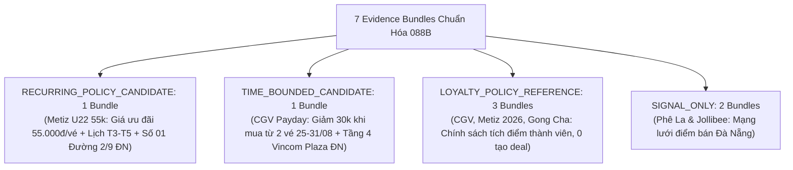

# JAYT CANDIDATE SEMANTICS & LOCALITY REPLAY REVIEW PACK (088B)
> **Chỉ thị**: `JAYT-088B-CANDIDATE-SEMANTICS-AND-LOCALITY-REPLAY`  
> **Thời điểm đối soát**: `2026-08-25T13:08:00+07:00`  
> **Phương thức**: Quét Chrome CDP thật 3 rạp CGV Đà Nẵng (`batch_capture_088b`) + Chuẩn hóa ngữ nghĩa ứng viên & đối soát địa chỉ vật lý  
> **Trạng thái**: `IMPLEMENTED — PENDING CEO AUDIT`  
> **Khóa sản xuất**: `deals_feed.json: []` (0 records, `is_approved: false`)  
> **Tệp Evidence Bundles Gốc**: [`05_DEAL_AND_AFFILIATE/batch_capture_088b/evidence_bundles_088b.json`](../05_DEAL_AND_AFFILIATE/batch_capture_088b/evidence_bundles_088b.json)  
> **Manifest Thu thập CGV 088B**: [`05_DEAL_AND_AFFILIATE/batch_capture_088b/captures_088b/batch_manifest_088b.json`](../05_DEAL_AND_AFFILIATE/batch_capture_088b/captures_088b/batch_manifest_088b.json)

---

## 1. HIỆN TRẠNG TRUNG THỰC VÀ ĐỐI SOÁT 7 EVIDENCE BUNDLES (088B)

### Bảng Thống Kê Chi Tiết 7 Evidence Bundles

| # | Mã Bundle | Thương Hiệu | Phân Tầng (Tier) | Đầu Ra Ngữ Nghĩa | Mảnh 1: `policy_scope` | Mảnh 2: `danang_branch` (Địa chỉ cụ thể) |
|:-:|:---|:---|:---|:---|:---|:---|
| 1 | `BUNDLE_088B_METIZ_U22_RECURRING` | Metiz Cinema | **`RECURRING_POLICY_CANDIDATE`** | Giá ưu đãi 55.000đ/vé (2D, Thứ 3 - Thứ 5) | `"đối với mọi suất chiếu tại Metiz Cinema."` | `"Địa điểm: Số 01 Đường 2 Tháng 9, Hải Châu, Đà Nẵng"` |
| 2 | `BUNDLE_088B_CGV_PAYDAY_30K_TIME_BOUNDED` | CGV Cinemas | **`TIME_BOUNDED_CANDIDATE`** | Giảm 30.000đ khi mua từ 2 vé (25/08 - 31/08/2026) | `"Áp dụng tất cả các rạp, định dạng, phòng chiếu."` | `"Tầng 4, TTTM Vincom Đà Nẵng, đường Ngô Quyền, P.An Hải Bắc, Q.Sơn Trà, TP. Đà Nẵng"` |
| 3 | `BUNDLE_088B_CGV_MEMBERSHIP_LOYALTY` | CGV Cinemas | **`LOYALTY_POLICY_REFERENCE`** | Điểm thưởng & quyền lợi hạng hội viên | `"Quầy Bắp Nước"` | `"255-257 đường Hùng Vương Quận Thanh Khê Tp. Đà Nẵng"` |
| 4 | `BUNDLE_088B_METIZ_MEMBER_2026_LOYALTY` | Metiz Cinema | **`LOYALTY_POLICY_REFERENCE`** | Tích lũy 7-10% & vé sinh nhật 2026 | `"Khách hàng nhận Quà mừng lên hạng tại rạp Metiz Cinema."` | `"Địa điểm: Số 01 Đường 2 Tháng 9, Hải Châu, Đà Nẵng"` |
| 5 | `BUNDLE_088B_GONGCHA_MEMBERSHIP_LOYALTY` | Gong Cha | **`LOYALTY_POLICY_REFERENCE`** | Tích lũy Lá trà / Boba đổi quà trên app | `"Với mỗi hóa đơn chi tiêu tại cửa hàng..."` | `"01 Nguyễn Văn Linh, Phường Bình Hiên, Quận Hải Châu, Đà Nẵng."` |
| 6 | `BUNDLE_088B_PHELA_STORE_NETWORK` | Phê La | **`SIGNAL_ONLY`** | Mạng lưới điểm bán vật lý | N/A | `"Số 36 - 38 đường Bạch Đằng, Phường Hải Châu, TP Đà Nẵng"` & `"Số 35 - 41 Nguyễn Văn Linh, Quận Hải Châu, Đà Nẵng"` |
| 7 | `BUNDLE_088B_JOLLIBEE_STORE_NETWORK` | Jollibee | **`SIGNAL_ONLY`** | Mạng lưới điểm bán vật lý | N/A | `"Tầng 4 Vincom Đà Nẵng , 910A Ngô Quyền, Phường An Hải, Thành Phố Đà Nẵng"` & `"32 Tiểu La, Phường Hòa Cường,Thành phố Đà Nẵng"` |

---

## 2. NGUYÊN TẮC NGỮ NGHĨA VÀ ĐỊA BÀN CHUẨN XÁC 088B

1. **Chuẩn Hóa Ngữ Nghĩa Metiz**: Ghi nhận chính xác là `"Giá ưu đãi 55.000đ/vé"`, loại bỏ hoàn toàn các từ ngữ suy diễn `"tiết kiệm"` khi chưa có trích đoạn giá gốc đối chiếu.
2. **Khắc Phục Toàn Diện Địa Bàn CGV**: Quét Chrome CDP thật 3 rạp CGV Đà Nẵng từ DOM lineage; kết nối thành công policy scope `"Áp dụng tất cả các rạp, định dạng, phòng chiếu"` với địa chỉ thực tế `"Tầng 4, TTTM Vincom Đà Nẵng, đường Ngô Quyền, P.An Hải Bắc, Q.Sơn Trà, TP. Đà Nẵng"` và `"255-257 đường Hùng Vương Quận Thanh Khê Tp. Đà Nẵng"`.
3. **Bảo Tồn Quyền Lợi Hội Viên**: 3 chương trình tích điểm được giữ nguyên ở `LOYALTY_POLICY_REFERENCE`, tuyệt đối không phát sinh nút mua/CTA.
4. **Bảo Toàn Khóa Bất Biến**:
   - Production feed: `deals_feed.json: []` (0 records, `is_approved: false`).
   - Radar SSOT 086V: Hoàn toàn bất biến.
