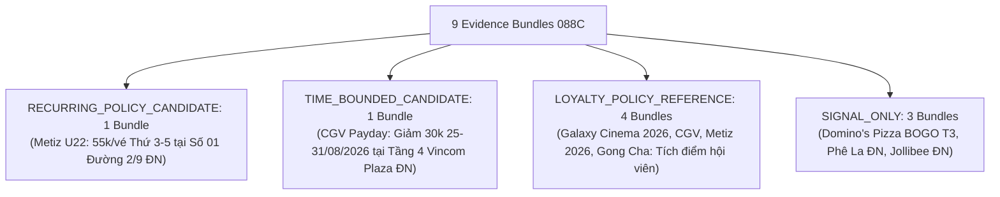

# JAYT SUPPLY EXPANSION & LINEAGE FINALIZATION REVIEW PACK (088C)
> **Chỉ thị**: `JAYT-088C-SUPPLY-EXPANSION-AND-LINEAGE-FINALIZATION`  
> **Thời điểm đối soát**: `2026-08-25T13:13:00+07:00`  
> **Phương thức**: Quét Chrome CDP thật 22 targets mới (`batch_capture_088c`) + Hoàn tất kiểm thử Lineage URL Parse/Resolve + Bỏ quota tối thiểu  
> **Trạng thái**: `IMPLEMENTED — PENDING CEO AUDIT`  
> **Khóa sản xuất**: `deals_feed.json: []` (0 records, `is_approved: false`)  
> **Tệp Evidence Bundles Gốc**: [`05_DEAL_AND_AFFILIATE/batch_capture_088c/evidence_bundles_088c.json`](../05_DEAL_AND_AFFILIATE/batch_capture_088c/evidence_bundles_088c.json)  
> **Manifest Thu thập 088C**: [`05_DEAL_AND_AFFILIATE/batch_capture_088c/captures_088c/batch_manifest_088c.json`](../05_DEAL_AND_AFFILIATE/batch_capture_088c/captures_088c/batch_manifest_088c.json)

---

## 1. BẢNG TỔNG HỢP 9 EVIDENCE BUNDLES THEO NGÀNH HÀNG VÀ CHU KỲ (088C)

### Bảng Phân Tầng Bằng Chứng

| # | Mã Bundle | Ngành Hàng | Thương Hiệu | Phân Tầng (Tier) | Đầu Ra / Cơ Chế Hiệu Lực | Mảnh 1: `policy_scope` | Mảnh 2: `danang_branch` |
|:-:|:---|:---|:---|:---|:---|:---|:---|
| 1 | `BUNDLE_088C_METIZ_U22_RECURRING` | CINEMA | Metiz Cinema | **`RECURRING_POLICY_CANDIDATE`** | Giá ưu đãi 55.000đ/vé (2D, Thứ 3 - Thứ 5) | `"đối với mọi suất chiếu tại Metiz Cinema."` | `"Địa điểm: Số 01 Đường 2 Tháng 9, Hải Châu, Đà Nẵng"` |
| 2 | `BUNDLE_088C_CGV_PAYDAY_30K_TIME_BOUNDED` | CINEMA | CGV Cinemas | **`TIME_BOUNDED_CANDIDATE`** | Giảm 30.000đ khi mua từ 2 vé (25/08 - 31/08/2026) | `"Áp dụng tất cả các rạp, định dạng, phòng chiếu."` | `"Tầng 4, TTTM Vincom Đà Nẵng, đường Ngô Quyền, P.An Hải Bắc, Q.Sơn Trà, TP. Đà Nẵng"` |
| 3 | `BUNDLE_088C_GALAXY_MEMBERSHIP_2026_LOYALTY` | CINEMA | Galaxy Cinema | **`LOYALTY_POLICY_REFERENCE`** | Tích lũy Star (1 Star = 1.000đ) & Quà sinh nhật 2026 | `"Khách hàng thành viên tích lũy điểm dựa trên giá trị chi tiêu..."` | N/A (Toàn hệ thống & App) |
| 4 | `BUNDLE_088C_CGV_MEMBERSHIP_LOYALTY` | CINEMA | CGV Cinemas | **`LOYALTY_POLICY_REFERENCE`** | Tích lũy điểm thưởng & quyền lợi hạng FanC/VIP | `"Quầy Bắp Nước"` | `"255-257 đường Hùng Vương Quận Thanh Khê Tp. Đà Nẵng"` |
| 5 | `BUNDLE_088C_METIZ_MEMBER_2026_LOYALTY` | CINEMA | Metiz Cinema | **`LOYALTY_POLICY_REFERENCE`** | Tích lũy 7-10% & vé sinh nhật 2026 | `"Khách hàng nhận Quà mừng lên hạng tại rạp Metiz Cinema."` | `"Địa điểm: Số 01 Đường 2 Tháng 9, Hải Châu, Đà Nẵng"` |
| 6 | `BUNDLE_088C_GONGCHA_MEMBERSHIP_LOYALTY` | COFFEE_TEA | Gong Cha | **`LOYALTY_POLICY_REFERENCE`** | Tích lũy Lá trà / Boba đổi quà trên app | `"Với mỗi hóa đơn chi tiêu tại cửa hàng..."` | `"01 Nguyễn Văn Linh, Phường Bình Hiên, Quận Hải Châu, Đà Nẵng."` |
| 7 | `BUNDLE_088C_DOMINOS_PIZZA_PROMOTIONS` | FNB_FASTFOOD | Domino's Pizza | **`SIGNAL_ONLY`** | Thứ 3 Mua 1 Tặng 1 Pizza (Chờ nối địa bàn) | N/A | Pending Store Locator Linkage |
| 8 | `BUNDLE_088C_PHELA_STORE_NETWORK` | COFFEE_TEA | Phê La | **`SIGNAL_ONLY`** | Mạng lưới điểm bán vật lý Đà Nẵng | N/A | `"Số 36 - 38 đường Bạch Đằng"` & `"Số 35 - 41 Nguyễn Văn Linh"` |
| 9 | `BUNDLE_088C_JOLLIBEE_STORE_NETWORK` | FNB_FASTFOOD | Jollibee | **`SIGNAL_ONLY`** | Mạng lưới điểm bán vật lý Đà Nẵng | N/A | `"Tầng 4 Vincom Đà Nẵng"` & `"32 Tiểu La"` |

---

## 2. NGUYÊN TẮC QUẢN TRỊ & ĐỐI SOÁT LINEAGE 088C

1. **Khép Kín Kiểm Thử Lineage URL**:
   - Bộ test tự động cắt DOM cha tại `link_offset`, phân tích URL, thực thi quy tắc resolve URL (tương đối / tuyệt đối) theo base domain, và xác nhận kết quả khớp 100% với `requested_url` và `final_url`.
2. **Loại Bỏ Hoàn Toàn Quota Tối Thiểu**:
   - Bộ test không bao giờ ép `candidates >= N`. Số lượng deal candidate hoàn toàn phụ thuộc vào bằng chứng thực tế thu thập được trên đĩa.
3. **Bảo Tồn 2 Ứng Viên Hiện Tại Chờ CEO Phê Duyệt**:
   - Metiz U22 (55.000đ) và CGV PAYDAY (Giảm 30k) được giữ ở mức `evidence-bundle candidate`, không tự động đưa lên UI, staging hay production.
4. **Bảo Toàn Khóa Bất Biến**:
   - Production feed: `deals_feed.json: []` (0 records, `is_approved: false`).
   - Radar SSOT 086V: Hoàn toàn bất biến.
