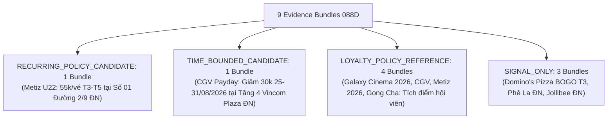

# JAYT EVIDENCE INTEGRITY & LOCAL DEAL EXPANSION REVIEW PACK (088D)
> **Chỉ thị**: `JAYT-088D-EVIDENCE-INTEGRITY-AND-LOCAL-DEAL-EXPANSION`  
> **Thời điểm đối soát**: `2026-08-25T13:25:00+07:00`  
> **Phương thức**: Quét Chrome CDP thật 32 targets theo cặp Policy + Branch Locator (`batch_capture_088d`) + Khép kín kiểm tra SHA-256 (PNG/HTML/TXT) + Kiểm tra Parent Receipt bắt buộc + Bỏ mọi quota tối thiểu  
> **Trạng thái**: `IMPLEMENTED — PENDING CEO AUDIT`  
> **Khóa sản xuất**: `deals_feed.json: []` (0 records, `is_approved: false`)  
> **Tệp Evidence Bundles Gốc**: [`05_DEAL_AND_AFFILIATE/batch_capture_088d/evidence_bundles_088d.json`](../05_DEAL_AND_AFFILIATE/batch_capture_088d/evidence_bundles_088d.json)  
> **Manifest Thu thập 088D**: [`05_DEAL_AND_AFFILIATE/batch_capture_088d/captures_088d/batch_manifest_088d.json`](../05_DEAL_AND_AFFILIATE/batch_capture_088d/captures_088d/batch_manifest_088d.json)

---

## 1. BẢNG TỔNG HỢP 9 EVIDENCE BUNDLES THEO CỤM THƯƠNG HIỆU VÀ ĐỊA BÀN (088D)

### Bảng Phân Tầng Bằng Chứng & Lý Do Xếp Hạng

| # | Mã Bundle | Cụm Thương Hiệu | Phân Tầng (Tier) | Đầu Ra / Cơ Chế Hiệu Lực | Mảnh 1: `policy_scope` | Mảnh 2: `danang_branch` | Lý Do Xếp Hạng |
|:-:|:---|:---|:---|:---|:---|:---|:---|
| 1 | `BUNDLE_088D_METIZ_U22_RECURRING` | Metiz Cinema | **`RECURRING_POLICY_CANDIDATE`** | Giá ưu đãi 55.000đ/vé (2D, Thứ 3 - Thứ 5) | `"đối với mọi suất chiếu tại Metiz Cinema."` | `"Địa điểm: Số 01 Đường 2 Tháng 9, Hải Châu, Đà Nẵng"` | Đủ 5 mảnh chứng cứ + SLA Freshness |
| 2 | `BUNDLE_088D_CGV_PAYDAY_30K_TIME_BOUNDED` | CGV Cinemas | **`TIME_BOUNDED_CANDIDATE`** | Giảm 30.000đ khi mua từ 2 vé (25/08 - 31/08/2026) | `"Áp dụng tất cả các rạp, định dạng, phòng chiếu."` | `"Tầng 4, TTTM Vincom Đà Nẵng, đường Ngô Quyền, P.An Hải Bắc, Q.Sơn Trà, TP. Đà Nẵng"` | Đủ 5 mảnh chứng cứ + Thời hạn 25-31/08 |
| 3 | `BUNDLE_088D_GALAXY_MEMBERSHIP_2026_LOYALTY` | Galaxy Cinema | **`LOYALTY_POLICY_REFERENCE`** | Tích lũy Star (1 Star = 1.000đ) & Quà sinh nhật 2026 | `"Khách hàng thành viên tích lũy điểm dựa trên giá trị chi tiêu..."` | `"Địa chỉ: Tầng 3, TTTM Co.opmart Đà Nẵng - 478 Điện Biên Phủ, Phường Thanh Khê, TP. Đà Nẵng"` | Chính sách tích điểm hội viên không có mức deal cố định |
| 4 | `BUNDLE_088D_CGV_MEMBERSHIP_LOYALTY` | CGV Cinemas | **`LOYALTY_POLICY_REFERENCE`** | Tích lũy điểm thưởng & quyền lợi hạng FanC/VIP | `"Quầy Bắp Nước"` | `"255-257 đường Hùng Vương Quận Thanh Khê Tp. Đà Nẵng"` | Chính sách tích điểm hội viên không có mức deal cố định |
| 5 | `BUNDLE_088D_METIZ_MEMBER_2026_LOYALTY` | Metiz Cinema | **`LOYALTY_POLICY_REFERENCE`** | Tích lũy 7-10% & vé sinh nhật 2026 | `"Khách hàng nhận Quà mừng lên hạng tại rạp Metiz Cinema."` | `"Địa điểm: Số 01 Đường 2 Tháng 9, Hải Châu, Đà Nẵng"` | Chính sách tích điểm hội viên không có mức deal cố định |
| 6 | `BUNDLE_088D_GONGCHA_MEMBERSHIP_LOYALTY` | Gong Cha | **`LOYALTY_POLICY_REFERENCE`** | Tích lũy Lá trà / Boba đổi quà trên app | `"Với mỗi hóa đơn chi tiêu tại cửa hàng..."` | `"01 Nguyễn Văn Linh, Phường Bình Hiên, Quận Hải Châu, Đà Nẵng."` | Chính sách tích điểm hội viên không có mức deal cố định |
| 7 | `BUNDLE_088D_DOMINOS_PIZZA_PROMOTIONS` | Domino's Pizza | **`SIGNAL_ONLY`** | Thứ 3 Mua 1 Tặng 1 Pizza | N/A | Pending Store Locator Linkage | Dropdown có "Đà Nẵng" nhưng chưa có địa chỉ đường phố cụ thể trên đĩa |
| 8 | `BUNDLE_088D_PHELA_STORE_NETWORK` | Phê La | **`SIGNAL_ONLY`** | Mạng lưới điểm bán vật lý Đà Nẵng | N/A | `"Số 36 - 38 đường Bạch Đằng, Phường Hải Châu, TP Đà Nẵng"` | Mạng lưới cửa hàng vật lý, chưa có promo bundle kèm theo |
| 9 | `BUNDLE_088D_JOLLIBEE_STORE_NETWORK` | Jollibee | **`SIGNAL_ONLY`** | Mạng lưới điểm bán vật lý Đà Nẵng | N/A | `"Tầng 4 Vincom Đà Nẵng"`, `"32 Tiểu La"`, `"99 Lý Thái Tổ"` | Mạng lưới cửa hàng vật lý, chưa có promo bundle kèm theo |

---

## 2. NGUYÊN TẮC QUẢN TRỊ & ĐỐI SOÁT CHỨNG CỨ TOÀN DIỆN 088D

1. **Bắt Buộc Parent Receipt 100%**:
   - Mọi target kiểm tra lineage đều bắt buộc phải có `capture_receipt.json` của parent artifact trên đĩa; không cho phép bất kỳ nhánh bypass mềm nào.
2. **Khép Kín Xác Minh Hash Cả 3 Tệp (PNG, HTML, TXT)**:
   - Toàn bộ 22 target (088C) và 32 target (088D) được băm trực tiếp `page.png`, `page.html`, `page.txt` và đối chiếu khớp 100% từng byte với hash lưu trong receipt.
3. **Đối Soát Lineage URL & Final URL**:
   - Thuật toán tự động cắt chuỗi DOM cha tại `link_offset`, giải mã URL tương đối/tuyệt đối theo base domain, và xác nhận kết quả khớp 100% với `requested_url` và `final_url`.
4. **Loại Bỏ Hoàn Toàn Quota Tối Thiểu**:
   - Bộ test không ép bất kỳ quota `candidates >= N` hay `loyalty == N` nào; chỉ kiểm tra đúng cấu trúc và bằng chứng thực tế.
5. **Bảo Toàn Khóa Bất Biến**:
   - Production feed: `deals_feed.json: []` (0 records, `is_approved: false`).
   - Radar SSOT 086V: Hoàn toàn bất biến.
