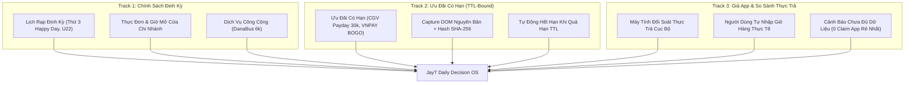

# ⚙️ NHỊP VẬN HÀNH & BA ĐƯỜNG CUNG DỮ LIỆU JAYT CORP
**Mã hiệu**: `JAYT-DOC-CADENCE-TRACKS-131`  
**Nguyên tắc chỉ đạo**: “Nhiều deal không phải mục tiêu độc lập. Mục tiêu là nhiều quyết định đúng, đúng lúc và có thể hành động.”

---

## 1. NĂM NHỊP VẬN HÀNH HẰNG NGÀY & ĐỊNH KỲ (OPERATIONAL CADENCE)

| Nhịp Vận Hành | Bộ Máy Hệ Thống Thực Hiện | Giá Trị Thực Nhận Của Khách Hàng |
|---|---|---|
| **Mỗi Sáng (06:30 – 07:30)** | Recheck các ưu đãi hết hạn sớm, cập nhật lịch rạp ngày hiện tại, kiểm tra địa điểm và giờ mở cửa. | Mở JayT biết ngay *“Hôm nay có gì đáng tiền & đi đâu được”*. |
| **Trước 11:05, 14:30, 17:30, 20:00** | Tái xếp Today Board bằng **Moment-Fit Gate**: chỉ đưa tối đa 3 card khớp 100% nhu cầu và thời điểm. | Không bị làm phiền bởi card lệch nhu cầu (11:05 chỉ có ăn trưa, 20:00 là phim/kèo tối). |
| **Mỗi Ngày** | Quét/capture nguồn chính thức, lập receipt băm SHA-256, chuyển item thiếu bằng chứng hoặc hết hạn về Watchlist. | Nguồn cung tăng trưởng vững chắc, **tuyệt đối 0 voucher giả**. |
| **Mỗi Tuần (Thứ Hai)** | Rà soát Lịch rạp 7 ngày, chính sách thành viên, cập nhật thực đơn và địa điểm theo 3 cụm sinh viên. | Người dùng dễ dàng lên kế hoạch đi chơi/học nhóm trước với bạn bè. |
| **Mỗi Tháng (Ngày 01)** | Xóa/đánh dấu hết hạn, công bố các *“Ngày cần theo dõi (Watchlist)”* thay vì dự báo ưu đãi bừa bãi. | Không bao giờ thấy lịch cũ hoặc khuyến mãi tưởng tượng. |

---

## 2. BA ĐƯỜNG CUNG DỮ LIỆU PHÂN TẦNG (THREE DATA SUPPLY TRACKS)

### 🏢 Track 1: Chính Sách Định Kỳ (Foundational Regular Policies)
- **Bao gồm**: Lịch rạp định kỳ (U22 45k, Happy Day), thẻ thành viên, thực đơn niêm yết, giờ hoạt động và xe buýt công cộng trợ giá.
- **Vai trò**: Đây là **nền tảng xương sống** để JayT hữu ích mỗi ngày ngay cả khi không có deal flash sale.

### 🟢 Track 2: Ưu Đãi Có Hạn (Limited-Time Verified Offers)
- **Bao gồm**: Các chương trình khuyến mãi ngắn hạn (CGV Payday 30k, CGV VNPAY Mua 1 Tặng 1, Starlight Combo 10k).
- **Nguyên tắc**: Chỉ được kích hoạt khi có capture/evidence còn hiệu lực; tự động chuyển về `EXPIRED` hoặc `RECHECK_PENDING` khi hết hạn TTL.

### 🧮 Track 3: Giá App, Voucher & So Sánh Thực Trả (Transparent Real-Pay Arithmetic)
- **Bao gồm**: So sánh chi phí giữa ăn tại quán, mua mang về và đặt app giao hàng.
- **Nguyên tắc**: Chỉ kết luận khi có API/feed được cấp quyền chính thức hoặc dữ liệu giỏ hàng do người dùng tự nhập. Khi không có quyền dữ liệu, JayT là **công cụ tính toán minh bạch**, tuyệt đối không giả vờ là máy so sánh thời gian thực.
